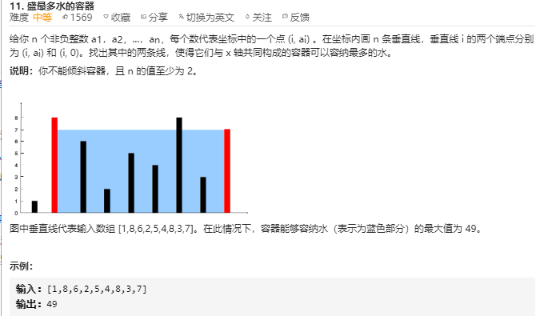
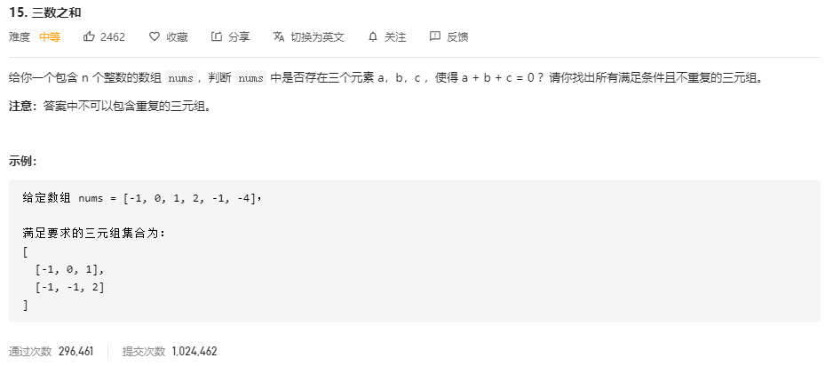
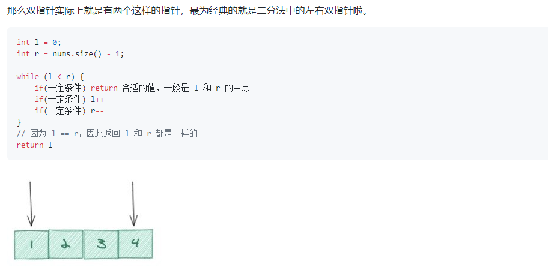
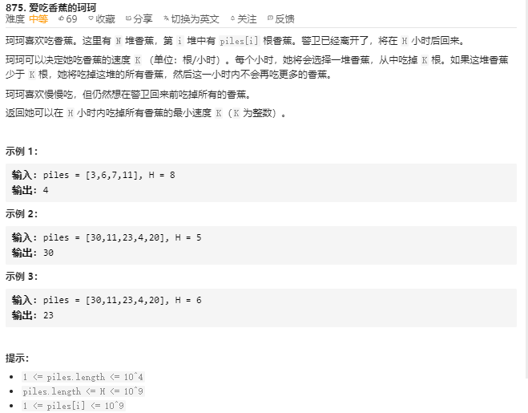
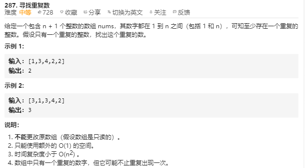
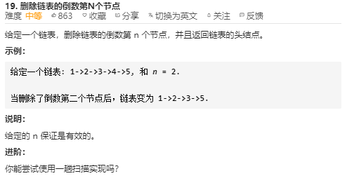
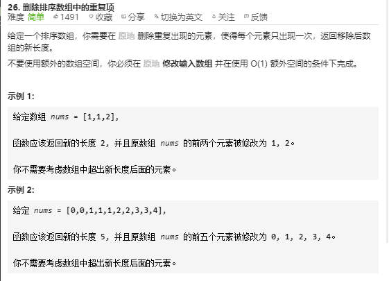
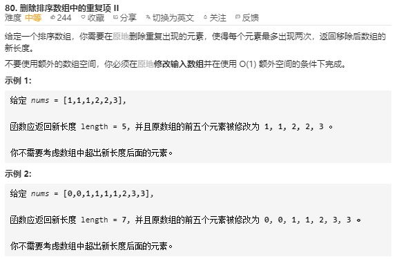
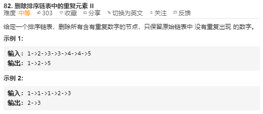

# 左右端点指针（二分法）

## 11 盛最多水的容器



**暴力解题**

两个for循环遍历，计算出每一种可能，存储最大值

时间复杂度：O(n^2^) ，空间复杂度：O（1）

### 左右双指针（排序不规则的情况）

左右两端各设定一个指针，比较两个指针指向的数据大小，小的一端向内移动，计算容器大小，存储最大值。直到两者相遇

时间复杂度：O(n)，空间复杂：O(1)

因为每次移动时，无论左指针向右移动还是右指针向左边移动，移动的距离都是1，**并且最后容器的体积取决于短的那一边**，所以移动短的那边，才可能比之前更大的体积

```JavaScript
var maxArea = function(height) {
    let i = 0
    let j = height.length-1
    let area = 0
    while ( i < j ){
        area = Math.max(Math.min(height[i],height[j]) * (j - i),area)
        if(height[i]>height[j])
            j--
        else
            i++
    }
    return area
};
```

## [15 三数之和](https://leetcode-cn.com/problems/3sum/)



**暴力法**

```JS
var threeSum = function（nums） {
    let result = []
    for(let i = 0; i<nums.length-2; i++)
    	for(let j = i + 1; j<nums.length-1; j++) 
    		for(let k = j + 1; i<nums.length; k++)
       			if(nums[i] + nums[j] + nums[k] == 0) {
                  	result.push(nums[i],nums[j],nums[k])  
                }
    return result
}
```

**[双指针法](https://leetcode-cn.com/problems/3sum/solution/3sumpai-xu-shuang-zhi-zhen-yi-dong-by-jyd/)**

### 左右双指针（排序规则的情况）

```JS 
var threeSum = function (nums) {
    let L,R,k;
    let result = [];
    // add
    const len = nums.length;
    if (nums == null || len < 3) return result;
    nums.sort((a,b) => a - b);
    for (let k = 0; k < len; k++) {
        // add 排序好的第一位都 大于0
        if (nums[k] > 0) break;
        // add 基准去重
        if (k > 0 && nums[k] == nums[k-1]) continue;
        L = k + 1;
        R = len - 1;
        while (L < R) {
            const sum = nums[L] + nums[R] + nums[k];
            if (sum == 0) {
                result.push([nums[k],nums[L],nums[R]]);
                while (L<R && nums[L] == nums[L+1]) L++;
                while (L<R && nums[R] == nums[R-1]) R--;
                L++;
                R--;
            }
            else if (sum < 0) L++;
            else if (sum > 0) R--;
        }
    }
    return result;
};
```

```java
class Solution {
    public List<List<Integer>> threeSum(int[] nums) {
        Arrays.sort(nums);
        List<List<Integer>> res = new ArrayList<>();
        for(int k = 0; k < nums.length - 2; k++){
            if(nums[k] > 0) break;
            if(k > 0 && nums[k] == nums[k - 1]) continue;
            int i = k + 1, j = nums.length - 1;	// 每次更换基准后，左指针始终从基准值的右边一位开始指向移动，右指针始终从最右边一位开始移动
            while(i < j){
                int sum = nums[k] + nums[i] + nums[j];
                if(sum < 0){
                    while(i < j && nums[i] == nums[++i]);	// 先++ ,再判断，没有出现相同元素也完成了移动操作
                } else if (sum > 0) {
                    while(i < j && nums[j] == nums[--j]);
                } else {
                    res.add(new ArrayList<Integer>(Arrays.asList(nums[k], nums[i], nums[j])));
                    while(i < j && nums[i] == nums[++i]);
                    while(i < j && nums[j] == nums[--j]);
                }
            }
        }
        return res;
    }
}
```

这里所使用到的 方法与 题 11 盛最多的水原理是一样的，只不过根据题目特点进行变化

这里先将数组进行排序，而此题最大的问题在于 避免重复 元组 ，所以在排序完数组后，要特别注意到相同值的处理

本题的思路是，先将数组排序后，选择一个数为基准 nums[k] ,基准是从最小的数开始选的，依次遍历到最大数的左边两位（因为总共三个元素），如果基准数与前一位是相同的值，继续遍历（因为结果肯定是一样的），那么再选择两个移动指针，一个指针指向基准右边第一个数，一个指针指向最大数，在选择好基准后，通过移动两个指针来完成匹配，如果和值大于0，右指针左移，如果和值小于0，左指针右移，如果刚好等于0，压入存储三个值，在进行移动指针时，一定要时刻注意到重复的值的忽略

**总结**：这种思路实现的最大问题是不敢去使用这个方法，因为个人又无法论证这样操作会不会概括所有的元组，在选择基准的时候，其实基准的值一直包含在关于基准的元组测试中，所以移动指针不用指向到基准这边，当基准移动了一定位置时，也不用关乎到移动指针不指向基准值的左边部分，因为在基准为现在基准的左边时，已经把包含其的所有可能都测试过了，所以不必担心会影响到，直到最后基准遍历到倒数第三个数停止遍历，因为基准左边的不用管理，所以如果继续遍历，那么就不存在三个元素了。特别注意到每次进行移动操作（包括基准的移动）都需要忽略相同元素的干扰，

### 总结

模板：



## 875 爱吃香蕉的珂珂



**题目解读**

注意在选择一堆吃后，就算吃完也不会继续吃另一堆，也就是说如果某堆存在 S 个香蕉，每小时能吃 a 个 ，那么吃完这堆至少需要 Math.ceil(S/a) 小时

**解题方法**

### 二分法（双指针）：

查找到最合适的速度，在一定的事件以最慢的速度吃完，也就是在一段速度区间上选择一个合适的速度，速度区间的起始点是1，区间的结束点可以是香蕉堆中最大堆的值，那么可以选择二分法来快速找到那个速度，初始速度为 （1+香蕉堆中最大堆值）/2， 以这个速度来计算吃完所需要的时间与题设给的最大时间进行对比，如果所需时间要大于给与的最大时间，那么需要提升速度，那么就将速度的起点定义为原来起点与终点的一半（二分法的特征），如果所需时间小于给与的时间，那么速度太快了，还可以选择更小的速度，同理将速度终点定义为原来的一半。那么找到速度的跳出条件是什么呢？ 速度的跳出条件是慢速度指针的值移动到比快指针的值要大，因为寻找的是最小的速度，所以返回此时的最小指针指向的值

- 时间复杂度：O(NlogW)，其中 N是香蕉堆的数量，W 是最大的香蕉堆的大小。
- 空间复杂度：O(1)。

### 总结：

难度难在于把问题抽象化为一个双指针问题，这个地方要找到的就是那个合适的速度（即在吃完的状态下的最慢速度），那么如何找到这个最合适的速度，已知最慢速度和最快速度（也就是知道这个速度区间，类似于已经把它排序好了），可以使用二分法，一半一半的跳着找，计算总的时间对比，大了小了继续调整，知道那个合适的速度，返回

```JavaScript
var minEatingSpeed = function(piles, H) {
  if (piles.length >= H) {
      // 因为每个小时只能吃一堆，吃完不能换，所以堆数等于小时数时，最大的堆就是解；循环找出最大的那一堆
      return piles.reduce((a, b) => Math.max(a, b));
  }
  // 排序，实际上不需要，可以直接用piles.reduce((a, b) => Math.max(a, b)) 找出最大值就行
  piles.sort((a, b) => b - a);
  let speedMax = piles[0];
  let speedMin = 1;

  // 二分查找；
  while (speedMax > speedMin) {
      const k = Math.floor((speedMin + speedMax) /2);
      // 计算当前速度下需要消耗的时间；
      const hours = piles.reduce((total, pre) => total + Math.ceil(pre/k), 0);
      if (hours > H) {
        // [k + 1, speedmax]
        speedMin = k + 1;
      } else {
        // [speedMin, k]
        speedMax = k;
      }
      // console.log(speedMin, speedMax, k);
  }
  // 这里之所以取的是speedMin， 而不是K，是因为当speedMin = k + 1造成 speedMin === speedMax时，
  // 已经跳出了二分，所以这时K是不对的，那为什么speedMin 就对喃， 因为speedMax已经经过了验证
  return speedMin;
};
```

我的报错代码：

```JavaScript
var minEatingSpeed = function(piles, H) {
    piles.sort((a,b)=>a-b)
    let max = piles[0]
    let min = 1,sum = 0
    while (min > max) {
        let mid = Math.floor((max + min) / 2)
        for(let i = 0; i < piles.length-1; i++) {
            sum += Math.ceil(piles[i] / mid)
        }
        if(sum > H)
            min = mid + 1
        else
            max = mid
    }
    return min
};
```


# 快慢指针

## [快慢指针的总结好文](https://juejin.im/post/5e64a20ff265da570a5d5633#heading-3)

## 287 寻找重复数



### 暴力解法

两遍循环

1. 时间复杂度：O(n^2^)
2. 空间复杂度：O(1)

### 哈希解法

#### 总结

**关键字：重复。一旦涉及出现次数，可以使用哈希表**

1. 时间复杂度：O(n)

   建立哈希表的过程是 O(n)，判断元素是否存在是 O(1)

   > 仔细分析这个过程，**其实判断这个数是否存在 是 穿插在哈希表建立的过程中，并不是再另外遍历一遍来判断**，也就是在建表的时候，先用if语句判断这个数是否存在于表中，如果存在则直接返回这个数，如果不存在不进入这个if语句，执行建表操作，即将数据插入到表中

2. 空间复杂度：O(n)

### 快慢指针（判断链表是否有环）

由于题目的特性，因为 `Given an array nums containing n + 1 integers where each integer is between 1 and n (inclusive)`,即数组的值全部排列下来**基本是**连着的，可能存在一个值有多个，那么相应的有些值就不存在，那么如果我们把这个数组内的值当做一个链表来看，数组的值表示链表下一个指向的索引，（类似于 数组的值等于链表中的next的值），而由于有些值不存在，有些值存在多个，那么一定会有地方连接不起，因为有些指向了相同一个地方，也就是会构成环。根据这一特性，我们需要找到构成环的那个节点索引值，也就是题目要求的重复的值

转化为链表指向下一个节点来理解的话，并且求环节点，那么又回到了类似于 142 环形链表 那题的龟兔赛跑快慢指针的解法

#### 总结

**相对来说这个问题很难抽象到链表指向，并且是快慢指针中的这个绕环追击问题**

具体解析可以查看  <a href='./链表'>142 环形链表二</a>

```JavaScript
var findDuplicate = function(nums) {
  let slowPointer = 0
  let fastPointer = 0
  while (true) {
    slowPointer = nums[slowPointer]
    fastPointer = nums[nums[fastPointer]]
    if (slowPointer == fastPointer) {
      let _slowPointer = 0
      while (nums[_slowPointer] !== nums[slowPointer]) {
        slowPointer = nums[slowPointer]
        _slowPointer = nums[_slowPointer]
      }
      return nums[_slowPointer]
    }
  }
};
```

## 19 删除链表的倒数第N个节点



**题目解析**

想要解题，无非是想知道 要删除的那个节点 从正序的位置，将此节点的上一个节点直接指向这个节点的下一个节点，即可完成删除操作，并且返回的是链表的首节点（留意当删除第一个节点这种情况！）

**解题方法**

### 暴力解题

两遍循环，第一遍循环获取到整个链表的长度 L ，那么正序的位置的值 为  L - N ，第二遍循环到这个节点，即进行删除操作

### 快慢指针

快指针向从起点向走 N 步，然后慢指针开始从起点走，当快指针走到NULL 时，慢指针此时指向的也就是要删除掉的节点

注意到要删除的节点也可以是第一个节点，那么fast就会移动N步，正好fast等于null，可以删除掉第一个节点，也就是返回头节点的next

```java
class Solution {
public:
    ListNode* removeNthFromEnd(ListNode* head, int n) {
        if(!head | !head -> next) return NULL;
        ListNode * fast = head, *slow = head;
        for(int i = 0; i < n; i++){
            fast = fast -> next;
        }
        if(!fast){
            return head -> next;    
        }
        
        while(fast -> next){
            fast = fast -> next;
            slow = slow -> next;
        }
        slow -> next = slow -> next -> next;
        return head;
    }
};
```

**快慢指针的的特点就是在一遍循环中，进行了了两个不同指针的移动操作**，从移动的距离来说，相当于移动了两遍循环的距离，从操作来说，只进行了一次循环，但是循环中的每次操作中，进行了两次移动。**在时间复杂度分析来看，这属于O(n)**

## 26 删除排序数组中重复的项



**题目解读**

题目中是给与排序好的数组，将重复的数值删除掉，也就是删除后，数组还是一个连接好的数组

**解题方法**

### 快慢指针（读写指针）

快指针起初快一步，每次判断两个指针的两个值，如果指向的值相等，说明要删除掉一个值，那么慢指针不动，快指针向前移动一个，如果两个值不相等，那么将慢指针前移动，将快指针指向的值赋值给慢指针此时指向的值，如果之前存在相等的值，那么赋值正好替代掉重复的值，如果没有，相当于赋值给自己

1. 时间复杂度：O(n)
2. 空间复杂度：O(1)

```JavaScript
var removeDuplicates = function(nums) {
    var j = 0;
    var n = nums.length;
    for(let i = 1;i<n;i++){
        if(nums[i]!=nums[i-1]){
            j++;
            nums[j] = nums[i];
        }
    }
    return j+1;
};


var removeDuplicates = function(nums) {
    let l = 0,r
    for (let i = 1; i < nums.length; i++) {
        if ( nums[l] == nums[i] ) {
            continue
        } else {
            nums[++l] = nums[i]
        }
    }

    nums.splice(l+1,nums.length - l)
};
```

## 80 删除排序数组中的重复项



### 快慢指针（读写指针，数组类型）

这类题目的特点就行 排序好的**数组**，删除掉重复的元素

如链接中展示一样，两个指针中，一个专门用来读取新的元素值，一个专门用来写符合条件的值，根据此类的题目，抽象出 使得每个元素最多可以出现 K 次 ，那么在解题方法中就是，读指针每次都移动，每次与写指针左移动 K 个元素的值对比，如果值相等，那么读指针继续前移动一格，写指针不动，如果值不相等，那么吧读指针的值赋值给写指针，两个指针同时向右移动一格，直到读指针指向空。

```java
精简版：（本质还是读写指针）
class Solution {
    public int removeDuplicates(int[] nums) {
        int i = 0;
        for (int n : nums) {
            if (i < 2 || n > nums[i-2]) nums[i++] = n;
        }
        return i;
    }
}
```
### [Lucifer （读写指针）删除排序数组重复项系列总结](https://github.com/azl397985856/leetcode/blob/master/problems/80.remove-duplicates-from-sorted-array-ii.md)

## 82 [删除排序链表中的重复元素 II](https://leetcode-cn.com/problems/remove-duplicates-from-sorted-list-ii/)



### 读写指针（链表类型）

由于链表的本身结构不同于数组，数组拥有快速随时访问的特点，所以处理起来相当方便，而链表要基于数据结构的特点来进行特定的操作

在Lucifer的总结（上面的链接）中有提到Python解法，根据的题目的特点：有序排序，相同的元素排序在一起，并且删除到有重复的元素，不留一个。

大致的解法是，一个读指针进行预先移动，当前的指针指向的值等于其当前指针的下一个值，读指针前移，直到遇到不相等的值，将慢指针的下一位直接指向这个新找到的这个元素值，同理，读指针继续按照同样的方法前移，遇到新的值就让慢指针的下一位指向这个值，知道快指针指向null

```java
class Solution {
public:
    ListNode* deleteDuplicates(ListNode* head) {
        ListNode *dummy = new ListNode(-1),*slow = dummy,*fast = head;
        dummy->next = head;
        while(fast!=NULL&&fast->next!=NULL){ //快指针用于查找相同元素
            if(fast->val!=fast->next->val) {                  
                if(slow->next == fast) slow = fast; //快指针先前没查找到相同数
                else slow->next = fast->next; //先前查找到相同数，将出现相同数的前一个数连接到相同数后第一个不同数 
            }
            fast = fast->next;
        }
        if(slow->next != fast) slow->next = fast->next; // 针对类似[1,1]的情况
        return dummy->next;
    }
};
```

## 83 [删除排序链表中的重复元素](https://leetcode-cn.com/problems/remove-duplicates-from-sorted-list/)


### 读写指针（链表类型）

快指针前移，如果快指针的值等于慢指针的值，将慢指针的下一位指向快指针的下一位，而快指针继续前移，如果不相等，快慢指针同时前移动

相对于上题这题简单，区别在于这边要保留重复的元素的一个值留在数组

```java
精简版：（if语句中的 cur.next实际上是快指针，else语句中的实际是慢指针）
class Solution {
    public ListNode deleteDuplicates(ListNode head) {
        ListNode cur = head;
        while(cur != null && cur.next != null) {
            if(cur.val == cur.next.val) {
                cur.next = cur.next.next;
            } else {
                cur = cur.next;
            }
        }
        return head;
    }
}
```

# 固定间距指针

167 两数之和

```JavaScript
/**
 * @param {number[]} numbers
 * @param {number} target
 * @return {number[]}
 */
var twoSum = function(numbers, target) {
    let p = 1;q = 2
    for (let i=0;i<numbers.length-1;i++){
        if( numbers[p] >= numbers[q])
            return false   
        if( numbers[p] + numbers[q] > target) {
            numbers[p] = numbers[p+1]
        }else if ( numbers[p] + numbers[q] == target) {
            return [p,q]
        }else {
            numbers[q] = numbers[q+1]
        }
    }
};
```

