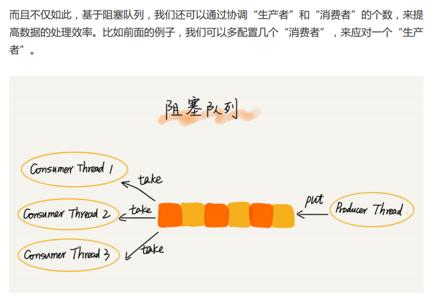
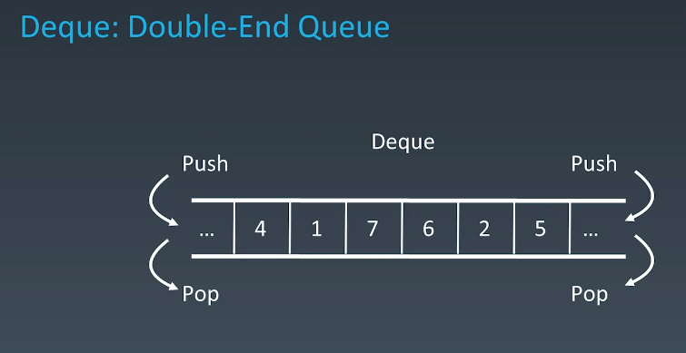
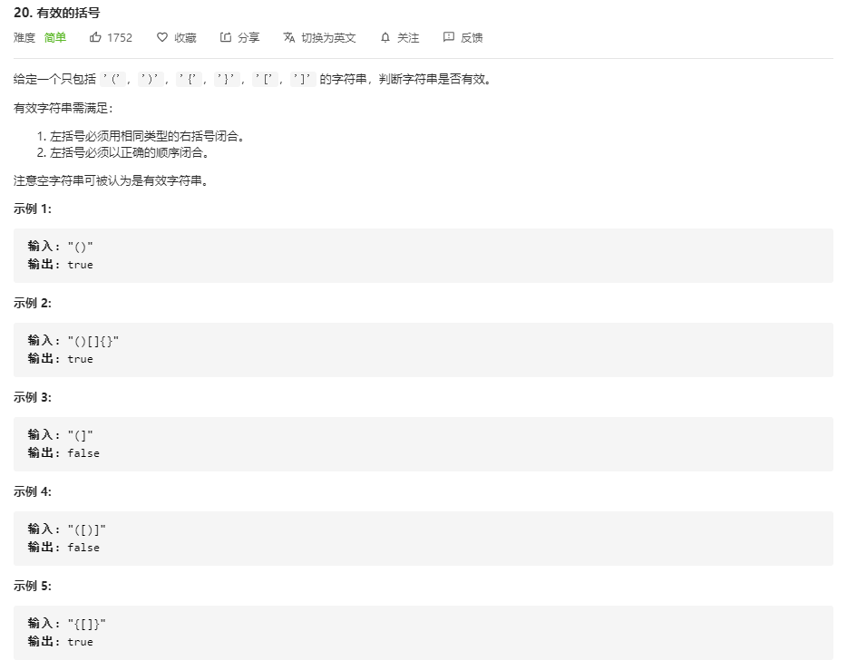
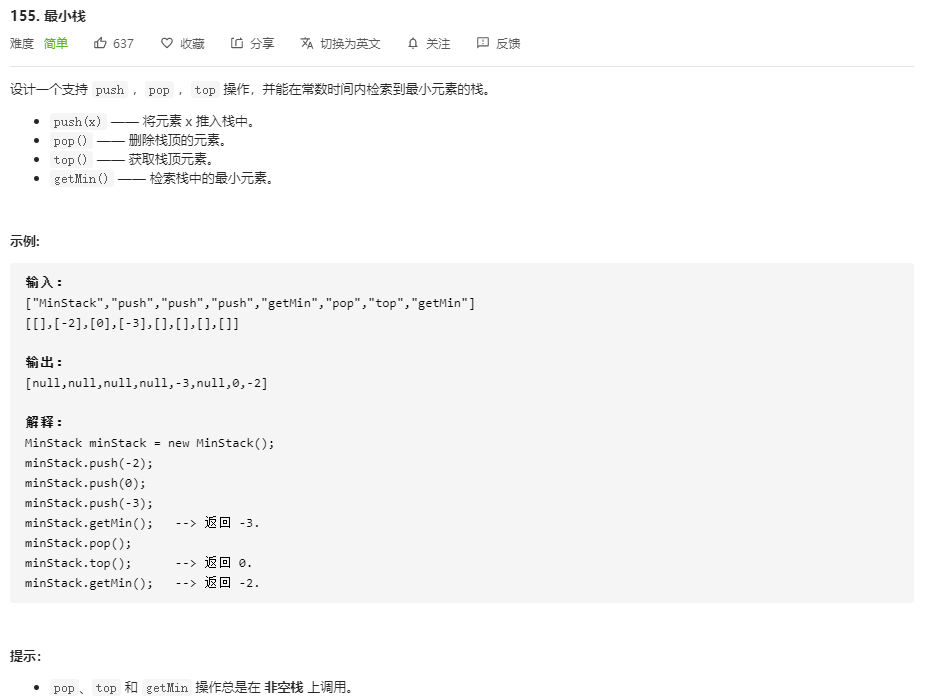
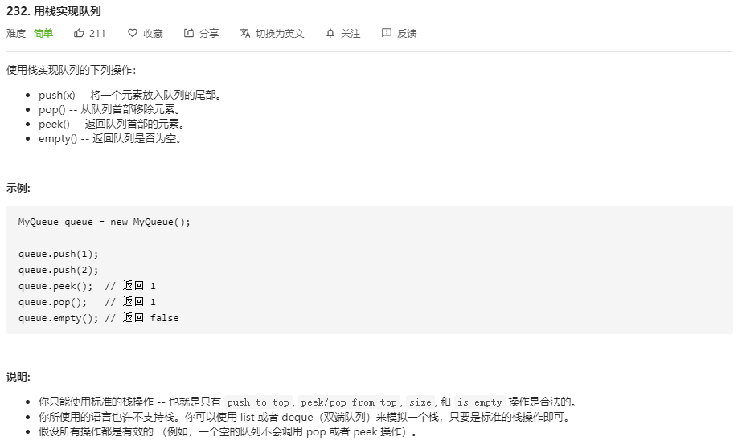
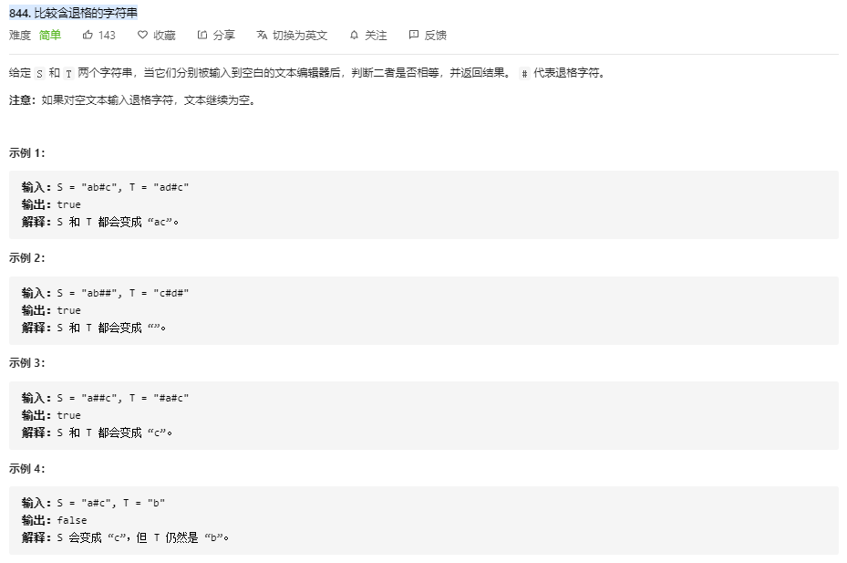
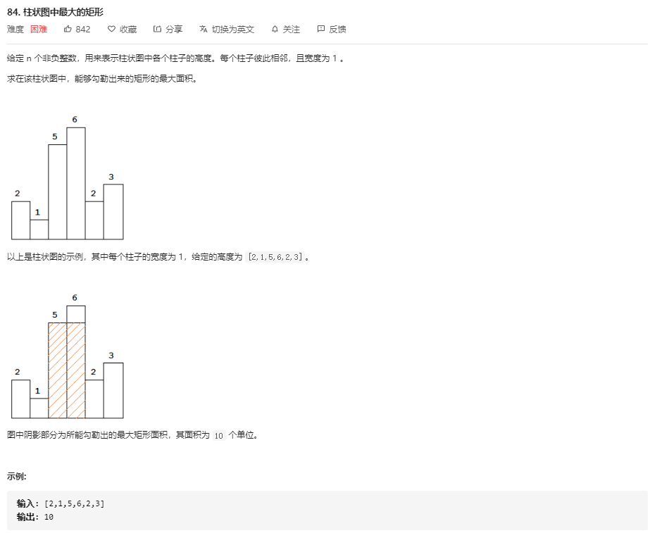
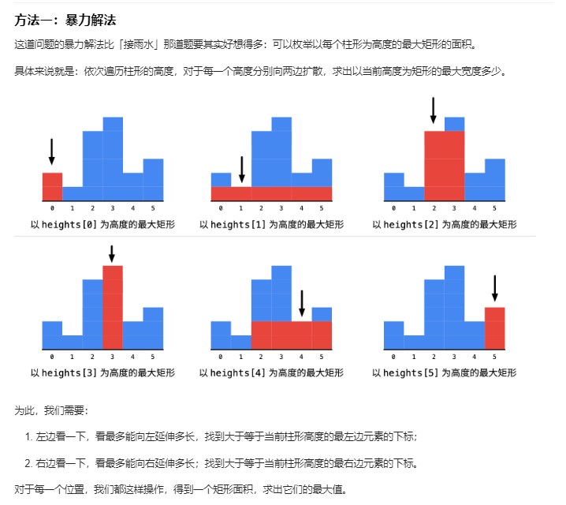

# 栈概念

后进者先出，先进者后出，这就是典型的“栈”结构。

**当某个数据集合只涉及在一端插入和删除数据，并且满足后进先出、先进后出的特性，我们 就应该首选“栈”这种数据结构。**

> 从栈的操作特性上来看，栈是一种“操作受限”的线性表，只允许在一端插入和删除数据。
>
> **相比数组和链表，栈带给我的只有限制，并没有任何优势。那我直接使用数组或者链表不就好 了吗？为什么还要用这个“操作受限”的“栈”呢？**
>
> 从功能上来说，数组或链表确实可以替代栈，但你要知道，**特定的数据结构是对特定场景的抽象，而且，数组或链表暴露了太多的操作接口，操作上的确灵活自由，但使用时就比较不可控，自然也就更容易出错。**

**如何实现栈？**

实际上，栈既可以用数组来实现，也可以用链表来实现。用数组实现的栈，我们叫作顺序栈，用链表实现的栈，我们叫作链式栈。

**以数组或者链表这种基本的数据结构为基础，并且添加封装像 push、pop 这样的API ，而构成了栈这样的数据结构**

**顺序栈**

```Java
// 基于数组实现的顺序栈
public class ArrayStack {
    private String[] items; // 数组
    private int count; // 栈中元素个数
    private int n; // 栈的大小
    
    // 初始化数组，申请一个大小为 n 的数组空间
    public ArrayStack(int n) {
        this.items = new String[n];
        this.n = n;
        this.count = 0;
    }
    
    // 入栈操作
    public boolean push(String item) {
        // 数组空间不够了，直接返回 false，入栈失败。
        if (count == n) return false;
        // 将 item 放到下标为 count 的位置，并且 count 加一
        items[count] = item;
        ++count;
        return true;
    }
    

    // 出栈操作
    public String pop() {
        // 栈为空，则直接返回 null
        if (count == 0) return null;
        // 返回下标为 count-1 的数组元素，并且栈中元素个数 count 减一
        String tmp = items[count-1];
        --count;
        return tmp;	// pop 处理函数返回的是 移出去的数值
    }
}
```

**复杂度分析**

时间复杂度：不管是顺序栈还是链式栈，入栈、出栈 只涉及栈顶个别数据的操作，所以时间复杂度都是 O(1)。

空间复杂度：这种数据结构本身需要 n 大小的存储空间，算法在使用这种数据结构解决算法问题时，也需要将数据结构本身的空间复杂度加进去

**动态扩容的顺序栈**

**基于数组实现的栈，是一个固定大小的栈，也就是说，在初始化栈时需要事先指定栈的大小。当栈满之后，就无法再往栈里添加数据了。**

> 尽管链式栈的大小不受限，但要存储 next 指针，内存消耗相对较多。 

**是如何来实现一个支持动态扩容的数组的吗？当数组空间不够时，我们就重新申请一块更大的内存，将原来数组中数据统统==拷贝过去==。这样就实现了一 个支持动态扩容的数组。**

**摊还分析法**

对于出栈操作来说，我们不会涉及内存的重新申请和数据的搬移，所以出栈的时间复杂度仍然是 O(1)。但是，对于入栈操作来说，情况就不一样了。当栈中有空闲空间时，入栈操作的时间复杂度为 O(1)。但当空间不够时，就需要重新申请内存和数据搬移，所以时间复杂度就变成了 O(n)。 也就是说，对于入栈操作来说，最好情况时间复杂度是 O(1)，最坏情况时间复杂度是 O(n)。

如果当前栈大小为 K，并且已满，当再有新的数据要入栈时，就需要重新申请 2 倍大小的 内存，并且做 K 个数据的搬移操作，然后再入栈。但是，接下来的 K-1 次入栈操作，我们 都不需要再重新申请内存和搬移数据，所以这 K-1 次入栈操作都只需要一个 simple-push 操作就可以完成。

涉及了 K 个数据的搬移，以及 K 次 simplepush 操作。将 K 个数据搬移均摊到 K 次入栈操作，那每个入栈操作只需要一个数据搬移 和一个 simple-push 操作。以此类推，入栈操作的均摊时间复杂度就为 O(1)。

均摊时间复杂度一般都等于最好情况时间 复杂度。因为在大部分情况下，入栈操作的时间复杂度 O 都是 O(1)，只有在个别时刻才会 退化为 O(n)，所以把耗时多的入栈操作的时间均摊到其他入栈操作上，平均情况下的耗时 就接近 O(1)。

**栈的实际应用**

1. **在函数调用中应用**

   **函数调用栈**。操作系统给每个线程分配了一块独立的内存空间，这块内存被组织成“栈”这种 结构, 用来存储函数调用时的临时变量。每进入一个函数，就会将临时变量作为一个栈帧入栈，当被调用函数执行完成，返回之后，将这个函数对应的栈帧出栈。

2. **栈在表达式求值中的应用**

   **表达式求值**，以只有含加减乘除四则运算来看，编译器就是通过两个栈来实现的。其中**一个保存操作数的栈，另一个是保存运算符的栈**。我们从左向右遍历表达式，当遇到数字，我们就直接压入操作数栈；当遇到运算符， 就与运算符栈的栈顶元素进行比较。 如果比运算符栈顶元素的优先级高，就将当前运算符压入栈；如果比运算符栈顶元素的优先级低或者相同，从运算符栈中取栈顶运算符，从操作数栈的栈顶取 2 个操作数，然后进行计算，再把计算完的结果压入操作数栈，继续比较。

3. **栈在括号匹配中的应用**

   用栈来保存未匹配的左括号，从左到右依次扫描字符串。当扫 描到左括号时，则将其压入栈中；当扫描到右括号时，从栈顶取出一个左括号。如果能够匹 配，比如“(”跟“)”匹配，“[”跟“]”匹配，“{”跟“}”匹配，则继续扫描剩下的字 符串。如果扫描的过程中，遇到不能配对的右括号，或者栈中没有数据，则说明为非法格 式。


> **内存中的堆栈和数据结构堆栈不是一个概念，可以说==内存中的堆栈是真实存在的物理区，数据结构中的堆栈是抽象的数据存储结构==。 内存空间在逻辑上分为三部分：代码区、静态数据区和动态数据区，动态数据区又分 为栈区和堆区。**


# 队列概念

先进者先出，这就是典型的“队列”。

队列跟栈一样，也是一种操作受限的线性表数据结构。栈只支持两个基本操作：入栈 push()和出栈 pop()。队列跟栈非常相似，支持 的操作也很有限，最基本的操作也是两个：入队 enqueue()，放一个数据到队列尾部；出 队 dequeue()，从队列头部取一个元素。

> 队列跟栈一样，也是一种抽象的数据结构

**队列的实现**

跟栈一样，队列可以用数组来实现，也可以用链表来实现。用数组实现的栈叫作顺序栈，用 链表实现的栈叫作链式栈。同样，**用数组实现的队列叫作顺序队列，用链表实现的队列叫作 链式队列。**

**顺序队列**

```java
// 用数组实现的队列
public class ArrayQueue {
    
    // 数组：items，数组大小：n
    private String[] items;
    private int n = 0;
    // head 表示队头下标，tail 表示队尾下标
    private int head = 0;
    private int tail = 0;
    
    // 申请一个大小为 capacity 的数组
    public ArrayQueue(int capacity) {
        items = new String[capacity];
        n = capacity;
    }
    
    // 入队
    public boolean enqueue(String item) {
        // 如果 tail == n 表示队列已经满了
        if (tail == n) return false;
        items[tail] = item;
        ++tail;
        return true;
    }
    
    // 出队
    public String dequeue() {
        // 如果 head == tail 表示队列为空
        if (head == tail) return null;
        // 为了让其他语言的同学看的更加明确，把 -- 操作放到单独一行来写了
        String ret = items[head];
        ++head;
        return ret;
    }
}
```

**顺序队列的数据搬移**

队列中有两个指针，一个 head 指针指向头部，一个 tail 指针指向尾部，尾部指针没有指向数据。由于出队的操作，那么队列的头部有大量的空余空间没有利用到，那么就会造成内存浪费，那么队列空余进行数据搬移，但是，每次进行出 队操作都相当于删除数组下标为 0 的数据，要搬移整个队列中的数据，这样出队操作的时 间复杂度就会从原来的 O(1) 变为 O(n)

**我们在出队时可以不用搬移数据。如果没有空闲空间了，我们只需要在入队时，再集中触发一次数据的搬移操作。**

```java
// 入队操作，将 item 放入队尾
public boolean enqueue(String item) {
    // tail == n 表示队列末尾没有空间了
    if (tail == n) {
        // tail ==n && head==0，表示整个队列都占满了
        if (head == 0) return false;
        // 数据搬移
        for (int i = head; i < tail; ++i) {
            items[i-head] = items[i];
        }
        // 搬移完之后重新更新 head 和 tail
        tail -= head;
        head = 0;
    }

    items[tail] = item;
    ++tail;
    return true;
}
```

当队列的 tail 指针移动到数组的最右边后，如果有新的数据入队，我 们可以将 head 到 tail 之间的数据，整体搬移到数组中 0 到 tail-head 的位置。

**循环队列**

可以避免数据搬移， 在用数组实现的非循环队列中，队满的判断条件是 tail == n，队空的判断条件是 head == tail。那针对循环队列，队列为空的判断条件仍然是 head == tail，当队满时，(tail+1)%n=head。

```java
public class CircularQueue {
    // 数组：items，数组大小：n
    private String[] items;
    private int n = 0;
    // head 表示队头下标，tail 表示队尾下标
    private int head = 0;
    private int tail = 0;
    
    // 申请一个大小为 capacity 的数组
    public CircularQueue(int capacity) {
        items = new String[capacity];
        n = capacity;
    }
    
    // 入队
    public boolean enqueue(String item) {
        // 队列满了
        if ((tail + 1) % n == head) return false;
        items[tail] = item;
        tail = (tail + 1) % n;
        return true;
    }
    
    // 出队
    public String dequeue() {
        // 如果 head == tail 表示队列为空
        if (head == tail) return null;
        String ret = items[head];
        head = (head + 1) % n;
        return ret;
    }
}
```

**阻塞队列和并发队列**

阻塞队列其实就是在队列基础上增加了阻塞操作。简单来说，就是在队列为空的时候，从队 头取数据会被阻塞。因为此时还没有数据可取，直到队列中有了数据才能返回；如果队列已 经满了，那么插入数据的操作就会被阻塞，直到队列中有空闲位置后再插入数据，然后再返回。



在多线程情况下，会有多个线程同时操作队列，这个时候就会存在 线程安全问题，

线程安全的队列我们叫作并发队列。最简单直接的实现方式是直接在 enqueue()、 dequeue() 方法上加锁，但是锁粒度大并发度会比较低，同一时刻仅允许一个存或者取操 作。实际上，基于数组的循环队列，利用 CAS 原子操作，可以实现非常高效的并发队列。 这也是循环队列比链式队列应用更加广泛的原因。

**队列的实际应用**

线程池没有空闲线程时，新的任务 请求线程资源时，线程池该如何处理？各种处理策略又是如何实现的呢？

我们一般有两种处理策略。第一种是非阻塞的处理方式，直接拒绝任务请求；另一种是阻塞 的处理方式，将请求排队，等到有空闲线程时，取出排队的请求继续处理

> 基于链表的实现方式，可以实现一个支持无限排队的无界队列（unbounded queue），但 是可能会导致过多的请求排队等待，请求处理的响应时间过长。所以，针对响应时间比较敏 感的系统，基于链表实现的无限排队的线程池是不合适的。 而基于数组实现的有界队列（bounded queue），队列的大小有限，所以线程池中排队的 请求超过队列大小时，接下来的请求就会被拒绝，这种方式对响应时间敏感的系统来说，就相对更加合理。不过，设置一个合理的队列大小，也是非常有讲究的。队列太大导致等待的请求太多，队列太小会导致无法充分利用系统资源、发挥最大性能。

**实际上，对于大部分资源有限的场景，当没有空闲资源时，基本上都可以通过“队列”这种数据结构来实现请求排队**


**复杂度分析**

无论是栈还是队列，两种数据结构的 查询 时间复杂度都是 O(n) ，因为两者内的数据都是无序的，都必须遍历一遍，才可以查询到

两种数据结构的查询时间复杂度都为  O(1)


**双端队列（Deque）**

其实 单独的 栈 或者 队列 在算法中应用不高，通常都是使用他们的结合体，比如说双端队列，头部可以实现数据的压入，也可以实现数据的弹出，尾部也是同理 



可以看做是 stack 和 queue 的结合体

**优先队列（Priority Queue）**

**插入操作 O(n) ，取出操作 O(logN)，可以按照元素的优先级取出，具有有序性，底层具体实现的数据结构较为复杂多样和复杂：heap 、bst 、treap**

> **优先队列的也是抽象出来的一种数据结构，多样底层数据结构将其构成，最大的特点是 优先队列内部的数据存储都是有序的**，也可以通过一个数组来实现有序性，不过那需要在每次插入数据后对数据进行一次 sort 排序


# 总结

关于栈这种数据结构，一般用来解决 最近相关性的问题 ，只要与最近处理的事件 有关联，那么最好就想到 栈这种数据结构，而队列这种数据结构，一般用来处理一些公平性的问题，比如说 排队等问题，先到先得等

# 题目集合

## [20. 有效的括号](https://leetcode-cn.com/problems/valid-parentheses/)



**暴力法**

每次都遍历数组，找到相邻且匹配的括号，则删除掉它

```JS
var isValid = function (s) {
    while (s.length) {
        var temp = s;
        s = s.replace('()', '');
        s = s.replace('[]', '');
        s = s.replace('{}', '');
        if (s == temp) return false
    }
    return true;
};
```

> **使用 JS 的API  replace 可以直接解决 查询和删除一体的操作，如果用 数组来实现的话，需要比遍历查找到字符，然后再删除，较为麻烦** 

**数组模拟栈**

用数组模拟栈结构，使用原生API 来模拟 栈的push 、pop操作，**下面的算法逻辑简单，执行效率高**

```JS
var isValid = function(s) {
    let arr = []
    if ( s.length % 2 == 1 )
        return false
    for (let i = 0; i < s.length; i++) {
        switch ( s[i] ) {
            case '[' : {
                arr.push(s[i])
                break
            }
            case '{' : {
                arr.push(s[i])
                break   
            }
            case '(' : {
                arr.push(s[i])
                break   
            }               
            case ']' : {
                if (arr.pop() !== '[') return false
                break   
            }
            case '}' : {
                if (arr.pop() !== '{') return false
                break
            }
            case ')' : {                
                if (arr.pop() !== '(') return false
                break
            }
        }
    }
        return !arr.length
}
```

**使用 map 对象来模拟栈**

```JS
var isValid = function(s) {
    let map = {
        '(' : ')',
        '{' : '}',
        '[' : ']'
    }
    
    let arr = []
    for (let letter of s) {
        if (letter in map) {
            arr.push(letter)
        } else {
            if (letter != map[arr.pop()])
                return false
        }
    }
    
    return !arr.length
}
```

**正则表达式法**

正则表达式的性能很差

```JS
var isValid = function(s) {
    if (s.length % 2 !== 0) return false;
    const len = s.length/2;
    for (let i = 0; i < len; i++) {
        s = s.replace(/(\(\))|(\[\])|(\{\})/, '');
    }
    return s.length == 0;
}
```

## [155. 最小栈](https://leetcode-cn.com/problems/min-stack/)



**这个题目难点在于，检索栈中的最小元素，由于在进行完压缩操作后，栈中的最小值可能发生了改变**

**另外维护一个同步栈来存储最小值**

```JS
var MinStack = function () {
	this.arr = []
    this.sortArr = []
}

MinStack.prototype.push = function (x) {
	this.arr.push(x)
    if (this.sortArr.length == 0) {
        this.sortArr.push(x)			// 第一个数据一定是最小值
    } else {	
        this.sortArr.push( x < this.sortArr[this.sortArr.length-1] ? x : this.sortArr[this.sortArr.length-1])  //同步存入，在栈中的某个位置上， sortArr 中对应的位置也就是这个状态下的最小值 
    }
}

MinStack.prototype.pop = function () {
    this.arr.pop()
    this.sortArr.pop()
}

MinStack.prototype.top = function () {
     return this.arr[this.arr.length-1] 
}

MinStack.prototype.getMin = function () {
    return this.sortArr[this.sortArr.length-1]
}


// 非同步栈的对应更改
MinStack.prototype.push = function(x) {
    this.arr.push(x);
    if(!this.sortArr.length || x <= this.sortArr[this.sortArr.length - 1]){
        this.sortArr.push(x);
    }
};

MinStack.prototype.pop = function() {
    if(this.arr.pop() == this.sortArr[this.sortArr.length - 1]){
        this.sortArr.pop();
    }
};
```

> 也可以不维护同步栈，在每次压缩 x 进入到辅助栈时，判断 x 是否为最小值，如果是最小值则压入到辅助栈中（等于也存进去）。当在 进行 pop 操作时，先判断 pop 的值是否等于 辅助栈中最后一位上的最小值，如果等于，则辅助栈也弹出最小值（即最后一位），那么在进行 getMin 操作时，只要获取 辅助栈的最后一位值即可
>
> 辅助栈不是与 主栈一一对应的，但是会在存储最小值的时候会记录下来 

## [232. 用栈实现队列](https://leetcode-cn.com/problems/implement-queue-using-stacks/)



**两个栈辅助实现**

```js
var MyQueue = function () {
	this.iStack = []
    this.oStack = []
}

MyQueue.prototype.push = function (x) {
    while (this.oStack.length) {
        this.iStack.push(this.oStack.pop())
    }
    this.iStack.push(x)
}

MyQueue.prototype.pop = function () {
	while (this.iStack.length) {
        this.oStack.push(this.iStack.pop())
    }
    return this.oStack.pop()
}

MyQueue.prototype.peek = function (x) {
    while (this.iStack.length) {
        this.oStack.push(this.iStack.pop())
    }
    return this.oStack[this.oStack.length-1]
}

MyQueue.prototype.empty = function () {
    return this.iStack.length == 0 && this.oStack.length == 0
}
```

构建两个栈来实现，一个称为输入栈，一个称为输出栈，当要进行输出时，将输入栈内的东西都转移到输出栈，那么原来在输入栈内的最里面的元素就会变成输出栈内的最外层，所以实现了队列头部输出的效果，当要进行输入时，将原来输出栈内的元素都转移到输入栈中，那么原来外部即将要输出的元素转移到了最内部，压缩元素后，也就实现了队列尾部输入操作

在输入和输出等操作，就是将两个栈内的元素反复转移，将尾部变成头部，头部变成尾部

值得注意的是 while 循环在 peek 函数中的作用，不仅起了循环遍历的作用，还可以让我们无需判断元素是存在 输入栈还是输出栈，如果元素恰好在所需栈中，那么不需要的栈长度为空，自然也就不会执行更换栈内元素的操作，比如连续输出两个头部元素，在第一次输出时已经将数组元素都转移到了 输出栈，那么第二次输出直接输出即可

### **总结**

关于用栈来实现队列，或者用队列来实现栈，都是使用两个栈或者两个队列来辅助交换来实现

## [844. 比较含退格的字符串](https://leetcode-cn.com/problems/backspace-string-compare/)



**模拟栈**

注意到在比较两个数组是否相同的时候，要先将两个数组转化为字符串来比较

```js
var backspaceCompare = function(S, T) {
    let ST = [],TT = []
    for(let i = 0; i < S.length; i++) {
        if ( S[i] == '#')
            ST.pop()
        else 
            ST.push(S[i])
    }
    for(let j = 0; j < T.length; j++) {
        if ( T[j] == '#')
            TT.pop()
        else 
            TT.push(T[j])
    }

    return ST.toString() === TT.toString()
};
```

> **因为题目中涉及到相邻问题，所以就可以联想到使用栈来解决**

**正则表达式**

```JS
var backspaceCompare = function(S, T) {
  while (S.indexOf('#')>-1 || T.indexOf('#')>-1){
    S = S.replace(/.?#/, '');
    T = T.replace(/.?#/, '');
  }
  return S === T;
};
```


## [84. 柱状图中最大的矩形](https://leetcode-cn.com/problems/largest-rectangle-in-histogram/)




**暴力解法**



```java
public class Solution {

    public int largestRectangleArea(int[] heights) {
        int len = heights.length;
        // 特判
        if (len == 0) {
            return 0;
        }

        int res = 0;
        for (int i = 0; i < len; i++) {

            // 找左边最后 1 个大于等于 heights[i] 的下标
            int left = i;
            int curHeight = heights[i];
            while (left > 0 && heights[left - 1] >= curHeight) {
                left--;
            }

            // 找右边最后 1 个大于等于 heights[i] 的索引
            int right = i;
            while (right < len - 1 && heights[right + 1] >= curHeight) {
                right++;
            }

            int width = right - left + 1;
            res = Math.max(res, width * curHeight);
        }
        return res;
    }
}
```

[**栈解法**](https://leetcode-cn.com/problems/largest-rectangle-in-histogram/solution/bao-li-jie-fa-zhan-by-liweiwei1419/)


## [42 接雨水](https://leetcode-cn.com/problems/trapping-rain-water/)（待）