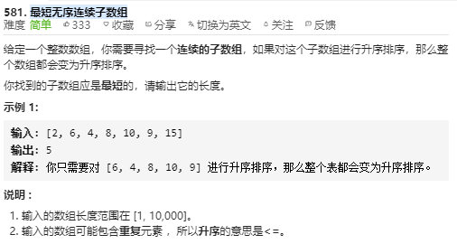

关键是只要左边有比我这边最小的还小，记录下这个最小的

左边有比我最小的要大，说明那个位置就是开始是乱序的，记录下那个位置

## 581 [最短无序连续子数组](https://leetcode-cn.com/problems/shortest-unsorted-continuous-subarray/)



**题目解读**：也就是数组中存在一部分不是有序的，是无序的，找到最短的无序的那部分长度

**解题方法**

### 数组排序法（复制排序对比）

将原数组复制一份（另外开辟了空间N），将复制的数组排序，然后将排序好的数组和原数组，进行左右开始分别对比，值出现不同时，记录位置，计算两者之间的距离即可

```java
class Solution:
    def findUnsortedSubarray(self, nums: List[int]) -> int:
        tmp = nums.copy()
        tmp.sort()
        l, r = 0, len(nums) - 1
        while l < len(nums) and nums[l] == tmp[l]:
            l += 1
        while r > l and nums[r] == tmp[r]:
            r -= 1
        return r - l + 1 
```

```javascript
var findUnsortedSubarray = function(nums) {
    let snums = nums.slice();
    snums.sort((a,b) => a - b);
    let start = nums.length,end = 0;
    for(let i = 0; i < nums.length; i++) {
        if(snums[i] !== nums[i]) {
            start = Math.min(start,i);
            end = Math.max(end,i);
        }
    }
    return end - start > 0 ? end - start + 1 : 0;
    //   细节，当不存在无序的情况下
};
```

**复杂度**：

time：O(NlogN)

space：O(N)

### [双向双指针（特殊，结合最大最小值）](https://leetcode-cn.com/problems/shortest-unsorted-continuous-subarray/solution/581-zui-duan-wu-xu-lian-xu-zi-shu-zu-by-ming-zhi-s/)

看到题目很容易想到使用双向指针，只要左右对比出现大小不是递增和递减就记录位置，计算长度，那么就会出现错误，在特殊情况下比如 [0,3,2,2,2,4],，如果按照之前的思路的话，计算出来的乱序最小距离是1，那么显然是错误的，乱序的长度应该是4

那么就要对双指针进行优化，使左指针来找到原本右指针该找到的右边界，而用右指针来找到原本左指针该找到的左边界，使用两个变量来记录大小，左指针移动时，将其与最大值进行对比，如果大于最大值，那么值符合升序，记录下这个最大值（max），如果小于最大值，那么说明这个位置就是乱序的，记录下这个位置为right，反之，右边指针移动，与最小值进行对比，如果小于最小值，那么这个值是降序的，将最小值记录下来（min），如果大于最小值，那么说明这个值存在问题，是乱序的，记录下他的位置为left，知道两个指针遍历完整个数组

```java
class Solution {
    public int findUnsortedSubarray(int[] nums) {
        int len = nums.length;
        int max = nums[0];
        int min = nums[len-1];
        int l = 0, r = -1;
        for(int i=0;i<len;i++){
            if(max>nums[i]){
                r = i;
            }else{
                max = nums[i];
            }
            if(min<nums[len-i-1]){
                l = len-i-1;
            }else{
                min = nums[len-i-1];
            }
        }
        return r-l+1;
    }
}
```

**复杂度**：

time：O(N)

space：O(N)

> 很好的解决了类似于 [1,3,2,2,2,4] 这样的特殊情况

