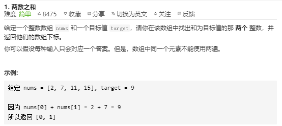
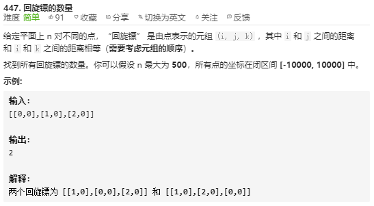
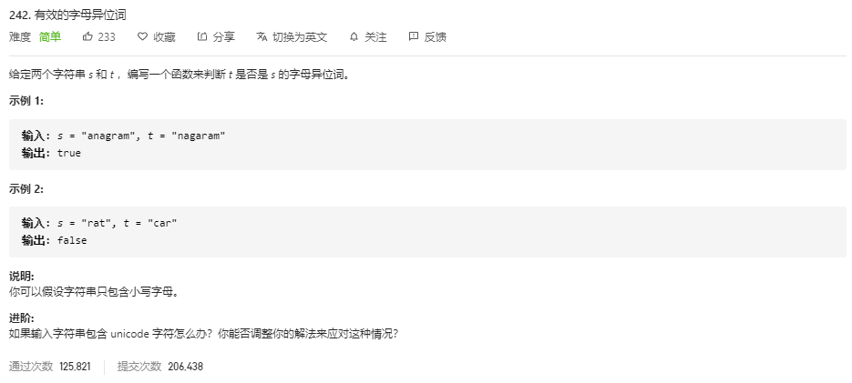
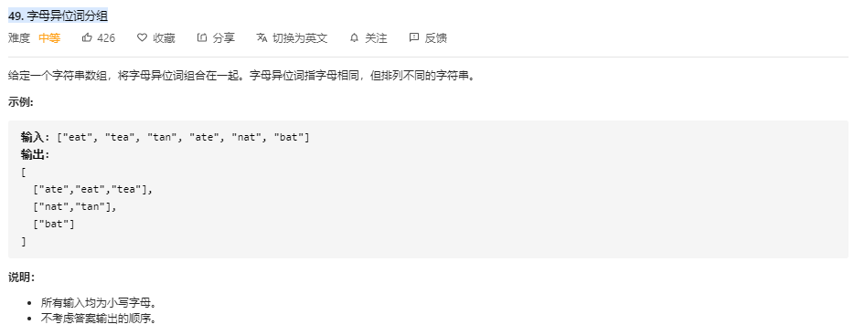

# 散列表（Hash Tab）

## 基础概念

**散列表用的是==数组支持按照下标随机访问数据的特性==，所以==散列表其实就是数组的一种扩展，由数组演化而来。可以说，如果没有数组，就没有散列表==。**

**索引等于要查询的关键字，如果要查询的关键字不是正规的非负整数，而是字符串或者较大的数值，那么需要一个散列函数先对要查询的关键字进行映射处理，将其转化为数组下标，而通过散列函数处理后的值称为散列值（哈希值）**

散列函数设计是重点，通过设计一种合理的映射函数，可以最大化的使用到数组内存，同时不影响查找效率，而关键的一点也是 **==如何把较大的数值或者字符串映射为一段较为连续的数组索引==**，无论如何设计哈希函数，在一定的内存空间，总会发生不同的查询值通过哈希函数映射后为相同的数组索引，而这个称为哈希冲突

### 哈希冲突两种解决方法

1. 开放寻址法
2. 链表法

#### 开放寻址法

开放寻址法又分为线性探测和平方探测，基本的原理都是在发生哈希冲突时，查找下一个空闲位置，将值存储在空闲位置上，那么在查找的时候，先通过哈希函数映射找到了哈希冲突的位置，**对比要查询的值和哈希冲突位置存储的值**，发现不相等，那么就按照线性的方式依次对比值或者平方的方式跳跃式的对比值，如果对比到，即查找成功，如果遇到下一个空闲位置，说明这个值不存在于这个哈希表中

删除哈希表中的数据，不能将数据置空，会影响到开放寻址法寻找元素，产生误查，可以设置为delete证明此处是后来删除的，不是在创建的时候就为空

开放寻址法的线性探测存在缺点，当哈希表中存储的数据越来越多，哈希冲突也越来越大，空闲位会越来越少，那么在查询一个值的时候，线性探测的时间会越来越久，极端下是O(n)，所以可以改为二次探测（不为线性探测，依次+1，+4，+9）和双重散列（两个散列函数，第一个转换如果冲突，使用第二个散列函数，函数转换的哈希值再从数组空间上存储对应的哈希位置上）的开放寻址法

开放寻址法无论使用哪种探测方式，在散列表的空闲位置不多的时候，散列冲突概率就会大大提高，所以在使用这种方式时，需要预留一定的空闲位限制，保证这种数据结构的高效性，用装载因子来表示空位的多少

> 散列表的装载因子 = 填入表中的元素个数 / 散列表的长度
>
> 装载因子越大，说明空闲位置越少，冲突越多，散列表的性能会下降。
>
> **当数据量比较小、装载因子小的时候，适合采用开放寻址法**

#### 链表法

依旧使用一定内存数组空间（散列表），在发生哈希冲突的时候，使用的是哈希冲突位置附属的链表，将冲突的数据依次连接存储到链表中，当查找、删除一个元素的时候，通过散列函数计算出对应的哈希位置，然后遍历链表进行查找或者删除。查询的时间复杂度跟链表的长度 k 成正比，也就是 O(k)。对于散列比较均匀的散列函数来说，理论上讲，k=n/m，其中 n 表示散列中数据的个数，m 表示散列表中“槽”的个数。

> 也就是说链表在解决哈希冲突上更容易理解，但是在进行查询的时候，极端情况下如果通过映射都存储在一个链表中，那么查询的时间也会退化为O(n)
>
> 链表因为要存储指针，所以对于比较小的对象的存储，是比较消耗内存的，还有可能会让内存的消耗翻倍。而且，因为链表中的结点是零散分 布在内存中的，不是连续的，所以对 CPU 缓存是不友好的，这方面对于执行效率也有一定 的影响。 当然，如果我们存储的是大对象，也就是说要存储的对象的大小远远大于一个指针的大小 （4 个字节或者 8 个字节），那链表中指针的内存消耗在大对象面前就可以忽略了。
>
> 对链表法稍加改造，可以实现一个更加高效的散列表。那就是将链表法 中的链表改造为其他高效的动态数据结构，比如跳表、红黑树。这样，即便出现散列冲突， 极端情况下，所有的数据都散列到同一个桶内，那最终退化成的散列表的查找时间也只不过 是 O(logn)。这样也就有效避免了前面讲到的散列碰撞攻击
>
> **基于链表的散列冲突处理方法比较适合存储大对象、大数据量的散列 表，而且，比起开放寻址法，它更加灵活，支持更多的优化策略，比如用红黑树代替链表。**

### 应用

单词输入，检验单词输入错误，提醒正确拼写，这个过程是如何高效的检索得知单词输入错误？，使用散列表，常用单词20万个，算平均每个单词10个字母，一个字母4字节，也就是20MB可以存储常用的单词，如何存储这些单词，并且高效的查询。使用散列表，也就是开辟一条20MB的数组空间，一个单词一个哈希位，查询时不会发生哈希冲突，所以时间复杂度为O(1)

> 在不发生哈希冲突的情况下散列表直接查询的时间复杂度 O(1)

散列表碰撞攻击的基本原理就是攻击者设计精良的数据，是所有数据都发送哈希冲突，从而使哈希表的查询效率下降为O(n)，当数据量十分大的时候，导致查询时间退化非常大，导致线程资源和CPU过分占用，系统无法响应

### 算法层面

**散列表这种数据结构虽然支持非常高效的数据插入、删除、查找操作，（主要是他的查询操作是 O(1)，所以插入删除查询时间复杂度都为O(1)）**，但是散列表中的数据都是通过散列函数打乱之后无规律存储的。也就说，它**无法支持按照某种顺序快速地遍历数据。如果希望按照顺序遍历散列表中的数据，那我们需要将散列表中的数据拷贝到数组中， 然后排序，再遍历**。 因为散列表是动态数据结构，不停地有数据的插入、删除，所以每当我们希望按顺序遍历散 列表中的数据的时候，都需要先排序，那效率势必会很低。**为了解决这个问题，我们将散列表和链表（或者跳表）结合在一起使用。**

> **==链表这种数据结构最大的缺点就是 查询效率非常低为 O(n)，一般情况下结合 散列表来使用 （散列表的查询复杂度为 O(1)），两种数据结构结合使用在实际应用中非常常见==**，比如说 LRU缓存淘汰算法

算法中常用的是哈希函数 有 **ASII码对比字符的映射关系**

## 哈希函数相关

### 如何设计哈希函数

**散列函数设计的好坏，决定了散列表冲突的概率大小，也直接决定了散列表的性能。**

散列函数的设计不能太复杂。过于复杂的散列函数，势必会消耗很多计算时间，也就 间接的影响到散列表的性能。其次，散列函数生成的值要尽可能随机并且均匀分布，这样才 能避免或者最小化散列冲突，而且即便出现冲突，散列到每个槽里的数据也会比较平均，不 会出现某个槽内数据特别多的情况。

### **装载因子过大或者过小**

装载因子过大的话，表示散列表中存储的数据量过多，容易产生哈希冲突，那么时间复杂度就会下降。可以通过动态扩容的方法来解决这问题，当数据量的占比达到一定的阈值时，启动动态扩容机制，比如说存储内存空间翻一倍，但是同样带来的问题是 需要重新计算每个数据对应的散列表中的位置，均摊复杂度分析下为 O(1) ，也就是在 达到阈值时，复杂度为 O(n)

如果系统对内存空间比较敏感的话，那么装载因子过小的话也会可以动态缩减存储空间

> 在达到阈值时才进行数据量的计算和搬迁的话势必会带来时间上的延迟，所以在当达到阈值时将新存的数据直接存储到新的内存空间内，然后在慢慢的同时搬迁旧内存中的数据。发生查找问题时先在新内存中查找，再到旧内存中查找

## 哈希算法

哈希算法的定义和原理非常简单，**将任意长度的二进制值串映 射为固定长度的二进制值串，这个映射的规则就是哈希算法，而通过原始数据映射之后得到的二进制值串就是哈希值**

**要想设计一个优秀的哈希算法并不容易，数据结构算法层面上设计的哈希函数相对来说简单一点，重要的关注哈希冲突问题**

> 一个优秀的哈希算法的基本要求：
>
> 1. 从哈希值不能反向推导出原始数据（所以哈希算法也叫单向哈希算法）； 
> 2. 对输入数据非常敏感，哪怕原始数据只修改了一个 Bit，最后得到的哈希值也大不相同； 
> 3. 散列冲突的概率要很小，对于不同的原始数据，哈希值相同的概率非常小； 
> 4. 哈希算法的执行效率要尽量高效，针对较长的文本，也能快速地计算出哈希值。

哈希算法再实际中的应用问题（密码加密，数据校验等） ： 访问链接文件

# 题目集合

## 1 两数之和



**哈希表**

起初不是创建的一个空表吗？通过遍历第一遍，就算存在差值，那么差值也在后面，还未设定在表中，那么循环又只有一次，为啥是对的？？

**复杂度分析**：

哈希表就是典型的空间换时间，在哈希表中查询均摊是 O （1）

时间复杂度： O （n）

空间复杂度： O （n）

```JavaScript
var twoSum = function(nums, target) {
    let map = new Map ()
    for (let i = 0; i < nums.length; i++) {
        const res = target - nums[i]
        if (map.has(res)) {
            return [map.get(res),i]
        }else{
            map.set(nums[i],i)
        }
    }
}
```

```JavaScript
var twoSum = function(nums, target) {
    let res = {}
    for (let i = 0; i < nums.length; i++) { // 每个人报出自己想要配对的人
        if (res[nums[i]] !== undefined) { // 如果有人被登记过
            return [nums[i], res[nums[i]]] // 就是他
        } else {  // 否则
            res[target - nums[i]] = nums[i] // 主持人记住他的需求
        }
    }
}
```

JS中创建哈希表（HashMap）

```JavaScript
const NewValueMap = (nums) => {
    const valMap = new Map ()
    nums.forEach((item, index) => {
        valMap.set(item,index)
    })
    return valMap
}
```

Java版哈希表

O(n)；O(n)

```java
class Solution {
    public int[] twoSum(int[] nums, int target) {
        Map<Integer, Integer> map = new HashMap<>();
        for (int i = 0; i < nums.length; i++) {
            map.put(nums[i], i);
        }
        for (int i = 0; i < nums.length; i++) {
            int complement = target - nums[i];
            if (map.containsKey(complement) && map.get(complement) != i) {
                return new int[] { i, map.get(complement) };
            }
        }
        throw new IllegalArgumentException("No two sum solution");
    }
}
```

**暴力解题**

两次遍历，寻找差值，符合返回

**复杂度分析**：

时间复杂度：两遍遍历 O(n*n)

空间复杂度： O(1)

```JavaScript
/**
 * @param {number[]} nums
 * @param {number} target
 * @return {number[]}
 */
var twoSum = function(nums, target) {
	for (let i = 0; i < nums.length; i++) {
        let dis = target - nums[i]
        for(let j = i+1; j < nums.length; j++) {
        	if (dis == nums[j]){
                return [i,j]
            }
        }
    }    
};
```

JS特点解法

使用原生API，indexof查找，存在即返回的是其值所在的索引

从pop出来，防止重复使用，如果从前面开始pop，会影响到后续的索引值,注意输出的是nums.length，因为已经pop出来本身了

```JavaScript
var twoSum = function(nums, target) {
    while (nums.length){
		let last = nums.pop()
    	let dis = target - last
        if ( nums.indexOf(dis) > -1 ) {
            return [nums.indexof(dis),nums.length]
        }
	}
}
```

## 447 回旋镖的数量



分析题目：大概的意思是，假如确定了一个点 i ，那么点 j 和 点 K 到点 i  的距离是相等的，这样就满足为一个回旋镖

整体思路一：（运用到哈希表），先拿出一个点，确定为点 i（一级循环） , 然后再循环其中的一个点 j (二级循环)，前提是这个点不能是与点 i 是一个点（题目中有要求到），计算出两点之间的距离，将距离存储起来，继续比较点 i 与剩余点的距离（还是二级循环），计算出距离，存储起来，现查看存在多少个距离相等的点（因为在不同方向，距离相同，存在无数个点），如果存在N个，那么可以根据数学知识，可以组建出 n*n-1 个组合点，也就是回旋镖的个数。

那么如何将距离保存起来，并且方便查询，方便查找和修改相同距离的个数 =》使用到哈希表用来存储 满足

时间复杂 O(n^2^+hashmap.length),空间复杂：O（hashmap.length）

```java
class Solution {
    public int numberOfBoomerangs(int[][] points) {
        // 回旋镖个数，初始化为0
        int count = 0;    
        for(int i=0; i<points.length; i++)
        {
            
            Map<Integer,Integer> map = new HashMap();
            for(int j=0; j<points.length; j++)
            {
                if(i != j)
                {
                    // 计算平方和 （i的X轴的值 - j的x轴的值）平方 + （i的y轴的值 - j的y轴的值）平方 +  
                    int dis = (points[i][0] - points[j][0]) * (points[i][0] - points[j][0]) + (points[i][1] - points[j][1]) * (points[i][1] - points[j][1]);
                    // 直接存入距离的平方即可
                    map.put(dis,map.getOrDefault(dis,0)+1);
                }
            }
            for(int key : map.keySet()){
                count += map.get(key) * (map.get(key) - 1);
            }
        }
    

        return count;
    }
}
```

JavaScript版本

```JavaScript
自己编写运行错误的版本
var numberOfBoomerangs = function(points) {
    let dis = 0
    for(var i=0;i<points.length;i++){
        for(var j=0;j<points.length;j++)
            var map = new Map ()
            if(j != i){
                dis = (points[i][0] - points[j][0]) * (points[i][0] - points[j][0]) + (points[i][1] - points[j][1]) * (points[i][1] - points[j][1]);
                if (map[dis] != 0) map[dis]++
                else map[dis]=1
            }
            map.forEach((index,key)=>{
                count += key * key-1 
            })
    }
};

正确版本：
var numberOfBoomerangs = function(points) {
	let res = 0
    for(let i=0;i<points.length;i++){
        const map = {}
        for(let j=0;j<points.length;j++){
            if(i != j){
                 dis = (points[i][0] - points[j][0]) * (points[i][0] - points[j][0]) + (points[i][1] - points[j][1]) * (points[i][1] - points[j][1]);
                // const dis = Math.pow(points[i][0] - points[j][0], 2) + Math.pow(points[i][1] - points[j][1], 2)
            }
            map[dis] = map[dis] === undefined ? 1 : map[dis]+1
        }
        for (let key in map){
            res += map[key] * map[key]-1
        }
    }
    return res
}
```

暴力版本：
三个for循环，计算每个 i 到 j ,i 到 k 的循环的距离，如果距离相等，那么回旋镖数量加一

时间复杂度：O（n^3^）,空间 O（1）

```java
public int numberOfBoomerangs(int[][] points) {

    if (points == null || points.length <= 2)
        return 0;

    int res = 0;
    
    for (int i = 0; i < points.length; i++) {

        for (int j = 0; j < points.length; j++) {

            if (i == j)
                continue;

            for (int k = 0; k < points.length; k++) {
                
                if (k == i || k == j)
                    continue;

                if (getDistance(points[i], points[j]) == getDistance(points[i], points[k]))
                    res++;
            }
        }
    }

    return res;   
}

private int getDistance(int[] x, int[] y) {

    int x1 = y[0] - x[0];
    int y1 = y[1] - x[1];

    return x1 * x1 + y1 * y1;
}
```

## [242. 有效的字母异位词](https://leetcode-cn.com/problems/valid-anagram/)



**暴力排序法**

```js
var isAnagram = function(s, t) {
     if(s.length != t.length) return false;
     return  s.split('').sort().join('') == t.split('').sort().join('');
 }
```

### **总结**

想要将字符串排序好又转化为字符串的常用方法 `string.split('').sort().join('')`

字符串无法直接排序，只有转化为数组才可以使用排序函数 sort()

字符串转换为数组常用 API `split('')` ， 数组转化为字符串常用 API `join('')`

**哈希表**

```js
var isAnagram = function(s, t) {
	if (s.length != t.length) return false

    let hash = Array(26).fill(0)
    for (let i = 0; i < s.length; i++) {
        hash[s[i].charCodeAt() - 'a'.charCodeAt()]++
        hash[t[i].charCodeAt() - 'a'.charCodeAt()]--
    } 

    for (let value of hash) {
        if (value !== 0) {
            return false
        }
    }
    return true
};
```

因为数据量不大，且字符范围在 a-z 之间，所以可以使用 ASII码与字符之间的映射关系作为 哈希函数，使用哈希表来解决这一问题，因为 a-z 只有 26 个字符 ，所以开辟一个大小为26的数组，（根本不会产生哈希冲突），遍历字符串每个字符，每当遍历到一个字符，将字符对应的哈希位存储的值加一，同时也查询另外一个字符串中的同等位上的字符，查询到，将对应的哈希值存储的数值减一，最后再遍历哈希数组，如果有数不等于 0 ，说明字母肯定存在不同的字符（因为两个字符串长度是一样的） 

## [49. 字母异位词分组](https://leetcode-cn.com/problems/group-anagrams/)




**哈希算法---质数映射**

用质数表示26个字母，把字符串的各个字母相乘，这样可保证字母异位词的乘积必定是相等的。同时又由于每个字母都是对应质数，不同的字母组合相乘一定不会产生哈希冲突

> **但是存在弊端，因为是相乘计算，同时就算从最小质数  2 开始映射，到 z 映射也会映射到 101 ，在字符串很长的情况下，最终的乘积很容易导致溢出**
>
> **思路可以借鉴，通过用质数在映射，不会产生哈希冲突**

```JS
var groupAnagrams = function(strs) {
    let map = {
        'a':2,'b':3,'c':5,'d':7,'e':11,'f':13,'g':17,'h':19,'i':23,'j':29,'k':31,'l':37,'m':41,
        'n':43,'o':47,'p':53,'q':59,'r':61,'s':67,'t':71,'u':73,'v':79,'w':83,'x':89,'y':97,'z':101
    }
    let resMap = {};
    let resList = [];
    for(let str of strs) {
        let m = 1;
        for(let i=0;i<str.length;i++) {
            m*=map[str[i]];
        }
        if(!resMap[m]) {resMap[m]=[];}
        resMap[m].push(str);
    }
    for(let key in resMap) {
        resList.push(resMap[key]);
    }
    return resList;
};
```

### 总结（关于JS map的使用）

1. 可以先利用 map 这种数据结构初始化数据，比如 存储映射关系，当要查询映射关系时，可以直接访问（特别的可以存储关于非数值类型（字符）的映射关系，并且为无序性）
2. 访问 map中的数据 `map[keyname]` ，如果存储了多个，那么就返回多个，存储数据进入 map 中的某个 key  中 `map[keyname].push(newValue)` 
3. 将 map 中的数据转换为 数组存储（通常是二维数组，也很好的解决了JS二维数组创建和初始化的麻烦问题） `for(let key in map) { arr.push(res.push(map[key]))}`

以上三种方法虽然解决了问题，但是似乎不太标准，如果是JS语言的话还是建议使用封装好的 API 来操作，如下个解法。


**哈希函数通常都是用 map 这种数据结构来存储，如果是 映射关系的两方都是 数值 ，原始值如果过大可以通过某种规律将其数值缩小，并且转化为与数组索引同等级的数值，比如说只取原始值的后三位，也可以通过相除相余等多种方法将原始值转化为与数组索引同等级的数值，那么我们就可以用 数组这中结构充当 哈希表来存储数据 。但是大部分情况下都是使用 map 这种对象类型来充当哈希表。为什么呢？**

**map 这种数据类型，可以不用初始化大小，并且非常适合存储 关于 字符的映射关系，而大部分哈希算法都是来处理字符串相关的问题，另外 Map 这种数据结构内部也封装了许多API，访问以及操作起来非常方便** 

> **基本使用方法**：
>
> 1. Map.get(key) : 获得keyName对应值
> 2. Map.has(key) : 检测key是否存在
> 3. Map.set(key,value) : 为 key 设置值 value
> 4. Map.values() : 返回的是一个 Iteration 对象
>
> MDN 详细介绍 ：[Map](https://developer.mozilla.org/zh-CN/docs/Web/JavaScript/Reference/Global_Objects/Map)

**哈希算法---排序后字符串映射**

```js
var groupAnagrams = function(strs) { 
	// let hash = {}
    let hash = new Map()
    
    for(let i = 0; i < strs.length; i++) {
		let hashValue = strs[i].split('').sort().join('') 	// 排序字符串
        
        if (hash.has(hashValue)) {
            let temp = hash.get(hashValue)
            temp.push(strs[i])
            hash.set(hashValue, temp)
        } else {
            hash.set(hashValue, [strs[i]])
        }
    }
    return [...hash.values()]		//返回的也是一个二维数组的形式，只不过是 Iteration 形式
}
```

**此解法是以 排序后的字符串作为哈希值，根据了题目的特点来设定的，因为异位字符串排序后的字符串是一样的 ，那么通过这个作为哈希值来进行归类，这个算法设计到了 Map 这种数据结构的基本API用法，可以多多看几遍**


## 347. 前 K 个高频元素

