# 数组

## 基础概念

数组的定义：数 组（Array）是一种线性表数据结构。它用一组连续的内存空间，来存储一组具有相同类型的数据。

JavaScript是动态语言，数组可以存储不同类型的数据，数组可以保存不同类型的值，这是因为其内部做了处理。对于 V8 引擎来说， 它将数据类型分为基本类型和引用类型，**基本类型直接存储值在栈上，而引用类型存储指针在栈上**，真正的内容存到堆上。因此不同的数据类型也可以保持同样的长度。

为什么静态语言要求存储同样类型的数据类型？为了支持随机访问，可以用**基址 + 偏移量**来定位任意一个元素

### 线性表

> 线性表：数据像排成一条线一样的结构，每个线性表上的数据只有前和后两个方向，除了数组，链表、栈、队列都是线性表结构
>
> 非线性表：二叉树、堆、图等。之所以叫非线性，是因为，在非线性表中，数据之间并不是简单的前后关系。

#### **连续的内存空间和相同类型的数据**

> 连续的内存空间和相同类型的数据，正是因为这个特点而对应出了 随机访问 的特性。同时也因为这个特点带来弊端，因为要保持连续性，不便于插入和删除
>
> **在进行随机访问时，由于是连续的内容空间，同时数据类型相同（每个数据大小也是相同的），那么在进行随机访问时，就非常方便，可以利用计算公式来访问`a[k]_address = base_address + (k-1)*type_size`**
>
> **所以数组这种结构，适用于数据已经确定好了，后续不用修改，仅用来快速查询的**

> **注意！！：**
>
> 我们常说  **数组适合查找，查找时间复杂度为 O(1)**，这种表述是不准确的。数组是适合查找操作，但是查找的时间复杂度并不为 O(1)。即便是排好序的数组，你用二分查找，时间复杂度也是 O(logn)。所以，正确的表 述应该是，**数组支持随机访问，==根据下标随机访问==的时间复杂度为 O(1)。而哈希表查询是O(1)**

#### **关于数组插入操作的相关问题**

数组中插入是不方便的，但是我们需要仔细的来分析一下，假设在数组中插入数据，数组大小为 n ，数据在数组每个位置插入的概率都是相同的，最坏插入的时间复杂度为 O(n) （即最后一位），**平均复杂度为  (1+2+ …n)/n=O(n)**。所以数组中插入数据总体效果不是很好

如果我们只是把数组当做一个存储数据的集合，无序，那么在想要插入的位置插入数据，可以先将在这个位置的数据移动到最后一位，然后再将数据插入到这个位置，时间复杂度也为 O(1），这在快速排序中有使用到这个思想

如果非要在数组中删除一个元素话，那么也不能直接删除这个元素，只有将数组的最后一个元素的值覆盖掉要删除的元素，然后删除掉最后一个元素，从而实现删除的效果，无论什么语言，在数组这种结构中，使用内置方法直接删除某个元素都是会将数组的进行重新排序，性能不好，最好的方式就是数组仅仅用来查询值，而不进行修改

#### **关于数组删除操作的相关问题**

和插入类似，如果删除数组末尾的数据，则最好情况时间复杂度为 O(1)；如果删除开头的 数据，则最坏情况时间复杂度为 O(n)；**平均情况时间复杂度也为 O(n)。**

实际上，在某些特殊场景下，我们并不一定非得追求数组中数据的连续性。如果我们**将多次 删除操作 集中在一起执行**，删除的效率会提高很多，我们可以先记录下已经删除的数据。 每次的删除操作并不是真正地搬移数据，只是记录数据已经被删除。当数组没有更多空间存储数据时，我们再触发执行一次真正的删除操作，这样就大大减少了删除操作导致的数据搬移。 **这也是JVM 标记清除垃圾回收算法的核心思想**

#### **数组编号为什么不从1开始而从0开始**

为什么大多数编程语言中，数组要从 0 开始编号，而不是从 1 开始呢？

**从CPU执行指令的效率上来看**

从数组存储的内存模型上来看，“下标”最确切的定义应该是“偏移（offset）”，如果用 a 来表示数组的首地址，a[0] 就是偏移为 0 的位置，也就是首地址，a[k] 就 表示偏移 k 个 type_size 的位置，所以计算 a[k] 的内存地址只需要用这个公式：

`a[k]_address = base_address + k * type_size`

但是，如果数组从 1 开始计数，那我们计算数组元素 a[k] 的内存地址就会变为：

`a[k]_address = base_address + (k-1)*type_size`

对比两个公式，我们不难发现，从 1 开始编号，**每次随机访问数组元素都多了一次减法运算，对于 CPU 来说，就是多了一次减法指令**。 数组作为非常基础的数据结构，通过下标随机访问数组元素又是其非常基础的编程操作，效率的优化就要尽可能做到极致。所以为了减少一次减法操作，数组选择了从 0 开始编号， 而不是从 1 开始。

**从历史原因来看**

C 语言设计者用 0 开始计数数组下标，之后的 Java、JavaScript 等高级语言都**效仿了 C 语言**，或者说，为了在一定程度上减少 C 语言程序员学习 Java 的学习成本，因此继续沿用了 从 0 开始计数的习惯。实际上，很多语言中数组也并不是从 0 开始计数的，比如 Matlab。甚至还有一些语言支持负数下标，比如 Python。

> 二维数组访问的地址计算公式（假设二维数组的维度为m * n）：
>
> `a[i][j]_address = base_address + (i * n + j) * type_size`

## 基础操作

### 数组

|                数组                 |             Java（ArrayList）              |                 JS                  |
| :---------------------------------: | :----------------------------------------: | :---------------------------------: |
|          修改指定位置的值           |             set(index，value)              |         arr[index] = value          |
|       在指定位置添加值(插入)        |              add(index,value)              |           splice(),fill()           |
|            访问指定元素             |                 get(index)                 |             arr[index]              |
|              删除元素               |               remove(index)                |              splice()               |
|              计算大小               |                   size()                   |             arr.length              |
|          特定位置添加元素           |                     无                     |          push()、unshift()          |
|          特定位置删除元素           |                     无                     |           pop()、shift()            |
|         检测是否存在这个数          | contains(),indexOf(),Arrays.binarySearch() | indexOf(),includes(),some(),find()  |
|              复制数组               |    Arrays.copyOf(),Arrays.copyOfRange()    |               slice()               |
|                排序                 |              Arrays.sort(arr)              |          reverse(),sort()           |
|           数组之间的组合            |             System.arraycopy()             |          concat(),splice()          |
|          数组转化为字符串           |                                            |              join("")               |
|                                     |                                            |                                     |
|              遍历数组               |                for-Each(:)                 |   forEach(),map(),for...of('of')    |
|           判断是否为数组            |                 isArray()                  |              isArray()              |
|          检测各个数组元素           |                                            |           every(),some()            |
|              过滤元素               |                                            |              filter()               |
|          查询元素值的索引           |                                            | indexOf(),lastIndexOf(),findIndex() |
|        将其他类型转化为数组         |                                            | from(arrayLike[, mapFn[, thisArg])  |
|      返回 Array Iterator 对象       |                                            |      keys(),entries(),values()      |
|                正常                 |                     .                      |                                     |
| ArrayList String 类型转换为str数组  |     arrList.toArray(new String[size])      |                                     |
| ArrayList Integer 类型转换为int数组 |              for循环遍历赋值               |                                     |
|       数组转换为集合ArrayList       |             Arrays.asList(arr)             |                                     |
|                                     |                                            |                                     |
|                                     |                                            |                                     |
|                                     |                                            |                                     |

### 哈希表

|       哈希表       |           Java           |                JS                 |
| :----------------: | :----------------------: | :-------------------------------: |
| 检测是否存在某个值 |   map.contains(value)    |              值做key              |
|     添加键值对     |    map.put(key,value)    |        map.set(key, value)        |
|      访问元素      |       map.get(key)       |        map[]，map.get(key)        |
|     删除键值对     |     map.remove(key)      |          map.delete(key)          |
|    修改某键值对    |  map.replace(key,value)  |        map.set(key, value)        |
|  检测是否存在 key  |   map.containsKey(key)   |           map.has(key)            |
| 检测是否存在 value | map.containsValue(value) |              值做key              |
|     清除哈希表     |       map.clear()        |            map.clear()            |
|  计算哈希表的大小  |        map.size()        |             map.size              |
|      遍历键名      |       map.keySet()       | map.keys() (Iterator对象),key..in |
|      遍历键值      |       map.values()       |    map.values() (Iterator对象)    |
|   返回可迭代对象   |                          |           map.entries()           |
|    遍历 map 表     |         for-Each         |      map.forEach(callback())      |
|    检测是否为空    |      map.isEmpty()       |                                   |
| 将对象转换为哈希表 |                          |   new Map(Object.entries(obj))    |
|                    |                          |                                   |
|                    |                          |                                   |
|                    |                          |                                   |
|                    |                          |                                   |

> 对象与Map不同，对象可以像数组一样下标访问，Map不行

[关于 对象 与 HashMap 的区别](https://developer.mozilla.org/zh-CN/docs/Web/JavaScript/Reference/Global_Objects/Map)


### 字符串

|         字符串         |               Java                |                     JS                      |
| :--------------------: | :-------------------------------: | :-----------------------------------------: |
|     获取字符串长度     |           str.length()            |                 str.length                  |
|       截取字符串       |     str.substring(start,end)      |  substring(s,t)，substr(s,length)，slice()  |
|   判断字符串是否相等   |            equals(str)            |               str.equals(str)               |
|  获取字符串中某个字符  |      charAt()，charCodeAt()       |   str[index]，str.charAt()，charCodeAt()    |
|    字符（串）的查找    | indexOf(String s)，lastIndexOf()  | indexOf()，lastIndexOf()，search()，match() |
|      字符串的修改      |        replace(oldS,newS)         |           replace()，replaceAll()           |
|    字符串大小写切换    |   toLowerCase()，toUpperCase()    |        toLowerCase()，toUpperCase()         |
|  字符串转换为字符数组  |           str.split('')           |                str.split('')                |
| 将字符数组转换为字符串 | new String(char[])，toCharArray() |                                             |
|      去掉首尾空格      |              trim()               |                   trim()                    |
|     判断字符串开头     |     startsWith(String prefix)     |               startsWith(str)               |
|     判断字符串结尾     |      endsWith(String suffix)      |                endsWith(str)                |
|    判断是否存在子串    |    contains(str)，indexOf(str)    |                includes(str)                |
|   判断字符串是否为空   |             isEmpty()             |                                             |
|      字符串的连接      |                                   |              str.concat(str2)               |
|                        |                                   |       JS 字符串方法拥有许多数组的方法       |
|    判断两个字符是否    |                ==                 |                     ===                     |

## 基础操作实例

**创建数组**

```JS
1.创建一个规定大小的数组
  let arr = new Array(30) 	// 值都为undefined

2.常规字面量建法
  let arr = [1,2,3,55]

3.Array.of()   // ES6 方法	数组创建，将参数中所有值作为元素形成数组，如果参数为空，则返回一个空数组。
  Array.of(1, 2, 3, 4); 		// [1, 2, 3, 4] 

4.Array(arr.length).fill(0)
```

```Java
1.声明
  int[] arr
  String[][] str = new String[3][4]

2.初始化
  int[] arr = new int[] {1,2,3,4,5}
  int[] arr = {1,2,3,4}
  int[][]	arr = new int[][] {{1},{2,3},{4},{4,5,6}}

3.多维数组
  int intArray[][] = new int[4][]; //先初始化高维数组为4
  // 逐一初始化低维数组
  intArray[0] = new int[2];
  intArray[1] = new int[1];
  intArray[2] = new int[3];
  intArray[3] = new int[3];

4.创建 ArrayList 对象
  // 一维 数组
  ArrayList<Integer> arr = new ArrayList()
  
  // 二维 数组
  
  List<List<Integer>> arr2 = new ArrayList()
 
  // 动态创建
  new ArrayList<Integer>(Arrays.asList(nums[k], nums[i], nums[j]))
```

JS 可以 通过 arr.length 来动态设定 数组长度， 多余的用 undefined 填充

```JS
arr.length = 5
```

**数组值的删除**

```JS
pop()
let lastValue = arr.pop()  // 删除的数组最后一位值，并且返回这个值
```

```JS
shift()
let fitstValue = arr.shift() 	// 删除数组的第一位值，并且返回这个值
```

**添加值到数组**

```JS
push()
let addValue = arr.push(6)	// 	添加值到数组的最后一位，返回数组长度
```

```JS
unshfit()
let addFirst = arr.unshift(12) // 添加值到数组第一位，返回数组长度
```

**综合操作 splice**

可以实现 数组元素的删除 和 数组元素的添加，默认是以删除为目的

```JS
splice(start[, deleteCount[, item1[, item2[, ...]]]])
// 三个参数：数组的起始位，删除的数组元素的个数，要添加的元素 ，第一个为必须，其他两个可省略
// 返回值：有删除的元素，返回删除的值的组成的数组，没删除的元素，返回空数组

实现数组元素的添加 arr.splice(添加的起始位，0，要添加的数组元素)
arr.splice(0,0,1,2,3,4)			// 添加（插入）元素 1 2 3 4 到数组的第一位

实现数组元素的删除
arr.splice(2,5) 						// 从索引为 2 的起始位开始，删除后面的五个元素 ，返回删除元素组成的元素

实现数组元素的删除与添加 
arr.splice(2,5,9,9,9)			// 先删除五个元素后，添加9，9，9
```

**数组的复制**

```JS
1.slice(start.end) 			// 复制数组，返回新数组，不改变原数组
arr.slice(1,3)				// 从索引值为 1 的元素开始复制（包含1对应的元素），到索引值为 3 的元素截止（不包含3对应的元素）
```

```java
1.Arrays.copyOf() 和 Arrays.copyOfRange
  int[] array = new int[]{3,7,8,2,1,9};
  array2 = Arrays.copyOf(array,3); //新数组的长度为3
  array3 = Arrays.copyOfRange(array,3,5); //复制第三到五个元素

2. System.arrayCopy(Object src,int srcPos,Object dest,int destPos,int length)
    参数：
    src - 源数组。
    srcPos - 源数组中的起始位置。
    dest - 目标数组。
    destPos - 目的地数据中的起始位置。
    length - 要复制的源数组元素的数量。
```

**数组的排序**

```JS
1.reverse()			// 倒置数组，对原数组产生影响，返回一个颠倒后的数组
arr.reverse()


TODO？？？？？
2.sort()			//  按照想要的方式进行排序，改变原数组，由于它取决于具体实现，因此无法保证排序的时间和空间复杂性。
默认没有参数时 arr.sort()	// 按照ASCII码的大小进行排序
接受一个回调函数作为参数，如果返回值为正数的话，按照由小到大的排序，返回为负值，按照由大到小的排序
a.sort(function(a,b)=>{return a - b})			// 按照由小到大的排序
a.sort(function(a,b)=>{return b - a})			// 按照由大到小的排序 
```

```java
1.Arrays.sort()
  int[] array = new int[]{3,7,8,2,1,9};
  Arrays.sort(array);    //全排序
  Arrays.sort(array,2,5);    //2到5排序

2.Arrays.sort(arr, Collections.reverseOrder());  // 倒序排序
	Integer[] ew = { 9, 8, 7, 2, 3, 4, 1, 0, 6, 5 };  // 使用这种方法  数组必须是包装类型
	Arrays.sort(ew, Collections.reverseOrder());  // 倒序排序
```

**数组的元素截取**

```JS
1.slice()					// 分割 指定起始位 与 终止位的数组元素 ，返回一个新的数组
arr.slice(stratIndex,endIndex)
```

**数组之间的组合**

```JS
1.concat()				// 	组合数组，将两个数组组合为一个数组，参数为需要组合的数组，返回一个新数组
arr1.concat(arr2)
```

**将数组转化为字符串**

```JS
join()				// 将数组元素组合为字符串 ,	有参转换和无参转换
let arr = [1,2,3,4,5]

let StringValue = arr.join() 				// "1,2,3,4,5"

let StringValue2 = arr.join() 			//	"12345"
```

**将数组转换为集合**

```java
1.Array.asList()
  List<List<Integer>> res = new ArrayList<>();
  res.add(new ArrayList<Integer>(Arrays.asList(nums[k], nums[i], nums[j])));
```

**遍历数组**

```JS
1.forEach(callback(currentValue [, index [, array]])[, thisArg])			
	// forEach() 方法对数组的每个元素执行一次给定的函数。不会对原数组进行改变，方法返回的是undefined
  // 参数为 一个回调函数和 一个当执行回调函数 callback 时，用作 this 的值（）可省略。
  // 回调函数为必须，参数current为遍历的当前元素的值，index为当前数组元素的索引，array为遍历的这个数组对象本身

  // forEach 方法主要为遍历数组元素，读取数组元素的值做读取操作，方法返回的是undefined，原理上不会对原数组的值进行改变，所以重点在与遍历读取数组元素
  let NumberArr = [1,2,3,4,5]
  let sum = 0

  NumberArr.forEach(element => {
        sum += element
  }

2.map(callback(currentValue [, index [, array]])[, thisArg]) 
	//  参数与 forEach() 方法是一样的，与此方法的重要区别在于会返回新的数组，不会修改原数组，
  // 因为map生成一个新数组，当你不打算使用返回的新数组却使用map是违背设计初衷的，请用forEach或者for-of替代


3.for....of 语句
  // for...of语句在可迭代对象（包括 Array，Map，Set，String，TypedArray，arguments 对象等等）上创建一个迭代循环
  // 与 forEach方法功能类型，主要也是做读取操作
  const array1 = ['a', 'b', 'c'];

  for (const element of array1) {
    console.log(element);
  }
```

```java
1.for 循环		// 确定执行次数时使用
  
2.for-Each		// 遍历数组和集合
 
  for(元素类型t 元素变量x : 遍历对象obj) {
        引用了x的java语句
  }

  // 遍历一维数组
  int[] arr = {1,2,4,5,6}
  for (int element : arr) {
    sout(element)
  }

  // 遍历二维数组
  int[][] arr = {{1,2},{2,2},{4,5,6,7}};
  for(int[] row : arr) {
    for(int element : row) {
      sout(element)
    }
  }

3.Arrays.toString(arr)
  // 将一维数组转化为字符串形式输出
  int[] arr = {1,2,4,5,6}		// [1,2,3,4,5]
```

**判断一个数据是否为数组**

```JS
isArray()

Array.isArray(arr)					// 返回布尔值
```

**检测数组各个元素的值**

```Js 
every(callback(element[, index[, array]])[, thisArg])  // every() 方法测试一个数组内的所有元素是否都能通过某个指定函数的测试。它返回一个布尔值。
// 参数形式与forEach方法相似，都是回调函数和一个thisArg

// 检测数组中的所有元素是否都大于 10
function isBigEnough(element, index, array) {
  return element >= 10;
}
[12, 5, 8, 130, 44].every(isBigEnough);   // false
[12, 54, 18, 130, 44].every(isBigEnough); // true


some(callback(element[, index[, array]])[, thisArg])		// some() 方法测试数组中是不是至少有1个元素通过了被提供的函数测试。它返回的是一个Boolean类型的值。
// 参数形式与forEach方法相似，都是回调函数和一个thisArg

function isBiggerThan10(element, index, array) {
  return element > 10;
}

[2, 5, 8, 1, 4].some(isBiggerThan10);  // false
[12, 5, 8, 1, 4].some(isBiggerThan10); // true
```

**判断数组是否存在某个值**

（查询首个满足某个条件的元素值）

```JS
includes(valueToFind[, fromIndex)		// 参数为要查询的元素 与 起始查询的位置，返回布尔值
[1, 2, 3].includes(2)					// true


some()		// some() 方法测试数组中是不是至少有1个元素通过了被提供的函数测试。它返回的是一个Boolean类型的值。

var fruits = ['apple', 'banana', 'mango', 'guava'];

function checkAvailability(arr, val) {
  return arr.some(arrVal => val === arrVal);
}

checkAvailability(fruits, 'kela');   // false
checkAvailability(fruits, 'banana'); // true


find(callback[, thisArg])		//  方法返回数组中满足提供的测试函数的第一个元素的值。否则返回 undefined。与forEach方法参数形式相同

// 用对象的属性查找数组里的对象
var inventory = [
    {name: 'apples', quantity: 2},
    {name: 'bananas', quantity: 0},
    {name: 'cherries', quantity: 5}
];

function findCherries(fruit) {
    return fruit.name === 'cherries';
}

console.log(inventory.find(findCherries)); // { name: 'cherries', quantity: 5 }
```

```java
1.Arrays.binarySearch(arr,value)		// index 返回索引 		！数组必须是已经按顺序排序好的
  int[] arr = {1,3,4,5,6}
	int index = Arrays.binarySearch(arr,3)  // 1
```

**过滤数组，组成新的数组**

```JS
filter(callback(element[, index[, array]])[, thisArg]) // 生产新的数组，不改变原数组，参数形式与forEach方法相同，主要对数组做过滤抽取操作

let arr = [1,'a',2,'b',3,'c',4,'d',5,'e']
let newArr = arr.filter(function(e,i,a){return typeof e === 'number'})	// [1,2,3,4,5]
```

**将可迭代对象或者类似数组转换为数组**

```JS
Array.from(arrayLike[, mapFn[, thisArg])	// ES6 方法 返回新数组
// arrayLike 需要转换的原对象，mapFn存在每个元素都会执行此函数，thisArg指针

String => Array
Array.from('foo');
// [ "f", "o", "o" ]

Set => Array
const set = new Set(['foo', 'bar', 'baz', 'foo']);
Array.from(set);
// [ "foo", "bar", "baz" ]

Map => Array
const mapper = new Map([['1', 'a'], ['2', 'b']]);
Array.from(mapper.values());
// ['a', 'b'];
Array.from(mapper.keys());
// ['1', '2'];

使用箭头函数
Array.from([1, 2, 3], x => x + x);
// [2, 4, 6]
```

**在 index 位置插入元素**

```JS 
fill(value[, start[, end]])			//	用一个固定值填充一个数组中从起始索引到终止索引内的全部元素。不包括终止索引。
// 只能用来填充一个固定值
// value 为要填充的值，start为起始要填充的位置（包括此位置），默认值为0。end为结束位置（不包含此位置），默认值为 arr.length

let arr = [1,3,5,7]
arr.fill(6)										//		[6,6,6,6],默认从起始到结尾都替换
arr.fill(6,1,2)								//		[1,6,5,7], 替换一个值

```

**根据 元素的值 （满足条件）查询到元素所在的索引**

```JS
indexOf(value，startIndex)			//	返回该元素第一次出现的索引，可以设定起始查询位 ，返回索引，未查找到返回 -1
arr.indexOf(2) 	 				// 从头开始查找，第一个出现 值为 2 的元素的索引

lastIndexOf(value，startIndex)			// 	返回该元素最后一次出现的索引，可以设定起始查询位，逆向查询
arr.indexOf(5)					// 从末位（起始位）开始逆向查找，第一个出现 值为 5 的元素的索引

findIndex(callback[, thisArg])			// 返回数组中满足提供的测试函数的第一个元素的索引。若没有找到对应元素则返回-1。参数形式与 forEach 一样，
// 与 indexOf不同在与可以先对要查询的数据进行处理后再查询，indexOf适用已知知道要查询的值，而此方法适合查询某个首先满足条件的元素 的 索引

// 查找首个素数的索引
function isPrime(element, index, array) {
  var start = 2;
  while (start <= Math.sqrt(element)) {
    if (element % start++ < 1) {
      return false;
    }
  }
  return element > 1;
}

console.log([4, 6, 8, 12].findIndex(isPrime)); // -1, not found
console.log([4, 6, 7, 12].findIndex(isPrime)); // 2
```

**将二维数组排序**

```JS
entries()			// 返回一个新的Array Iterator对象，该对象包含数组中每个索引的键/值对
// 将一个一维数组，转化为可迭代的二维数组，将数组的索引作为键名，数组元素作为键值，而每一个 iterator1.next().value 就是二维数组中的元素（即一维数组），iterator1.next().value[0] 为此数组元素的索引，iterator1.next().value[1] 为此数组元素的值，iterator1.next().done 为此数组元素是否遍历到底的标志，未到底 false ，到底为 true

const array1 = ['a', 'b', 'c'];
const iterator1 = array1.entries();

console.log(iterator1.next().value);
// expected output: Array [0, "a"]					// 打印的同时也执行了next()
console.log(iterator1.next().value);
// expected output: Array [1, "b"]
console.log(iterator1.next().value[1]);
// expected output: "c"
console.log(iterator1.next().done);						// false
console.log(iterator1.next().done);						// true

// 二维数组
let arr = [[1,2],[33,56,11],[13,34,9]];
let arrIter = arr.entries()

console.log(arrItem.next().value)					// [[0],[1,2]]
console.log(arrItem.next().value)					// [[1],[33,56,11]]
console.log(arrItem.next().value[1])			// [13,34,9]

// 二维数组的排序
let arr = [[1,34],[456,2,3,44,234],[4567,1,4,5,6],[34,78,23,1]];
SortArr(arr);

function entriesSortArr(arr) {
  let goNext = true;
  let entries = arr.entries();
  while (goNext) {
    let item = entries.next();
    if (item.done !== true) {
      item.value[1].sort((a,b) => a - b);
      goNext = true;
    } else {
      goNext = false;
    }
  }
  return arr
}

sort()
function SortArr2(arr) {
  for (let i = 0; i < arr.length; i++) {
    arr[i].sort((a - b) => a - b)
  }
}
```

## Java [Arrays 工具类](http://c.biancheng.net/view/5885.html)

java.util.Arrays类能方便地操作数组，它提供的所有方法都是静态的。静态方法是属于类的，不是属于类的对象。所以可以直接使用类名加方法名进行调用。Arrays作为一个工具类，能很好的操作数组。

## [Java ArrayList](https://www.runoob.com/java/java-arraylist.html)

ArrayList 类是一个可以动态修改的数组，与普通数组的区别就是它是没有固定大小的限制，我们可以添加或删除元素。

基本操作

```Java
import java.util.ArrayList; // 引入 ArrayList 类

1.创建对象
    ArrayList<E> objectName = new ArrayList()
  	// E: 泛型数据类型，用于设置 objectName 的数据类型，只能为引用数据类型。
  	ArrayList<String> arr = new ArrayList();
2.添加元素
  arr.add([指定要插入的位置,]"google")	//	默认插入最后一位
3.访问元素
  arr.get(1)	// 访问索引为 1 的数组元素
4.修改元素
  arr.set(2,"google")		// 第一个参数为索引位置，第二个为要修改的值
5.删除元素
  arr.remove(3)		 // 删除第四个元素
6.计算大小
  arr.size()
```

遍历

```java
1.for循环
  
  
2.for-Each
  for (String element : arr) {sout(element)}

3.forEach方法
  arr.forEach((e) -> {
    e = e + 10;
  })
```

排序

```java
判断两个字符是否
```

此类型的其他方法

```java
===
```


## Java HashMap

**基本操作**

```java
1.创建 HashMap 对象
  import java.util.HashMap; // 引入 HashMap 类
  HashMap<Integer, String> Sites = new HashMap<Integer, String>();
2.添加键值对
  Sites.put(1, "Google");
3.访问元素
  Sites.get(3);	// 参数为 index ，返回此位置的值
4.删除键值对
  Sites.remove(4); // 参数为 index ，删除此键对应的键值对
5.替换某键值对
  Site.replace(2, "newValue"); // 将 key为 2 的值 替换为 newValue
6.检测键 为 key 的键值对是否存在
  Site.containsKey(1);
7.检测值 为 value 的键值对是否存在
  Site.containsValue("Runoob");
5.清除所有键值对 
  Sites.clear();
6.计算大小
  Sites.size();
```

**迭代 HashMap**

可以使用 for-each 来迭代 HashMap 中的元素。如果你只想获取 key，可以使用 keySet() 方法，然后可以通过 get(key) 获取对应的 value，如果你只想获取 value，可以使用 values() 方法。

```java
正常
```

**其他方法**

与 ArrayLists 对象类似

# 题目集合

## [66 加一](https://leetcode-cn.com/problems/plus-one/)

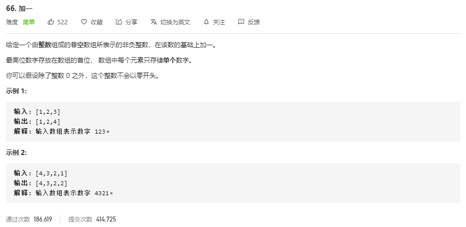

**数组遍历**

```JS
var plusOne = function(digits) {
    let arr = digits
    let index = digits.length-1
    for ( let i = index; i >= 0; i--) {
        if (arr[i] < 9) {
            arr[i]++
            break
        } else {
            arr[i] = 0
            if(i == 0)
                arr.unshift(1)
        }
    }
    return arr;
};
```

```Java
class Solution {
    public int[] plusOne(int[] digits) {
        int len = digits.length;
        for(int i = len - 1; i >= 0; i--) {
            digits[i]++;
            digits[i] %= 10;			// 10 % 10 为0
            if (digits[i] != 0) {
                return digits;
            }
        }
        digits = new int[len+1];
        digits[0] = 1;
        return digits;
    }
}
```

```java
class Solution {
    public int[] plusOne(int[] digits) {
        int len = digits.length;
        for(int i = len - 1; i >= 0; i--) {
            digits[i]++;
            digits[i] %= 10;			// 10 % 10 为0
            if (digits[i] != 0) {
                return digits;
            }
        }
        digits = new int[len+1];
        digits[0] = 1;
        return digits;
    }
}


class Solution {
    public int[] plusOne(int[] digits) {
        int n = digits.length - 1;
        while (n >= 0 && digits[n] == 9) {
            digits[n--] = 0;
        }
        if (n == -1) {
            digits = new int[digits.length + 1];
            digits[0] = 1;
        } else {
            digits[n]++;
        }
        return digits;
    }
}
```

本题关键要如 算法画手一样将 三种情况列出来

- 45  + 1  => 46

- 49 + 1 => 50

- 99 + 1 => 100

java 解法与 JS 相似，只不过这里第三种情况下 java 是利用新建一个 数组默认值为0 ，将初始化值设置为 1 

### **总结**

其实原生数组在设计的时候，仅方便查询相关的问题，关于其他修改数组的操作都是需要重新设计一个数组来存储，或者对数组的元素进行覆盖等操作，设计到插入某个元素删除某个元素在头部插入元素等问题其实JavaScript很多原生API都有封装，所以对数组的操作不再局限，只要是涉及到数组的操作，可以立马想到数组的API来解题

## 28 实现 str


内置函数处理

```JS
// indexOf
var strStr = function (haystack, needle) {
  return haystack.indexOf(needle)
}

// search
var strStr = function(haystack, needle) {
    return haystack.search(needle);
};

// substr
var strStr = function (haystack, needle) {
  for(let i = 0; i < haystack.length - needle.length; i++) {
    if(haystack.substr(i, neddle.length) === neddle) 
      return i
  }
  return -1
}
```

```java
class Solution {
    public int strStr(String haystack, String needle) {
        if (haystack.toString() == needle.toString()) return 0
        for (int i = 0; i < haystack.length() - needle.length(); i++) {
            if (haystack.substring(i,i + needle.length()).equals(needle)) {
                return i;
            }
        }
        return -1;
    }
}
```

滑动窗口，双指针

```JS
var strStr = function(haystack, needle) {
    let p = 0,j = 0;
    if (haystack.toString() == needle.toString()) return 0;
    while ( p < haystack.length && j < needle.length) {
        if (haystack[p+j] === needle[j]) {
            j++;
        } else {
            p++;
            j = 0;
        }
    }
    return j === needle.length ? p : -1
};
```

```java
class Solution {
    public int strStr(String haystack, String needle) {
    	int n = haystack.length(), m = needle.length();
      for (int i = 0; i < n - m; i++) {
        for (int j = 0; j < m; j++) {
          if (haystack.charAt(i) != needle.charAt(j)) break;
          if (j == m - 1) return i;
        } 
      }
      return -1;
    }
}
```

注意到 移动主串上的指针时，在未进行完完全的比较成功时不要移动主串指针，仅加上某个变量值来访问后面元素，否者容易忽略到意外情况

**KMP 解法**

## [88 合并两个有序数组](https://leetcode-cn.com/problems/merge-sorted-array/)

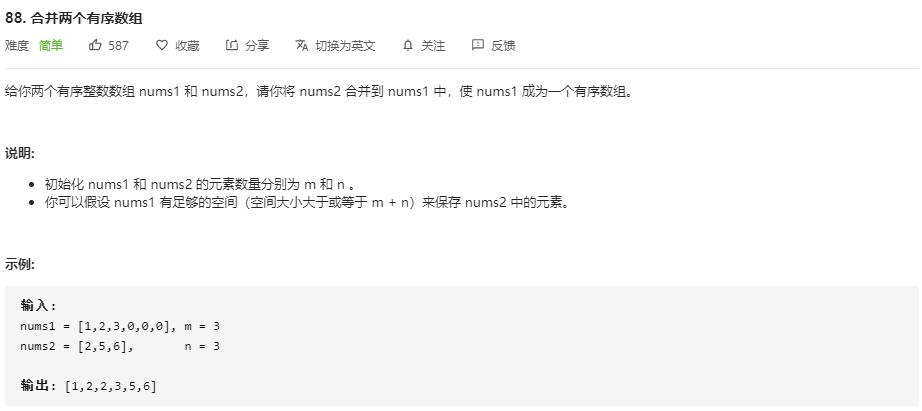

**先合并再排序**

```JS
var merge = function(nums1, m, nums2, n) {
    nums1.splice(m,n,...nums2)
    return nums1.sort((a,b) => a-b)
};
```

注意：题目中有设定不允许返回其他参数，必须在  nums1 的基础上进行修改，所以类似于 concat 这样产生新的数组的 API无法使用

```Java
class Solution {
  public void merge(int[] nums1, int m, int[] nums2, int n) {
    System.arraycopy(nums2,0,nums1,m,n);
    Arrays.sort(nums1);
  }
}
```

**复杂度分析**

- 时间复杂度 : O((n + m)log(n + m))	 使用的是快速排序
- 空间复杂度 : O(1)。

**双指针** （由前向后）


```Java
class Solution {
  public void merge(int[] nums1, int m, int[] nums2, int n) {
    	// 复制一个与nums1一样的数组，用来移动。nums1用来覆盖
			int[] copy_nums1 = new int[m];
      Arrays.copyOf(nums1,nums1.length);
    	// nums1的指针
    	int p = 0;
    	// copy_nums1 的指针 和 nums2 的指针
    	int p1 = 0, p2 = 0;
    
    	while (p1 < m && p1 < n) {
        nums1[p++] = (copy_nums1[p1] > nums2[p2]) ? nums2[p2++] : copy_nums1[p1++];
      }
    
    	if (p1 < m) {
				System.arraycopy(copy_nums1[p1], p1, nums1, p1 + p2, m + n - p1 - p2)
      }
    	if (p2 < n) {
      	System.arraycopy(nums2, p2, nums1, p1 + p2, m + n - p1 - p2);
      }
  }
}
```

**复杂度分析**

- 时间复杂度 : O(n + m)
- 空间复杂度 : O(m）

注意： m 大小不等于 数组大小， m 与 n 的大小关系未知

将值依次覆盖元素源数组，由于要读取源数组的值，所有需要复制出一个数组来存储源数组的数据，所以开辟了空间，如果题目设定不能复制另一数组，那么如何操作??

**双指针（由后往前）**

```Java
class Solution {
  public void merge(int[] nums1, int m, int[] nums2, int n) {
    int p1 = m - 1;
    int p2 = n - 1;
    
    int p = m + n - 1;

    while ((p1 >= 0) && (p2 >= 0))
      nums1[p--] = (nums1[p1] < nums2[p2]) ? nums2[p2--] : nums1[p1--];

    System.arraycopy(nums2, 0, nums1, 0, p2 + 1);
  }
}
```

```JS
var merge = function(nums1, m, nums2, n) {
    let len1 = m - 1;
    let len2 = n - 1;
    let len = m + n - 1;
    while(len1 >= 0 && len2 >= 0) {
        nums1[len--] = nums1[len1] > nums2[len2] ? nums1[len1--] : nums2[len2--];
    }
    function arrayCopy(src, srcIndex, dest, destIndex, length) {
        dest.splice(destIndex, length, ...src.slice(srcIndex, srcIndex + length));
    }
    arrayCopy(nums2, 0, nums1, 0, len2 + 1);
};
```

**复杂度分析**

- 时间复杂度 : O(n + m)
- 空间复杂度 : O(1）

不常想到，因为这题源数组后部分是空的，可以直接覆盖，充分利用空间

# [归并排序中的并](https://leetcode-cn.com/problems/merge-sorted-array/solution/shou-hui-tu-jie-gui-bing-pai-xu-zhong-de-bing-by-h/)？？

### 总结

对于存在两个数组的操作，一般都要联想到使用多个指针移动来解决，比如说一边一个指针，必要时需要三个指针，第三个指针用来存储真正的值，而其他两个指针用来扫描两个数组，比较指向的数组元素大小等。

对应一个数组的操作，也可以联想到两个指针来解题，一个用来扫描数组，一个用来存储数据，实现覆盖，空间复杂度非常高

## [189. 旋转数组](https://leetcode-cn.com/problems/rotate-array/)

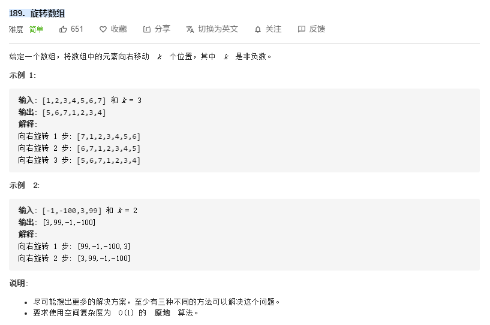

**暴力法**


```js
var rotate = function(nums, k) {
    let temp = null , cur 
    // 循环置换的次数
    for (let i = 0; i < k % nums.length; i++) {
        cur = nums[nums.length-1]
      	// 整体搬移一个单位
        for (let j = 0; j < nums.length; j++ ) {
          	[cur,nums[j]] = [nums[j],cur]
        }
    }
}
```

将数组遍历循环依次改变,注意到  k % nums.length ，对循环进行优化，因为每旋转一个周期又回到了原来的位置

暴力法中对数组这种结构进行了遍历，依次对每个元素位置进行了移动，插入删除等操作在不使用API情况下，都是这样操作，虽然效率不高，但是却是基础，要熟练掌握

复杂度：

- 时间复杂度：O（n^2）
- 空间复杂度：O（1）

**使用额外数组**

```JS

var rotate = function(nums, k) {
    const n = nums.length;
    const newArr = Array(n);
    for (let i = 0; i < n; ++i) {
        newArr[(i + k) % n] = nums[i];
    }
  	nums.splice(0,nums.length,...newArr)
};
```

构建一个新数组，存放数据，因为怕覆盖数据所以不能直接由前到后直接覆盖。再复制回原数组

### 总结

在数组中插入或者删除某个元素，都会移动后面元素，如暴力法所示，这就是数组不便于插入与删除的本质，时间复杂度消耗太高

数组在使用多个指针的情况下，通过指针的判断，将不符合的数据直接比较过，可以直接覆盖，但是在数据有用的情况下，不能用移动指针来覆盖，

**内置函数**

```JS
var rotate = function(nums, k) {
    nums.unshift(...nums.splice(nums.length - k))
};

var rotate = function(nums, k) {
    let n = k % nums.length;
    for (var i = 0; i < n; i++) {
        nums.unshift(nums.pop())
    }
};
```

## [283 移动零](https://leetcode-cn.com/problems/move-zeroes/)

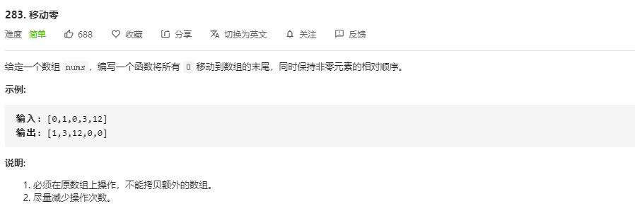

关于数组内部数据的操作

**快慢指针思想解决**(直接覆盖)

```JS
var moveZeroes = function(nums) {
    var s = 0, l = 0;
    while (s < nums.length) {
        if (nums[s] != 0) {
            nums[l++] = nums[s++];
        } else {
            s++;
        }
    }
    nums.fill(0,l,nums.length)
};

// 交换，本质也是双指针移动 优雅
var moveZeroes = function(nums) {
  let j = 0;
  for (let i = 0; i < nums.length; i++) {
    if (nums[i] != 0) [nums[j++], nums[i]] = [nums[i], nums[j]]; 
  }
};
```

**JS内置函数的应用**

```JS
var moveZeroes = function(nums) {
    nums.sort((a,b)=>b===0?-1:0)
};

var moveZeroes = function (nums) {
    for (let i = nums.length ; i --;) {
      if (!nums[i]) {
        // 删除 0 这个元素
        nums.splice(i, 1);
        nums.push(0);
      }
    }
}
```

### 总结

关于数组这种数据结构，本身在未出现 内置封装API时，在数组中实现删除一个数据的时间复杂度为 O(n)，并且实现代码较为啰嗦，所以一般不会进行这样的操作，而在JavaScript中封装了 像 splice、push、pop、shift、unshift 等封装API，可以很方便的实现数组的删除某个元素的操作或者增加某个操作

这样虽然可以很快速完成删除或者插入添加等操作，但是本质还是对数组进行了O(n)的时间复杂度操作，所以时间复杂度还是很高

交换操作：[ x , y ] = [ y , x ]

## 75.[颜色分类](https://leetcode-cn.com/problems/sort-colors/)

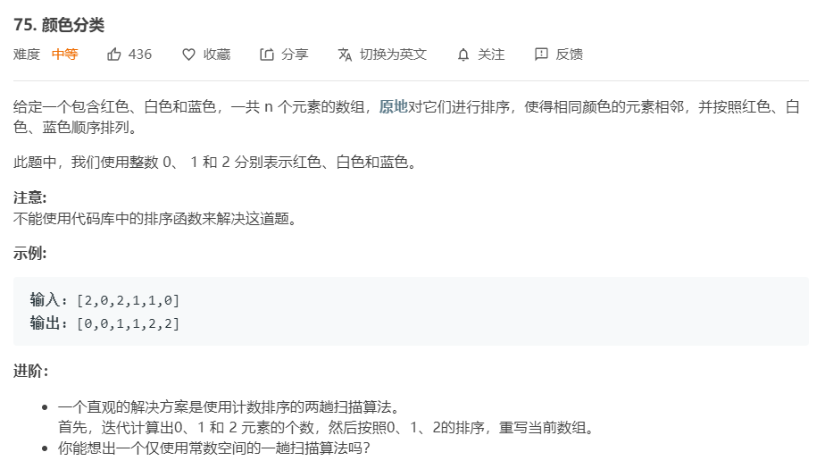

**三指针循环遍历（快速排序）**

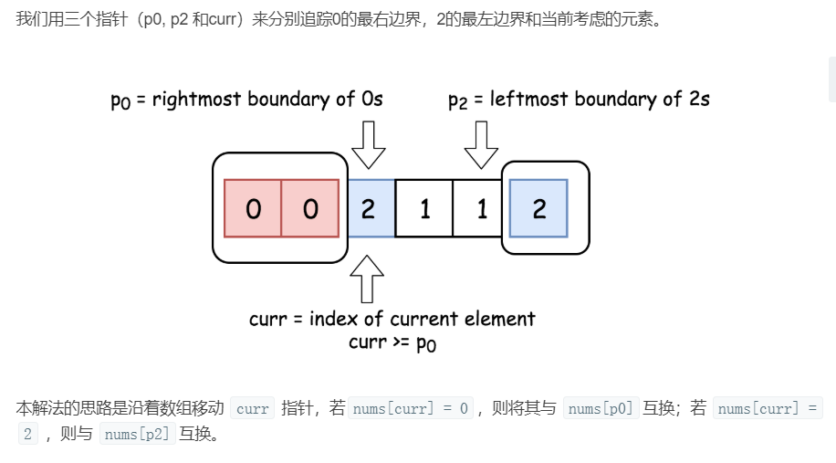

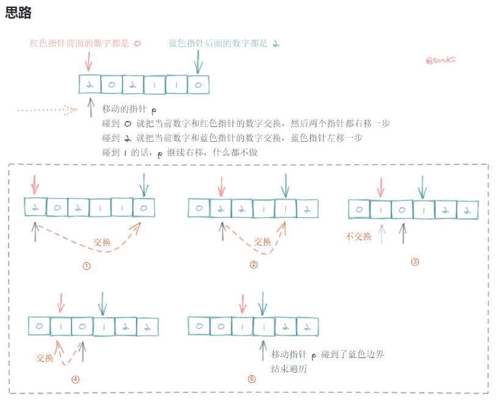

```JavaScript
var sortColors = function (nums) {
    
  const swap = (list, p1, p2) => [list[p1], list[p2]] = [list[p2], list[p1]]
  
  let red = 0,blue = nums.length - 1,p = 0

  while (p <= blue) {
    switch (nums[p]) {
      case 0:
        swap(nums, red++, p)
        p++
        break;
      case 1:
        p++												// 未进行交换
        break;
      case 2:
        swap(nums, blue--, p)			// 指针未++
        break;
      default:
        break;
    }
  }
};
```

简洁写法：

```JavaScript
var sortColors = function (nums) {
  let p = 0;
  let len = nums.length - 1
  for (let i = 0; i <= len; i++) {
    if (nums[i] === 0) [nums[i], nums[p++]] = [nums[p], nums[i]];
    // 即指针不变，再次检测换过来的值
    if (nums[i] === 2) [nums[i--], nums[len--]] = [nums[len], nums[i]];	
  }
}
```

三个指针进行移动，p0指针指向最左边，p2指针指向最右边，curr是一个移动的指针

1. curr进行移动，遇到值为1，不进行变化，curr++
2. 遇到值为0，将遇到的值与p0指的值进行互换，（互换完后，最左边的值，即第一个就为0，那么归序完毕，将p0++，不动第一个值了，同时将cur++）
3. 遇到值为2，将遇到的值与p2指向的值进行互换，（互换完后，最右边的值，即最后一个就为2，那么归序完毕，将p2--，不动最后一个值了，此时curr不能++，因为p2原本指向的值互换过来还未扫描，继续以curr指向的值继续判断）

注意：

1. 左边的进行交换的时候，curr要++，右边进行交换的时候curr不需要++
2. 跳出循环的条件是遇到了p2指针，因为p2指针右边都是排序好的

> 为什么左边进行交换需要curr++，而右边不用？
>
> 1. 左边从0区换过来的数是已经扫过的，右边从2区换过来的数是没扫过的，从左边换过来的不会是 0 ，更不会是 2 ，属于其他 （也就是1）

### 总结

使用了三个指针，在简洁写法中，for循环是最好的 curr 指针，即 i 是最好的当前数据指针，可以节约一个指针大小空间

不使用的 for 循环的话，可以使用 while 循环，构建三个指针：curr ，left ， right 。

本题使用了三个指针来扫描数组，对单个数组来说是一种常见的解体方法，当满足一定的条件时，进行互换等操作。这种类型的题目关键在于把握好三个指针移动的条件，比如说这题中，从 2 区域的边界换过来的数据是未扫描的，必须再重新比较一次，而 从 0 区域的边界换过来的数据是扫描过的，也就是默认处理过的，可以继续移动不再扫描，而遇到 1 为什么不管直接移动指针，可以理解为因为不属于 0 区域 也不属于 2 区域而本题只有3个区域，自然默认在1区域

**两个区域边界指针是 两大区域的大门，指针移动过的地方是已经确定的值，正在指向的值是还未确定下一步该处理的值**

**计数排序**

```JavaScript
var sortColors = function(nums) {
    let count = [0, 0, 0];
    for (let num of nums) {
        count[num] += 1;
    }
    for (let i = 0, j = 0; i < 3; i++) {
        while(count[i]--) {
            nums[j++] = i;
        }
    }
};
```

用 **哈希表** 来计数（常用的方法）

```JS
var sortColors = function(nums) {
    var hash = {
        0: 0,
        1: 0,
        2: 0
    };

    for(var i = 0; i < nums.length; i++) {
        hash[nums[i]]++;
    }

    var j = 0;
    for(const [k, v] of Object.entries(hash)) {
        while(hash[k] > 0) {
            nums[j++] = k;
            hash[k]--;
        }
    }
}
```

对象与哈希表不同，有本质区别，Object.entries(hash) 使对象具有 可枚举属性，那么此对象就可以作为 Map 的参数构建哈希表

### 总结

使用哈希表，时间复杂度非常低，效率非常高

**冒泡排序**

```JavaScript
 var sortColors = function(nums) {
     for(let i = 0;i < nums.length; i++){
         for(j = 0;j < nums.length - i; j++){
             if(nums[j] > nums[j+1]){
                 [nums[j], nums[j+1]] = [nums[j+1], nums[j]];
             }
         }
     }
     return nums
 };
```

## 1381 [设计一个支持增量操作的栈](https://leetcode-cn.com/problems/design-a-stack-with-increment-operation/) 

## （构造，数组模拟，哈希表）

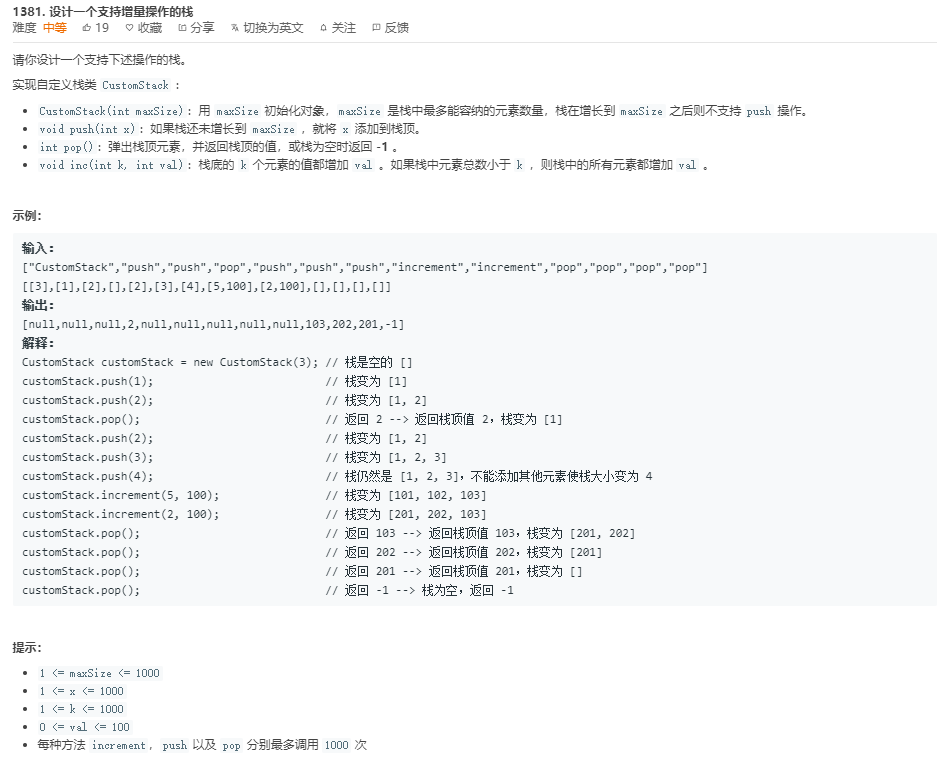

**数组模拟**

```JavaScript
var CustomStack = function(maxSize) {
		this.stack = []
    this.maxSize = maxSize
};

CustomStack.prototype.push = function(x) {
	if (this.stack.length < this.maxSize) {
        this.stack.push(x)
    }
};

CustomStack.prototype.pop = function() {
	if (this.stack.length === 0)
        return -1
    return this.stack.pop()
};


CustomStack.prototype.increment = function(k, val) {
	const min = Math.min(k, this.stack.length)
    for (let i = 0 ;i < min; i++){
        this.stack[i] += val 
    }
};

```

解析：

1. 题目自动设计好了模板，即为一个构造函数，而方法是定义在其原型上
2. 题解是将数组构建一个栈，利用数组中的原型方法实现了栈的结构特点
3. 将数组定义为这个构造函数的一个属性，而还存在一个size属性用来存储规定的数组最大值
4. 最后K值的对比用 Math原生方法比较出来最下值效果非常好和简洁

***复杂度分析***

- **时间复杂度：push 和 pop 操作的时间复杂度为 $O(1)$（讲义有提到），而increment操作的时间复杂度为 $O(min(k, stack.length))$**
- **空间复杂度：$O(1)$**

**java解法**

```java
class CustomStack {
    // 在类里面声明变量
    int[] arr;
    int top;

    public CustomStack(int maxSize) {
        // 构造函数里初始化变量
        arr = new int[maxSize];
        top = -1;
    }

    public void push(int x) {
        if (top >= arr.length - 1) return;
        arr[++top] = x;
    }

    public int pop() {
        if (top <= -1) return -1;
        top--;
        return arr[top + 1];
    }

    public void increment(int k, int val) {
        int limit = Math.min(k, arr.length);
        for (int i = 0; i < limit; i++) {
            arr[i] += val;
        }
    }
}
```

### 总结

Java中没有数组中内置的方法 push 和 pop ，通常的方法就是使用 数组来模拟，然后使用一个 额外的指针来 辅助，指针指向的位置表示栈的顶部位置，（正是因为数组的大小是固定的，无法直接改变数组的大小）

**优化（空间来换时间）**

***分析原来的特点:***

1. 每当执行一次increment时，都会遍历到范围内的每一个元素，进行相加操作，重复几次执行此函数后，会产生相应的浪费，可以进行优化
2. 只要序列大的值有相加的操作，那么序列小的肯定有相加的操作，所以在每次进行increment函数时，只需要标记范围内最末位的那个值，不用遍历每一个值

***优化操作：***

1. 另外构建一个数组（或者哈希表），对应这原stack，初始化此数组全为0，专门用来存储标记执行increment函数的标记值（也就是每执行increment函数，将val值添加到对应的标记上，实际此时并没有将值加到原数组上，而是加在标记数组上，什么时候真正意义添加到数组上呢，是在进行pop操作的时候）
2. 在pop操作的时候，在进行输出前，查询标记表格将自身值和标记数组上的值相加输出返回即可（同时还会将对应的标记的值添加到其前一位标记表上，（因为需要把标记传递上去，因为前面的值都有添加这个值，只不过是将标记添加在后末位上））

***优化结果：***

***避免了重复使用循环函数，优化了时间复杂度，以空间来换取时间***


```JS
/**
 * @param {number} maxSize
 */
var CustomStack = function(maxSize) {
    this.stack = [];
    this.hashMap = {};
    this.limit = maxSize;
};

/**
 * @parms {number} key 
 * @parms {number} value
 * @return {void}
 */
CustomStack.prototype._setInc = function (key, value) {
    // 细节，使相同的key相加
    if (!(key in this.hashMap)) {
        this.hashMap[key] = 0;
    }
    this.hashMap[key] += value;
}

/**
 * @parms {number} key
 * @return {number}
 */
CustomStack.prototype._getInc = function (key) {
  	// 没有，也要返回 0 ,获得后相加
    return this.hashMap[key] || 0;
}

/**
 * @parms {number} key
 * @return {number}
 */
CustomStack.prototype._size = function () {
    return this.stack.length;
}

/**
 * @param {number} x
 * @return {void}
 */
CustomStack.prototype.push = function(x) {
    if (this._size() < this.limit) {
        this.stack.push(x);
    }
};

/**
 * @return {number}
 */
CustomStack.prototype.pop = function() {
    let index = this._size() - 1;
    let add = this._getInc(index);
	
  	let val = this.stack.pop();
  	if (val === undefined) {
      return -1;
    }
    let re = val + add;

  	const newTop = index - 1;
    this._setInc(newTop, add)
    this.hashMap[index] = 0;

    return re;
};

/**
 * @param {number} k
 * @param {number} val
 * @return {void}
 */
CustomStack.prototype.increment = function(k, val) {
    let size = this._size();
    k = k > size ? size - 1 : k - 1;
    this._setInc(k, val);
};
```

***复杂度分析***

时间复杂度：pop() 和 push() 操作都是 O(1) , increment()在优化后时间复杂度也为 O(1)；

空间复杂度：额外使用了一个哈希表 空间复杂度 O(n)

*典型的空间换时间*

### 总结

以空间换时间，额外使用哈希表来作为辅助，因为哈希表的查询复杂度很低，具体的解决方法可查看上述解析，本题需要注意到的是，无论是使用模拟数组还是这种方式，针对解题来说都是可以的，本质数据是不完全对等的，比如这种解法，在修改数据的值的时候本质数据没有改变，只是在输出pop的时候，将值改变，满足输出，这种在算法中非常常见。

哈希表辅助数组来操作非常常用，哈希表来存储数据，需要时查询数据，效率高花费一点空间

构造方法 _getInc ，_ setInc  都是存在细节

## 394 [字符串解码](https://leetcode-cn.com/problems/decode-string/ ) 

## （栈结构，递归）

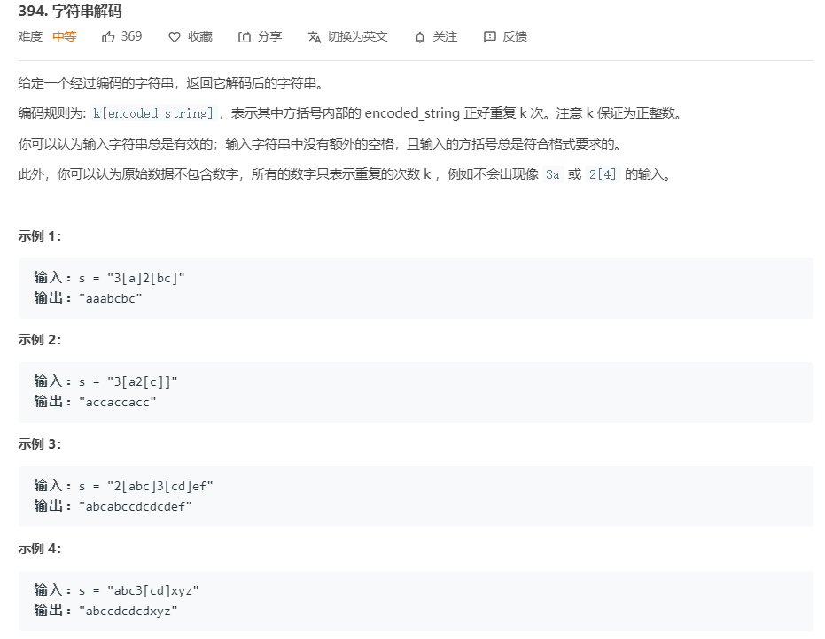

***栈结构***


```JavaScript
var decodeString = function(s) {
    let stack = [];
    let factor = '';
    for (let i = 0; i < s.length; i++) {
        if (/[0-9]/.test(s[i])) {
            factor += s[i];
        } else if (s[i] === '[') {	
          	// 避免多位倍数，在这里由于是字符
            if (factor) {
              	// 转换为数字存储
                stack.push(factor - 0);
            }
            factor = '';
        } else if (s[i] === ']') {
            let char = stack.pop();
            let str = '';
            while (typeof char !== 'number') {
                str = char + str;
                char = stack.pop();
            }
            stack.push(str.repeat(char));		
        } else {
            stack.push(s[i])
        }
    }
    return stack.join('');
};
```

**思路**：

题目要求将一个经过编码的字符解码并返回解码后的字符串。题目给定的条件是只有四种可能出现的字符

1. 字母
2. 数字
3. [
4. ]
   并且输入的方括号总是满足要求的（成对出现），数字只表示重复次数

那么根据以上条件，我们可以利用stack来实现这个操作

- 遍历这个字符串s，判断每一个字符的类型
  -- 如果是字母 --> 添加到stack当中
  -- 如果是数字 --> 先不着急添加到stack中 --> 因为有可能有多位
  -- 如果是 [ --> 说明重复字符串开始 --> 将数字入栈 --> 并且将数字清零
  -- 如果是 ] --> 说明重复字符串结束 --> 将重复字符串重复前一步储存的数字遍

**分析特点**：

1. 要注意到像 100  112 13 这类多位数值，在进行逐个字符判定时，一定要把多位数字给表示清楚，所以题解用了一个 factor 来先存储多位的数值类型 （多位数值通常使用一个字符串形式的变量）（先用这个factor变量来存储数字，不存储到栈中，根据题意，[的前面一定是数字，所以待遇到 [ 时，再将数字存储到栈中）
2. 字符串中的字母是遇到直接存储到栈中，遇到数字先factor存储，遇到 [ 时将数字存储到栈中，（记得把原来的清空）,遇到 ] 结束符时，表明要将栈中的一些字母进行重复成一个新的字符串，然后再以单个字符的形式存储到栈中
3. 在进行合成重复字符串时，先将重复的字符串基数字母用一个变量存储起来，当遇到数字时（相当于遇到 ] ），完成一个  [  ] ，乘以数值，完成重复，最后以一个字母的形式再次添加到栈中，重复实现
4. 最后拼接起来，形成一个字符串

***复杂度分析***

- 时间复杂度：$O(N)$，其中 N 为 s 长度。
- 空间复杂度：$O(N)$，其中 N 为 s 长度。

***[递归](https://leetcode-cn.com/problems/decode-string/solution/394zi-fu-chuan-jie-ma-di-gui-die-dai-zhan-javascri/#%E6%80%9D%E8%B7%AF)***


```JS
// 检测字符的类型
const type = {
    isAlpha: s => /[a-z]/i.test(s),
    isDigit: s => /[0-9]/.test(s),
    isOpenParen: s => s === '[',
    isCloseParen: s => s === ']',
}

var decodeString = function(s, i = 0) {
    // 注意到每次递归调用的时，都是新建了一个 decoded 变量来存储在那个递归深度的字符串，不同深度的 decoded 值不一样
    let decoded = '';
    let cnt = '';

    while (i < s.length) {
        if (type.isAlpha(s[i])) {
            // 普通字符，直接拼接到 decoded
            decoded += s[i];
            i++;
        } else if (type.isDigit(s[i])) {
            // 数字，拼接到 cnt
            cnt += s[i];
            i++;
        } else if (type.isOpenParen(s[i])) {
            // 遇到开括号，就把括号内的字符串重复 cnt 次，再拼接到 decoded
            // 但括号内可能存在嵌套括号，所以需要递归处理
            // 我们需要从递归中取两个东西，1.括号内解析后的模式，2.这个开括号对应的右括号的下标，下次遍历字符串就从这个下标+1开始
            let [temp, index] = decodeString(s, i + 1)
            // 重复 cnt 次拼接到 decoded
            decoded += temp.repeat(Number(cnt))

            cnt = '';
            i = index;
            continue;
        } else if (type.isCloseParen(s[i])) {
            // 遇到闭括号，说明括号内的模式解析完毕
            // 递归结束，返回我们需要的东西：1.解析后的字符串，2.解析到的字符下标
            return [decoded, i + 1]
        }
    }
    return decoded;
};
```

### 总结

注意到每次递归调用的时，都是新建了一个 decoded 变量来存储在那个递归深度的字符串，不同深度的 decoded 值不一样，清楚了解到每次递归返回的值，一般是 索引 或者 此次递归得到的结果 ，一定要写好递归的结束条件与返回值

# Java？？

## 232 [用栈实现队列](https://leetcode-cn.com/problems/implement-queue-using-stacks/)

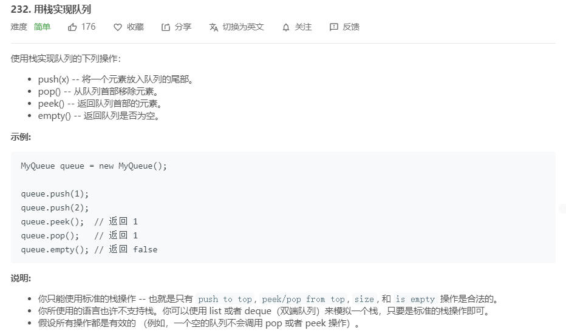

***两个栈***

```JavaScript
var MyQueue = function() {
    this.stack = []
    this.helperStack = []
};

MyQueue.prototype.push = function(x) {
    let cur = null
    while ((cur = this.stack.pop())) {
    this.helperStack.push(cur);
  }
    
  this.helperStack.push(x);

  while ((cur = this.helperStack.pop())) {
    this.stack.push(cur);
  }
};

MyQueue.prototype.pop = function() {
    return this.stack.pop()
};

MyQueue.prototype.peek = function() {
    return this.stack[this.stack.length-1]
};

MyQueue.prototype.empty = function() {
    return this.stack.length === 0
};
```

```Js
class MyQueue {
  constructor() {
    this.stack = [];
  }
  
  push(x) {
    const helper = [];
    while(!this.stack.empty()) {
      helper.push(this.stack.pop());
    }
    
    this.stack.push(x);
    
    while(helper.length) {
      this.stack.push(helper.pop());
    }
  }
  
  peek() {
    return this.stack[stack.length - 1];
  }
  
  pop() {
    return this.stack.pop();
  }
  
  empty() {
    return this.stack.length === 0
  }
}
```

*同理也可以在输出的时候倒置栈中的 元素，简化输入，复杂化输出*

***复杂度分析***

- 时间复杂度：$O(N)$，其中 N 为 栈中元素个数，因为每次我们都要倒腾一次。
- 空间复杂度：$O(N)$，其中 N 为 栈中元素个数，多使用了一个辅助栈，这个辅助栈的大小和原栈的大小一样。

> 其实使用两个栈来替代一个队列的实现是为了在多进程中分开对同一个队列对读写操作。一个栈是用来读的，另一个是用来写的。当且仅当读栈满时或者写栈为空时，读写操作才会发生冲突。
>
> 当只有一个线程对栈进行读写操作的时候，总有一个栈是空的。在多线程应用中，如果我们只有一个队列，为了线程安全，我们在读或者写队列的时候都需要锁住整个队列。而在两个栈的实现中，只要写入栈不为空，那么`push`操作的锁就不会影响到`pop`。

***两个栈的优化***

```JS
// 基于数组构造栈结构
class Mystack {
  constructor() {
    this.stack = [];
  }
  push(x) {
    this.stack.push(x);
  }
  pop() {
    return this.stack.pop();
  }
  peek() {
    return this.stack[this.stack.length - 1];
  }
  empty() {
        return this.stack.length === 0;
   }
}

class MyQueue {
  constructor() {
    this.stack = new MyStack();
    this.helper = new MyStack();
  }
  
  push(x) {
    this.stack.push(x);
  }
  peek() {
    if (this.helper.empty()) {
      // 如果辅助栈中没有数据了
      while (!this.stack.empty()) {
        this.helper.push(this.stack.pop())
      }
    }
    return this.helper.peek();
  }
  
  pop() {
    if (this.helper.empty()) {
      // 如果辅助栈中没有数据了
      while (!this.stack.empty()) {
        this.helper.push(this.stack.pop())
      }
    }
    return this.helper.pop();
  }
  
  empty() {
    return this.stack.empty() && this.helper.empty()
  }
}
```

分析：

1. 另外的一个栈不是一个用来颠倒的用的暂时性栈，而是用来存储队列中的一部分数据，
2. pop操作时，当s1栈的数据想要pop出来，将s1中的所有数据push到s2中，直接pop s2的栈顶元素即完成pop操作，当下次继续想要 pop时，直接pop s2的栈顶元素，当s2的元素pop出完了，继续从s1中push数据来
3. 当想要push数据时，直接push到s1中（当s2为空时，依次取出放置到s2中，后面push进来的都放到了s2的底部，满足了队列的后进后出）
4. 取队首元素（peek)，我们定义了 front 变量来保存队首元素，每次 入队 操作我们都会随之更新这个变量。当 s2 为空，front 变量就是对首元素，当 s2 非空，s2 的栈顶元素就是队首元素。

***复杂度分析***

- 时间复杂度：入列是 $O(1)$，出列最差的情况就是每个元素都要从模拟栈中弹出，压入辅助栈，再从辅助栈中弹出，所以是 $O(n)$。
- 空间复杂度：$O(n)$，n 为队列大小。

## 380  常数时间插入、删除和获取随机元素

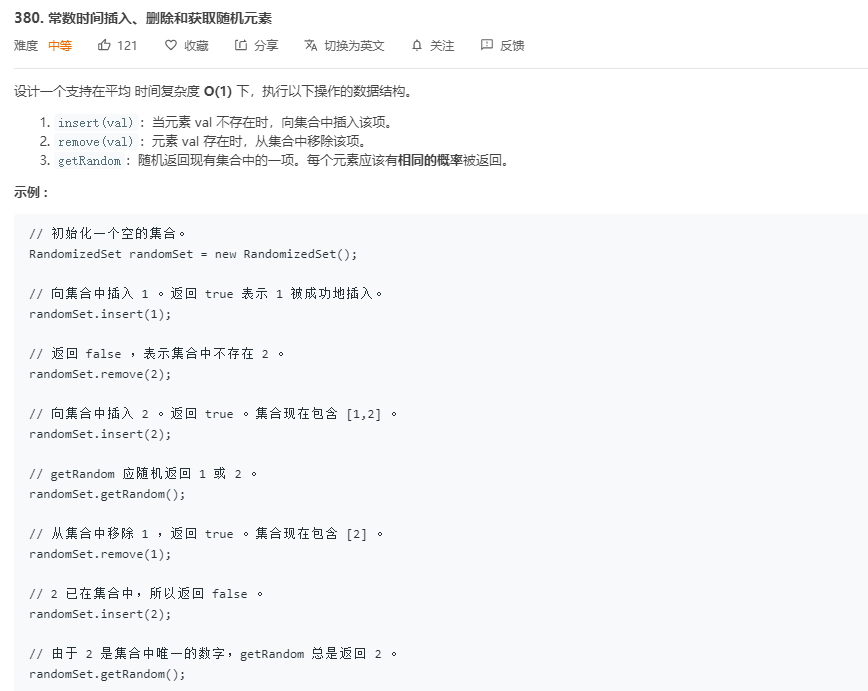

### Java版本

```Java
class RandomizedSet {
    Map<Integer,Integer> dict;
    List<Integer> list;
    Random rand = new Random();

    /** Initialize your data structure here. */
    public RandomizedSet() {
        dict = new HashMap();
        list = new ArrayList();
    }
    
    /** Inserts a value to the set. Returns true if the set did not already contain the specified element. */
    public boolean insert(int val) {
      	// 在 HashMap 中查询是否存在，时间复杂度 O（1）
        if (dict.containsKey(val)) return false;
	
      	// 在 HashMap 存储 值到索引的映射关系 
        dict.put(val,list.size());
      	// 在 list 中存储元素 （默认存储到数组的最后一位）
       	list.add(list.size(),val); 		//  list.add(val);
        return true;
    }
    
    /** Removes a value from the set. Returns true if the set contained the specified element. */
    public boolean remove(int val) {
      	// 	在 HashMap 中查询是否存在，时间复杂度 O（1）
        if (!dict.containsKey(val)) return false;
				
      	// 获取到最后一个元素的值 和 要删除的元素的索引
      	int lastElement = list.get(list.size() - 1);
      	int removeElementIndex = dict.get(val);
         
     		// 将最后一个元素的值 移动到 要删除元素的位置
        list.set(removeElementIndex,lastElement);
      	// 更新 hashMap 中的映射关系
        dict.put(lastElement,removeElementIndex);
      	// 删除掉 要删除元素的 映射关系
        dict.remove(val);
      	// 删除掉 最后一个元素 （移动后原位删除）
        list.remove(list.size() - 1);
        return true;
    }
    
    /** Get a random element from the set. */
    public int getRandom() {
        return list.get(rand.nextInt(list.size()));
    }
}
```

关键点：要设计一个支持在平均时间复杂度 O(1) 下，执行三个操作 ( 插入、删除、获取到随机值)

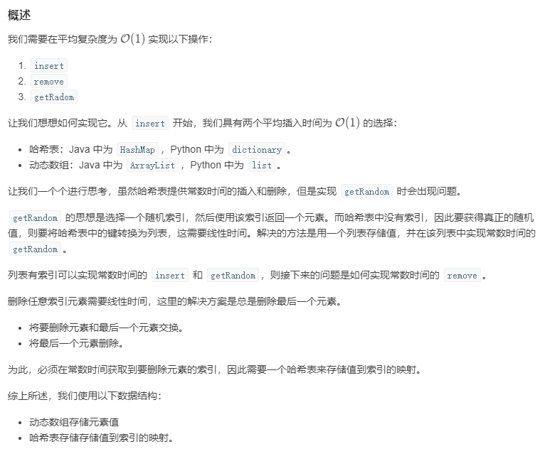

**总结**

本题中，使用这种解法比较考察 对 Java 中 HashMap 和 ArrayList 两种对象的内置方法熟练掌握程度

想要符合 O(1) 的时间复杂度 来完成 对数据的 插入 与 删除 ，问题在与 需要先检测数据集合是否存在这个数 ，而这个过程如果使用常规的数组，那么就需要 O(n) 的时间复杂度来遍历对比，显然不符合，所以联想到了用 HashMap 来做解决这一问题 ，内置的 containsKey() ，containsValue()  都是 O(1) 的时间复杂度来查询是否存在这个值，优化了遍历带来的高时间复杂度，

> 哈希表的特点：每个元素都是键值对的形式，**键名可以对应着数组中元素的值，而键值则可以对应着数组元素中的索引值**，所以在数组中查找某个值的时候，在不能遍历的情况下，可以通过哈希表来辅助使用，在存储到数组的同时，将数组元素的值存储给哈希表的键名，将数组元素的索引存储为哈希表的键值，当要查找某个值对其进行操作时，可以现在哈希表中通过这个值(键名)来获取他的值(索引值),这样就可以通过索引直接在数组中对数据进行操作（优化了时间复杂度O(n)为O(1)）

为什么不 只用哈希表来解决 这一个问题 ？ 哈希表中的内置方法足以实现 本题目的 删除 和 插入 方法，但是由于单独使用哈希表来实现 键值或者键名不是数字，显然这里要使用 Random 来获取随机值，不方便实现，所以采用 哈希表加数字的形式来实现，哈希表仅作为一个映射表，而数组来存储实际的值，这也符合了哈希表设计的初衷。

> 哈希表 与 动态数组 是常见搭配

复杂度分析

时间复杂度：getRandom 时间复杂度为O(1)，insert 和 remove 平均时间复杂度为 O(1)，在最坏情况下为 O(N) 当元素数量超过当前分配的动态数组和哈希表的容量导致空间重新分配时。
空间复杂度：O(N)，在动态数组和哈希表分别存储了 N个元素的信息。

### JavaScript版本

```JavaScript
var RandomizedSet = function () {
    // this.set = new Set()
    //存放值
    this.set = []
    //表示数组中的对应的值的下标是多少
    //用哈希表的键(key)存储val 用值(value)存储这个值在数组中的下标index
    //然后删除的时候就可以根据val找到数组里面的下标 然后在数组中进行删除
    //比如说当我想要找数组里面的10 就可以通过setMap[10]来找到数组中对应的下标然后删除 不需要遍历
    this.setMap = {}
};

RandomizedSet.prototype.insert = function (val) {
    //如果已经有这个值了就返回false
    if (typeof (this.setMap[val]) !== "undefined") return false
    //在表中记录插入的值在数组中的下标
    this.setMap[val] = this.set.length
    //在数组中添加这个值
    this.set.push(val)
    return true
};

RandomizedSet.prototype.remove = function (val) {
    //如果没有这个值就返回false
    if (typeof (this.setMap[val]) === "undefined") return false;
    // move the last element to the place idx of the element to delete
    // 得到最后一个数的下标
    let lastIndex = this.set.length - 1
    // 得到数组中最后一个数
    let lastNum = this.set[lastIndex]
    // 找到要删除的值的下标
    let deleteIndex = this.setMap[val]
    // 用最后一个数代替要删除的值
    this.set[deleteIndex] = lastNum
    // 在表中把最后一个数的位置设置为要删除的值的位置
    this.setMap[lastNum] = deleteIndex
    // 删除最后一个值
    this.set.pop()
    delete this.setMap[val]
    return true;
};

RandomizedSet.prototype.getRandom = function () {
    let size = this.set.length
    //返回一个0到set的长度之间的随机数
    let random = Math.floor(Math.random() * size)
    //以随机数为下标返回
    return this.set[random]
};
```

删除某个元素。先获取最后一个元素的索引，通过索引找到最后一个元素的值，获取要删除的值在map中的的值（即获得了在数组中的索引），在数组中，将最后一个元素的值直接覆盖掉要删除元素的值，并且将新的索引与值的对应关系更新在map中的，那么此时可以把最后一个元素删除掉（因为已经复制到删除位上了），并且把要删除的元素在map中的对应关系给删除掉

## 821 字符的最短距离


中心拓展法

```JS
var shortestToChar = function(s, c) {
    let result = Array(s.length).fill(0);
    for (let i = 0; i < s.length; i++) {

        if (s[i] === c) continue;

        let l = i,r = i,min = Infinity;

        while (l >= 0) {
            if (s[l] === c) {
                min = Math.min(min,i - l)
                break;
            }
            l--;
        }

        while (r < s.length) {
            if (s[r] === c) {
                min = Math.min(min,r - i);
                break;
            }
            r++;
        }

        result[i] = min;
    }
    return result;
};
```

```JS
import java.util.ArrayList; // 引入 ArrayList 类

1.创建对象
    ArrayList<E> objectName = new ArrayList()
  	// E: 泛型数据类型，用于设置 objectName 的数据类型，只能为引用数据类型。
  	ArrayList<String> arr = new ArrayList();
2.添加元素
  arr.add([指定要插入的位置,]"google")	//	默认插入最后一位
3.访问元素
  arr.get(1)	// 访问索引为 1 的数组元素
4.修改元素
  arr.set(2,"google")		// 第一个参数为索引位置，第二个为要修改的值
5.删除元素
  arr.remove(3)		 // 删除第四个元素
6.计算大小
  arr.size()
```

```Java
**基本操作**
```

以元素为中心，两边添加两个指针，左右移动来探索

**滑动窗口**

```JS
var shortestToChar = function(s, c) {
    let res = Array(s.length);
    let l = s[0] === c ? 0 : Infinity,
        r = s.indexOf(c,1);
    for (let i = 0; i < s.length; i++) {

        res[i] = Math.min(Math.abs(i - l),Math.abs(r - i));

        if (i === r) {
            l = r;
            r = s.indexOf(c,r + 1);
        }
    }
    return res;
};
```

画出两特殊情况

- 开头字符为 目标字符
- 开头不为 目标字符
- 结尾字符为 目标字符
- 结尾不为 目标字符

**注意到在什么时候滑动窗口（谁等于谁时），怎么滑动窗口（变换两个指针的值）**

**空间换时间**

```JS
var shortestToChar = function(s, c) {
    // 此字符的所有索引
    var iArr = [];
    for (var i = 0; i < s.length; i++) {
        if (s[i] === c) iArr.push(i);
    }

    // 结果数组
    var res = Array(s.length).fill(Infinity);

    for (var j = 0; j < s.length; j++) {
        // 目标字符是 0
        if (s[j] === c) {
            res[j] = 0;
            continue;
        }

        for (const cIndex of iArr) {
            const dis = Math.abs(cIndex - j)

            if (dis >= res[j]) break;

            res[j] = dis;
        }
    }
    return res;
};
```

将所有 目标元素 的索引用数组存储起来，每个元素遍历和这个数组里的元素比较

