# 二叉树概念

## 关于树中的几个基本概念

1. 高度（Height）：节点到叶子节点的最长路径（边数）
2. 深度（Depth）：根节点到这个节点的所经历的边的个数
3. 层（Level）：节点的深度 + 1
4. 树的高度：根节点的高度

> 注意区分 高度和深度，高度是从下到上，深度是从上到下，并且高度是从 0 开始的 （包括 0 ） ，相对于层数要少一

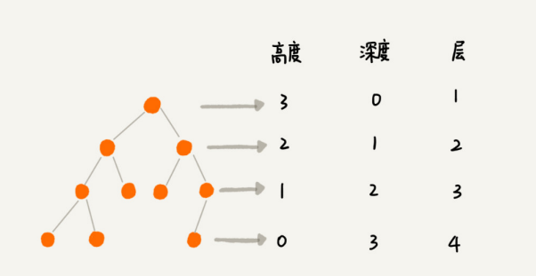


**二叉树是树中最典型的一种结构，在算法中常常用到就是二叉树，二叉树的结构特点就是，每个节点都最多有一个左子树和右子树**

## 二叉树中两种特别树

1. 满二叉树：叶子节点全都在最底层，除了叶子节点之外，每个节点都有左 右两个子节点，这种二叉树就叫作满二叉树
2. 完全二叉树：叶子节点都在最底下两层，**最后一层的叶子节点都靠左排列，并且除 了最后一层，其他层的节点个数都要达到最大**，这种二叉树叫作完全二叉树。

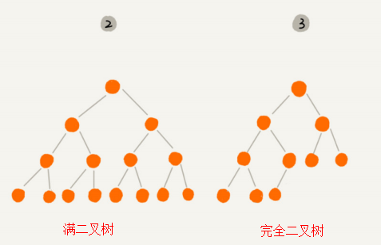

**为什么们我们要着重注意到 完全二叉树这种 在多种状态树中显的十分普通结构树呢？**

**根据这个问题我们来探讨一下 二叉树是如何存储的**

## **二叉树的实现（存储）**

想要存储一棵二叉树，我们有两种方法，**一种是基于指针或者引用的二叉链式存储法，一种是基于数组的顺序存储法。**

### **链式存储法**（基于链表）

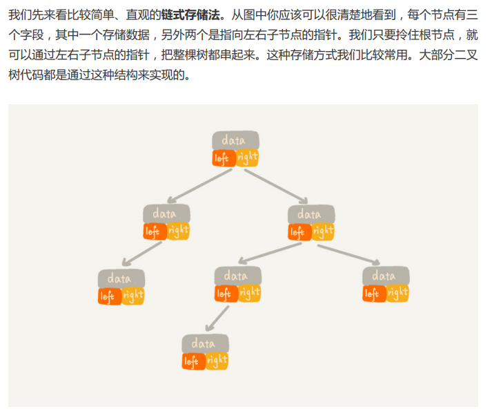

也就是 **节点的组成结构为 一个 数据变量 和 两个指针索引，通过链表的指向功能来连接起来构建起整个树，非常直观** 


### 顺序存储法（基于数组）

我们把根节点存储在下标 i = 1 的位置，那左子节点 存储在下标 2 * i = 2 的位置，右子节点存储在 2 * i + 1 = 3 的位置。以此类推，B 节点的 左子节点存储在 2 * i = 2 * 2 = 4 的位置，右子节点存储在 2 * i + 1 = 2 * 2 + 1 = 5 的位 置。如图

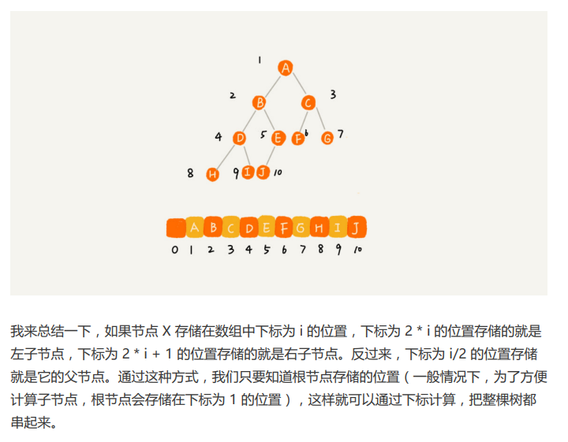

**注意到 根节点 以 1 开始，方便表示，如果已知道这个节点在数组中存储的索引 i ，那么通过计算， 索引为 2 * i 的地方就是它的左子节点，索引为 2 * i + 1 的地方就是他的右子节点 ，而他的父节点的索引是 i / 2 ,也就是知道一个点的索引，可以找到他父亲和儿子** 

**仔细观察，我们举例的这个树就是一个完全二叉树，而正是因为完全二叉树，数组的仅仅是浪费了下标为 0 的存储位置，相对于链表来说，不仅优化了存储指针的内存空间，并且在访问上效率非常高（众所周知数组访问数据效率为（O(1)），而链表访问需要遍历（O(n)，并且数组在访问父亲上比链表简单太多）**

> 当我们讲到堆和堆排序的时候，你会发现，堆其实就是一种完全二叉树，最常用的存储方式 就是数组。

**但是数组这种作为树的存储结构似乎也仅仅是为 完全二叉树 量身定制的** ，我们来看看非完全二叉树

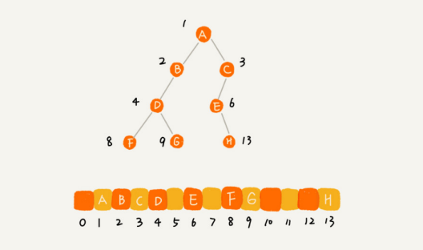


**空间利用率急剧下降！这就是为什么我们特地要区分出 完全二叉树 这种树结构的原因，一旦遇到的问题是 完全二叉树，可以用数组来存储，操作效率和存储效率非常高**

## 二叉树的遍历

四种遍历树结构的方式：

1. 前序遍历
2. 中序遍历
3. 后序遍历
4. 按层遍历

**前、中、后序，表示的是节点与它的左右子树节点遍历打印的先后顺序，二叉树的前、中、后序遍历就是一个递归的过程。比如，前序遍历，其实就是先打 印根节点，然后再递归地打印左子树，最后递归地打印右子树。**

> 前序遍历是指，对于树中的任意节点来说，先打印这个节点，然后再打印它的左子树，最后打印它的右子树。 
>
> 中序遍历是指，对于树中的任意节点来说，先打印它的左子树，然后再打印它本身，最后 打印它的右子树。 
>
> 后序遍历是指，对于树中的任意节点来说，先打印它的左子树，然后再打印它的右子树， 最后打印这个节点本身。

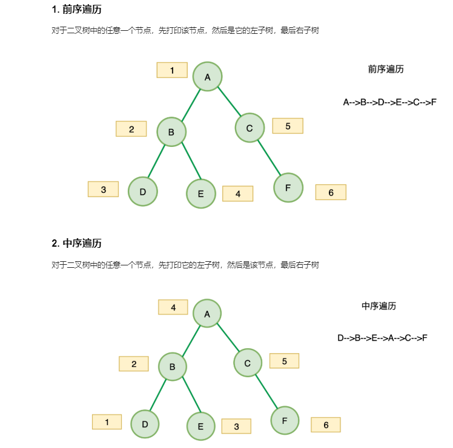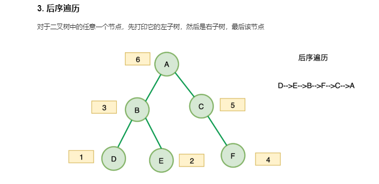

**时间复杂度**

每个节点最多会被访问两次，所以 遍历操作的时间复杂度，跟节点的个数 n 成正比，二叉树遍历的时间复杂度为 O(2n) = O(n)

**树三种遍历方法的代码：**

```java
public class TreeNode {
    public int val
        public TreeNode left,right
        public TreeNode(int val) {
        this.val = val
            this.left = null
            this.right = null
    }
}

def preorder(self.root): 
	if root:
		self.traverse_path.append(root.val)
    	self.preorder(root.left)
    	self.preorder(root.right)


def inorder(self.root): 
	if root:
		self.preorder(root.left)
    	self.traverse_path.append(root.val)
    	self.preorder(root.right)

def postorder(self.root): 
	if root:
		self.preorder(root.left)
    	self.preorder(root.right)
    	self.traverse_path.append(root.val)
```


## **二叉查找**树

Binary Search Tree ，二叉查找树是二叉树中最常用的一种类型，也叫二叉搜索树。顾名思义，**二叉查找树是为了 实现快速查找而生的**

**二叉查找树要求，在树中的任意一个节点，其左子树中的每个节点的值，都要小于这个节点的值，而右子树节点的值都大于这个节点的值。**

> **注意到是左子树和右子树，不是左子节点和右子节点，也就是说除了左子节点本身外，左边子部所有节点都要小于父节点，右边也是类似，由底层数据向上推导也可以得到这个结论**

### **二叉查找树的查找操作**

如何在二叉查找树中查找一个节点。我们先取根节点，如果它等于我们要查找的数据，那就返回。如果要查找的数据比根节点的值小，那就在左子树中递归查找；如果要查找的数据比根节点的值大，那就在右子树中递归查找,知道找到相等的值。

实现代码：

```java
public class BinarySearchTree {
    private Node tree

	public Node find(int data) {
		Node p = tree
		while( p != null) {
			if (data < p.data) 
                p = p.left
			else if (data > p.data) 
                p = p.right
			else 
                return p
		}
        return null
    }

    public static class Node {
        private int data
		private Node left
		private Node right

		public Node(int data) {
            this.data = data
        }
    }
}
```

### **二叉查找树的插入操作**

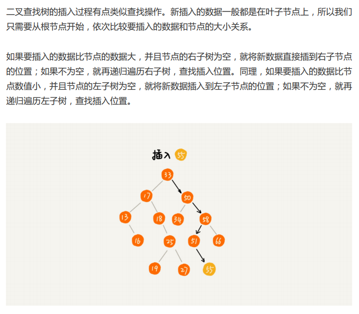

实现插入功能代码：

```java
public static class Node {
    private int data
        private Node left
        private Node right

        public Node(int data) {
        this.data = data
    }
}

public void insert(int data) {
    if (tree == null) 
        tree = new Node(data)
        return

        Node p = tree
        while (p != null) {
            if (data > p.data) {
                if(p.right == null) {
                    p.right = new Node(data)
                        return 
                }
                p = p.right
            } else {
                if(p.left == null) {
                    p.left = new Node(data)
                        return 
                }
                p = p.left
            }
        }
}
```

###  二叉查找树的删除操作

二叉查找树的查找、插入操作都比较简单易懂，但是它的删除操作就比较复杂了 。**针对要删除节点的子节点个数的不同，我们需要分三种情况来处理。**

> **很多数据结构包括 二叉查找树，在查询效率上很高，但是维护成本很高**

第一种情况是，如果要删除的节点没有子节点，我们只需要直接将父节点中，指向要删除节点的指针置为 null。比如图中的删除节点 55。 

第二种情况是，如果要删除的节点只有一个子节点（只有左子节点或者右子节点），我们只需要更新父节点中，指向要删除节点的指针，让它指向要删除节点的子节点就可以了。比如图中的删除节点 13。 

第三种情况是，如果要删除的节点有两个子节点，这就比较复杂了。我们需要找到这个节点 的右子树中的最小节点，把它替换到要删除的节点上。然后再删除掉这个最小节点，因为最 小节点肯定没有左子节点（如果有左子结点，那就不是最小节点了），所以，我们可以应用 上面两条规则来删除这个最小节点。比如图中的删除节点 18。

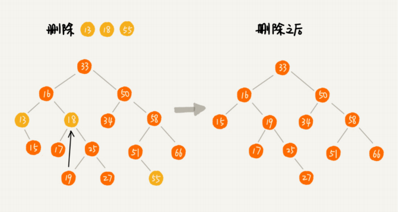

**删除实现代码：**

```java
public void delete(int data) {
    Node p = tree; // p 指向要删除的节点，初始化指向根节点
    Node pp = null; // pp 记录的是 p 的父节点
    while (p != null && p.data != data) {
        pp = p;
        if (data > p.data) p = p.right;
        else p = p.left;
    }
    if (p == null) return; // 没有找到
    
    // 要删除的节点有两个子节点
    if (p.left != null && p.right != null) { // 查找右子树中最小节点
        Node minP = p.right;
        Node minPP = p; // minPP 表示 minP 的父节点
        while (minP.left != null) {
            minPP = minP;
            minP = minP.left;
        }
        p.data = minP.data; // 将 minP 的数据替换到 p 中
        p = minP; // 下面就变成了删除 minP 了
        pp = minPP;
    }
    
    // 删除节点是叶子节点或者仅有一个子节点
    Node child; // p 的子节点
    if (p.left != null) child = p.left;
    else if (p.right != null) child = p.right;
    else child = null;
    if (pp == null) tree = child; // 删除的是根节点
    else if (pp.left == p) pp.left = child;
    else pp.right = child;
}
```

**实际上，关于二叉查找树的删除操作，还有个非常简单、取巧的方法，就是单纯将要删除的节点标记为“已删除”，但是并不真正从树中将这个节点去掉。这样原本删除的节点还需要 存储在内存中，比较浪费内存空间，但是删除操作就变得简单了很多。而且，这种处理方法 也并没有增加插入、查找操作代码实现的难度**

> **删除标记，不影响数据查找效率和正确性，实现较为简单**

### 二叉排序树

二叉查找树除了支持上面几个操作之外，还有一个重要的特性，**就是==中序遍历二叉查找树==， 可以输出有序的数据序列，时间复杂度是 O(n)，非常高效。因此，二叉查找树也叫作二叉排序树。**

### 二叉树插入相同的数据操作

在实际的软件开 发中，我们在二叉查找树中存储的，是一个包含很多字段的对象。我们利用对象的某个字段 作为键值（key）来构建二叉查找树。我们把对象中的其他字段叫作卫星数据。 

前面我们讲的二叉查找树的操作，针对的都是不存在键值相同的情况。那如果存储的两个对象键值相同，这种情况该怎么处理呢？存在两种方法

1. **第一种方法比较容易。二叉查找树中每一个节点不仅会存储一个数据，因此我们==通过链表和支持动态扩容的数组等数据结构==，把值相同的数据都存储在同一个节点上。**
2. **第二种方法将新插入的数据当作大于这个节点的值来处理。每个节点仍然只存储一个数据。在查找插入位置的过程中，如果碰到一个节点的值，与要插入数据的值相同，我们就将这个要插入的数据放到这个节点的右子树。**

> 但是第二种方法要查找数据的时候，遇到值相同的节点，我们并不停止查找操作，而是继续在右子树中查 找，直到遇到叶子节点，才停止。这样就可以把键值等于要查找值的所有节点都找出来。对于删除操作，我们也需要先查找到每个要删除的节点，然后再按前面讲的删除操作的方法，依次删除
>
> 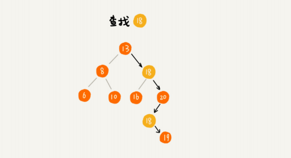
>
> 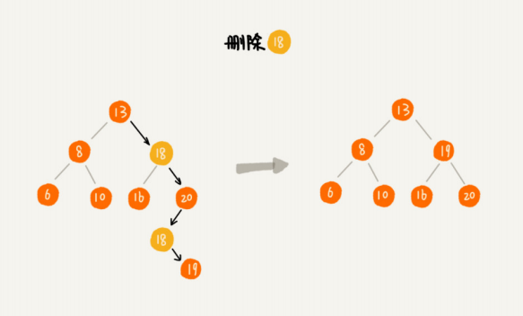

**方法一和方法二都是在原来的基础上进行改进，那么在树进行查找删除和插入时相应的也要做出修改**

### 二叉查找树的时间复杂度

二叉查找树的三种情况：

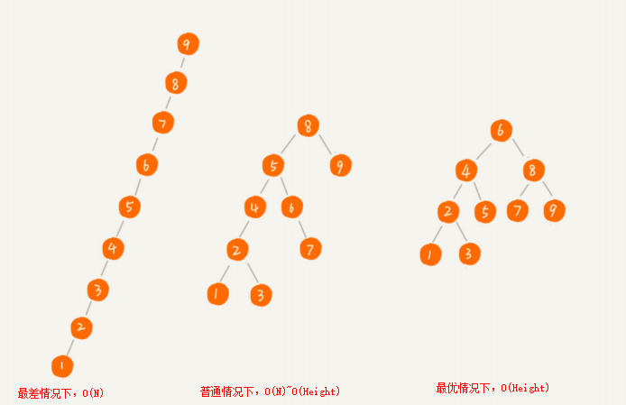


**图中第一种二叉查找树，根节点的左右子树极度不平衡，已经退化成了链表，所以查找的时间复杂度就变成了 O(n)。**

分析最优情况下的时间复杂度，不管操作是插入、删除还是查找，时间复杂度其 实都跟树的高度成正比，也就是 O(height)。既然这样，现在问题就转变成另外一个了， 也就是，如何求一棵包含 n 个节点的完全二叉树的高度？

> 树的高度就等于最大层数减一，为了方便计算，我们转换成层来表示。从图中可以看出，包 含 n 个节点的完全二叉树中，第一层包含 1 个节点，第二层包含 2 个节点，第三层包含 4 个节点，依次类推，下面一层节点个数是上一层的 2 倍，第 K 层包含的节点个数就是 2^(K-1)。 不过，对于完全二叉树来说，最后一层的节点个数有点儿不遵守上面的规律了。它包含的节 点个数在 1 个到 2^(L-1) 个之间（我们假设最大层数是 L）。如果我们把每一层的节点个 数加起来就是总的节点个数 n。也就是说，如果节点的个数是 n，那么 n 满足这样一个关 系：
>
> ```
> n >= 1+2+4+8+...+2^(L-2)+1
> n <= 1+2+4+8+...+2^(L-2)+2^(L-1) 
> ```
>
> 借助等比数列的求和公式，我们可以计算出，L 的范围是 [log (n+1), log n +1]。完全二叉树的层数小于等于 log n +1，也就是说，**完全二叉树的高度小于等于 log n。**

### 散列表与二叉查找树对比

**散列表的插入、删除、查找操作的时间复杂度可以做到常量级的 O(1)，非常高效。而二叉查找树在比较平衡的情况下，插入、删除、查找操作时间复杂度 才是 O(logn)，相对散列表，好像并没有什么优势，那我们为什么还要用二叉查找树呢？**

1. 第一，散列表中的数据是无序存储的，如果要输出有序的数据，需要先进行排序。而对于二叉查找树来说，我们只需要中序遍历，就可以在 O(n) 的时间复杂度内，输出有序的数据序列。 
2. 第二，散列表扩容耗时很多，而且当遇到散列冲突时，性能不稳定，尽管二叉查找树的性能不稳定，但是在工程中，我们最常用的平衡二叉查找树的性能非常稳定，时间复杂度稳定在 O(logn)。 
3. 第三，笼统地来说，尽管散列表的查找等操作的时间复杂度是常量级的，但因为哈希冲突的存在，这个常量不一定比 logn 小，所以实际的查找速度可能不一定比 O(logn) 快。加上哈希函数的耗时，也不一定就比平衡二叉查找树的效率高。
4. 第四，散列表的构造比二叉查找树要复杂，需要考虑的东西很多。比如散列函数的设计、冲突解决办法、扩容、缩容等。平衡二叉查找树只需要考虑平衡性这一个问题，而且这个问题的解决方案比较成熟、固定。
5. 最后，为了避免过多的散列冲突，散列表装载因子不能太大，特别是基于开放寻址法解决冲 突的散列表，不然会浪费一定的存储空间。

**综合这几点，平衡二叉查找树在某些方面还是优于散列表的，所以，这两者的存在并不冲 突。我们在实际的开发过程中，需要结合具体的需求来选择使用哪一个。**


## 红黑树

在上面我们有提到，二叉查找树在树的结构为完全二叉树时，他的时间复杂度效率最高，为 O(logN) 。显然这在工程应用上存在局限性，我们来看一种特殊的树结构

在了解到红黑树之前，我先了解到 平衡二叉树 这个概念，平衡二叉树的定义就是节点的左右子树的高度不能超过 1 ，这样就保证了 二叉树的不会造成一遍偏斜的情况（最差情况下退化为链表O(N)），因为树这种数据结构操作的时间复杂度与树的高度程正相关，所以当树的高度约小，执行效率就越高，但是在上面我们也提到过，二叉树查找树，以及平衡二叉树最大的问题就是关于树的维护问题，查询等操作十分方便，但是一旦数据有插入语删除等操作，那么树 的结构会发生改变，查询的效率也就相应的降低

> **AVL 树是一种高度平衡的二叉树（二叉平衡搜索数）**，所以查找的效率非常高，但是，有利就有弊，AVL 树为 了维持这种高度的平衡，就要付出更多的代价。每次插入、删除都要做调整，就比较复杂、 耗时。所以，对于有频繁的插入、删除操作的数据集合，使用 AVL 树的代价就有点高了。 **红黑树只是做到了近似平衡，并不是严格的平衡，所以在维护平衡的成本上，要比 AVL 树 要低。**

红黑树在严格意义上并不是 平衡二叉树，但是我们通常把它归类到平衡二叉树，

**红黑树是一种平衡二叉查找树。它是为了解决普通二叉查找树在数据更新的过程中，复杂度退化的问题而产生的。红黑树的高度近似 log~2~n，所以它是近似平衡，插入、删除、查找操 作的时间复杂度都是 O(logn)。** 

**因为红黑树是一种性能非常稳定的二叉查找树，所以，在工程中，但凡是用到动态插入、删 除、查找数据的场景，都可以用到它。不过，它实现起来比较复杂，如果自己写代码实现， 难度会有些高，这个时候，我们其实更倾向用跳表来替代它。**

> 这部分内容较难，并且在实际的工程应用中接触不多，不会出现手写红黑树等操作，所以放到后面有时间来了解

[红黑树原理](https://www.cnblogs.com/tiancai/p/9072813.html)


> **链表是特殊化的树，树是特殊化的图**
>
> 链表也是树的一部分，只不过是单向树，只有一个 next 指针，而树是图的一部分，只不过没有环，也就是没有环的图就是树

树这种数据结构的产生就是由于我们生存在一个多维的空间，一维的数据结构已经无法满足，而树其实就是一种多维结果化而产生的结构，比如说AlphaGo围棋算法，就是根据每一步围棋而产生各种可能结果，而最后的叶子节点也就是最终的结果。


# 树的面试题基本上都是递归

**递归问题转化为树这种结构来表示思路十分清晰，毕竟树的三种遍历方式用递归来实现仅仅只需要四行代码即可表述清楚**

**树这种数据结构的本身就存在重复性，并且节点的定义也具有相似性，本身与递归就密不可开**


# 递归

## **递归基础理论**

**递归分为 "递" 和 ”归“ 两个过程，向下发展的 递进过程和 向上回来 回归过程**

同时满足以下**==三个条件==**，即可以用递归来求解问题

1.  **一个问题的解可以分解为几个子问题的解**
2.  **这个问题与分解之后的子问题，除了数据规模不同，求解思路完全一样**
3. **存在递归终止条件**

> **写递归代码最关键的 是写出递推公式，找到终止条件，剩下将递推公式转化为代码就很简单了。**

经典的递归思维产生示例：（爬楼梯问题）

假如这里有 n 个台阶，每次你可以跨 1 个台阶或者 2 个台阶，请问走这 n 个台阶有多少种 走法？如果有 7 个台阶，你可以 2，2，2，1 这样子上去，也可以 1，2，1，1，2 这样子 上去，总之走法有很多，那如何用编程求得总共有多少种走法呢？

我们仔细想下，实际上，可以根据第一步的走法把所有走法分为两类，第一类是第一步走了 1 个台阶，另一类是第一步走了 2 个台阶。所以 n 个台阶的走法就等于先走 1 阶后，n-1 个台阶的走法 加上先走 2 阶后，n-2 个台阶的走法

用公式表示就是： `f(n) = f(n-1)+f(n-2)`

> 这里从 第一步走法举例，发现第一步的走法的结果可以分为两个小问题，小问题是，已经走完第一步的情况下，接下来怎么走，依次向下推导，可以发现满足递归使用的条件（划分为小问题，数据规模一样，求解思路完全一样），推导出公式是非常关键的一部分，我们从第一步发现，求解第一步的的值，需要第一步中走了一步和走了两步的各自可能的数值之和，进而推导到 N 级问题，从而推导出递归公式

**推断递归终止条件 f(1)=1、f(2)=2 ，可以用较小的数来测试公式，也可能用较小的数来推导出终止条件**

推导出最终的递归代码：

```c
int f(int n) {
    if (n == 1) return 1;
    if (n == 2) return 2;
    return f(n-1) + f(n-2);
}
```

> **写递归代码的关键就是找到如何将大问题分解为小问题的规律，并且基于此写出递推公式，然后再推敲终止条件，最后将递推公式和终止条件翻译成代码。**

## **递归最大的误区**

人脑几乎没办法把整个“递”和“归”的过程一步一步都想清 楚。比如上述爬楼梯问题，在推导出 递推公式 后，人脑几乎没办法把整个“递”和“归”的过程一步一步都想清楚。计算机擅长做重复的事情，所以递归正和它的胃口。而我们人脑更喜欢平铺直叙的思维方 式。当我们看到递归时，我们总想把递归平铺展开，脑子里就会循环，一层一层往下调，然 后再一层一层返回，试图想搞清楚计算机每一步都是怎么执行的，这样就很容易被绕进去

**对于递归代码，这种试图想清楚整个递和归过程的做法，实际上是进入了一个思维误区**。很多时候，我们理解起来比较吃力，主要原因就是自己给自己制造了这种理解障碍

**如果一个问题 A 可以分解为若干子问题 B、C、D，你可以假设子问题 B、C、D 已经解 决，在此基础上思考如何解决问题 A。而且，==你只需要思考问题 A 与子问题 B、C、D 两层 之间的关系==即可，不需要一层一层往下思考子问题与子子问题，子子问题与子子子问题之间 的关系。屏蔽掉递归细节，这样子理解起来就简单多了。**

> **编写递归代码的关键是，只要遇到递归，我们就把它抽象成一个递推公式，不用想一 层层的调用关系，不要试图用人脑去分解递归的每个步骤。**
>
> **在拿到递归题目时，直接编写 递归函数（找到子问题与母问题之间的关系），不要人肉的进行递归！！！**
>
> **要熟练掌握 数学归纳法 的思维**

## 递归代码要警惕堆栈溢出

堆栈溢出会造成系统性崩溃，后果会非常严重，如果递归求解的数据规模很大，调用层次很深，一直压入栈，就会有堆栈溢出的风险。

**如何避免出现堆栈溢出**

我们可以通过在代码中限制递归调用的最大深度的方式来解决这个问题。递归调用超过一定 深度（比如 1000）之后，我们就不继续往下再递归了，直接返回报错。（但这种做法并不能完全解决问题，因为最大允许的递归深度跟当前线程剩余的栈空间大小有 关，事先无法计算。如果实时计算，代码过于复杂，就会影响代码的可读性）

**递归方法适用于数据量很小的问题**

如果最 大深度比较小，比如 10、50，就可以用这种方法，否则这种方法并不是很实用。

## 递归代码要警惕重复计算

递归代码中很可能会使用到一个数据多次重新计算，我们可以通过一个数据结构（比如散列表）来保存已经求解过的 f(k)。 当递归调用到 f(k) 时，先看下是否已经求解过了。如果是，则直接从散列表中取值返回， 不需要重复计算，这样就能避免刚讲的问题了。

## **递归算法的效率**

**在时间效率上，递归代码里多了很多函数调用，当这些函数调用的数量较大时，就会积聚成 一个可观的时间成本。在空间复杂度上，因为递归调用一次就会在内存栈中保存一次现场数据，所以在分析递归代码空间复杂度时，需要额外考虑这部分的开销，比如我们前面讲到的 电影院递归代码，空间复杂度并不是 O(1)，而是 O(n)。本质时间复杂度很高**

> 递归是什么，递归就是用栈的数据结构，加上一个简单的逻辑算法实现了业务功能。

## 递归代码改写为非递归代码

爬楼梯问题改为 迭代循环 来解决

```c
int f(int n) {
    if (n == 1) return 1;
    if (n == 2) return 2;

    int ret = 0;
    int pre = 2;
    int prepre = 1;
    for (int i = 3; i <= n; ++i) {
        ret = pre + prepre;
        prepre = pre;
        pre = ret;
    }
    return ret;
}
```

**是不是所有的递归代码都可以改为这种==迭代循环==的非递归写法呢**？

笼统地讲，是的。因为递归本身就是借助栈来实现的，只不过我们使用的栈是系统或者虚拟 机本身提供的，我们没有感知罢了。如果我们自己在内存堆上实现栈，手动模拟入栈、出栈 过程，这样任何递归代码都可以改写成看上去不是递归代码的样子。 **但是这种思路实际上是将递归改为了“手动”递归，本质并没有变，而且也并没有解决前面讲到的某些问题，徒增了实现的复杂度**。

> 也就是说 使用 迭代循环 其实本质也是一种 **“递归”** 在效率上并没有提高，换汤不换药

## 递归代码模板（解题方法）

**递归代码的基本形式**

```JS
// JavaScript
const recursion = (level, params) =>{
    
   // recursion terminator  递归终结条件
   if(level > MAX_LEVEL){
     process_result
     return 
   }
    
   // process current level	处理当前层逻辑
   process(level, params)
    
   //drill down	下探到下一层
   recursion(level+1, params)
    
   //clean current level status if needed  清理当前层
}
```

关于递归算法的解题方法，我们还是回到递归的三个重要条件上

> 同时满足以下**==三个条件==**，即可以用递归来求解问题
>
> 1.  **一个问题的解可以分解为几个子问题的解**
> 2.  **这个问题与分解之后的子问题，除了数据规模不同，求解思路完全一样**
> 3.  **存在递归终止条件**

==**递归题目的难点就在与 如何发现 子问题与父问题之间的关系，找到规律，并且把抽象的问题转化为 用公式来表示，这十分看重对 数学归纳法 的掌握**==

方法一，尝试从小的测试数据来找到 其中的规律，（但是不要过多的人肉递归！！）


# 题目集合

## 100 [相同的树](https://leetcode-cn.com/problems/same-tree/)

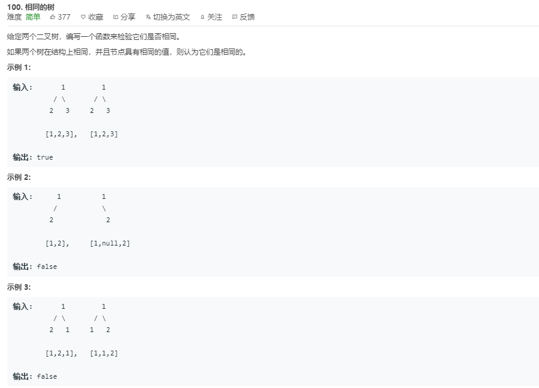

### DFS深度优先遍历

```JavaScript
var isSameTree = function(p, q) {
    if (p == null && q == null)
        return true
    if (p == null || q == null)
        return false
    if (p.val != q.val)
        return false
    return isSameTree(p.left,q.left) && isSameTree(p.right,q.right)
};
```

**终止条件与返回值**：

当两棵树的当前节点都为 null 时返回 true

当其中一个为 null 另一个不为 null 时返回 false

当两个都不为空但是值不相等时，返回 false

> 同时遍历每个节点的左右子节点进行比较对比，直到都为null 时，一个节点的左右子节点都为true，遍历结束

**复杂度分析**

时间复杂度 : O(N)，其中 N 是树的结点数，因为每个结点都访问一次。

空间复杂度 : 最优情况（完全平衡二叉树）时为 O(log(N)，最坏情况下（完全不平衡二叉树）时为 O(N)，用于维护递归栈。

### 序列化

```JavaScript
var isSameTree = function(p, q) {
	return JSON.stringify(p)===JSON.stringify(q)
};
```

## 104 [二叉树的最大深度](https://leetcode-cn.com/problems/maximum-depth-of-binary-tree/)

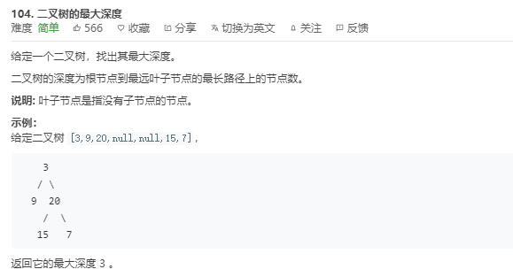

### DFS深度优先遍历

```JavaScript
var maxDepth = function (root) {
    if(!root) {
        return 0
    }else{
        const left = maxDepth(root.left)
        const right = maxDepth(root.right)
        return Math.max(left,right) + 1
    }
}
```

**复杂度分析**：

时间复杂度：O(n)

空间复杂度：最好 O(logN),最差 O（N）

## 105 从前序与中序遍历序列构造二叉树

另外构建数组

```JavaScript
var buildTree = function (preorder, inorder) {
  if (inorder.length === 0) return null // inorder不能再划分了
  let root = new TreeNode(preorder[0]) // 构建root
  let mid = inorder.indexOf(preorder[0]) // 找到root在inorder的位置
  root.left = buildTree(preorder.slice(1, mid + 1), inorder.slice(0, mid)) 
  // 根据左子树的preorder和inorder序列，构建左子树
  root.right = buildTree(preorder.slice(mid + 1), inorder.slice(mid + 1))
  // 根据右子树的preorder和inorder序列，构建右子树
  return root
};
```

改用移动指针

```JavaScript
var buildTree = (preorder, inorder) => {
  return helper(preorder, 0, preorder.length - 1, inorder, 0, inorder.length - 1)
}

function helper(preorder, p_start, p_end, inorder, i_start, i_end) {
  if (p_start > p_end) return null // preorder为空
  let rootVal = preorder[p_start] // 根节点的值
  let root = new TreeNode(rootVal) // 根节点
  let mid = inorder.indexOf(rootVal) // 根节点在inorder的位置
  let leftNum = mid - i_start // 左子树的节点数

  root.left = helper(preorder, p_start + 1, p_start + leftNum, inorder, i_start, mid - 1)
  root.right = helper(preorder, p_start + leftNum + 1, p_end, inorder, mid + 1, i_end)
  return root
}
```

添加哈希表，避免查询浪费性能

```JavaScript
var buildTree = (preorder, inorder) => {
  let map = new Map()
  for (let i = 0; i < inorder.length; i++) {
    map.set(inorder[i], i)
  }
  return helper(preorder, 0, preorder.length - 1, inorder, 0, inorder.length - 1, map)
}

function helper(preorder, p_start, p_end, inorder, i_start, i_end, map) {
  if (p_start > p_end) return null // preorder为空
  let rootVal = preorder[p_start] // 根节点的值
  let root = new TreeNode(rootVal) // 根节点
  let mid = map.get(rootVal) // 根节点在inorder的位置
  let leftNum = mid - i_start // 左子树的节点数

  root.left = helper(preorder, p_start + 1, p_start + leftNum, inorder, i_start, mid - 1, map)
  root.right = helper(preorder, p_start + leftNum + 1, p_end, inorder, mid + 1, i_end, map)
  return root
}
```

## [94. 二叉树的中序遍历](https://leetcode-cn.com/problems/binary-tree-inorder-traversal/)

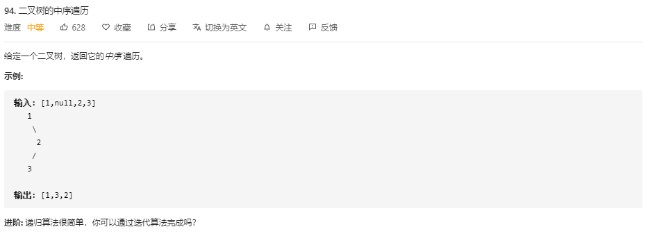

**递归** 

```js
/**
 * Definition for a binary tree node.
 * function TreeNode(val) {
 *     this.val = val;
 *     this.left = this.right = null;
 * }
 */
/**
 * @param {TreeNode} root
 * @return {number[]}
 */
var inorderTraversal = (root) => {
    let result = []
    var inorderTraversal = (node) => {
        if(node) {
            inorderTraversal(node.left)			// 先遍历左子树
            result.push(node.val)				// 再根节点
            inorderTraversal(node.right)		// 最后遍历右子树
        }
    }
    inorderTraversal(root)
    return result
}
```

```JS
var inorderTraversal = function(root) {
    let res = []
    let reverse = function(root) {
		root.left && reverse(root.left)		// 如果第一个满足则执行第二个
        res.push(root.val)
        root.right && reverse(root.right)
    }
    root && reverse(root)
    return res
}
```

> **注意到压栈中的是节点本身，压入数组中的是节点的值**

复杂度分析

时间复杂度：O(n)。递归函数 T(n) = 2⋅T(n/2)+1。
空间复杂度：最坏情况下需要空间O(n)，平均情况为O(log n)

**栈 迭代实现**

```JS
var inorderTraversal = function(root) {
	let stack = []
    let res = []
    let node = root
    
    while (stack.length != 0 || node) {
		while(node) {
            stack.push(node)
			node = node.left
        }
        
        node = stack.pop()
        res.push(node.val)
        node = node.right
    }
    return res
}
```

以上过程最好结合PPT来理解 [PPT](https://leetcode-cn.com/problems/binary-tree-inorder-traversal/solution/er-cha-shu-de-zhong-xu-bian-li-by-leetcode/)

内部 小 while 循环作用 ：在存在 node 节点时，就存储这个节点的入栈，然后移动到他的左子节点，直到不存在 左子节点，那么栈中存储了 最底层到最上层的左子节点，结束循环遍历后，开始跳出栈中的数据并存储，每次跳出一个节点时，查看它是否存在 右子节点，如果存在，那么继续执行 小 while 循环，将这个右子节点的左子节点存储进栈，类似于开始进入的 root 节点找其最左子节点的情况。如果不存在右子节点，那么不会循环 小 while 循环，（因为 node  = node.right , 此时 node = null） ，而关键的地方在于 此时执行 node = stack.pop() ，瞬间将 移动指针 node 转移到了栈中栈顶元素，这一步需要注意到，反复压入栈跳出栈，直到栈空

##  [144. 二叉树的前序遍历](https://leetcode-cn.com/problems/binary-tree-preorder-traversal/)

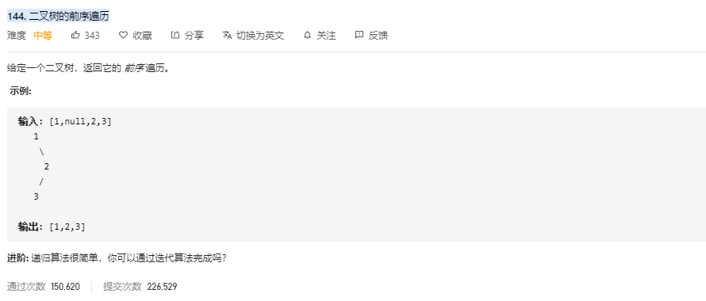

**递归**

```JS
/**
 * Definition for a binary tree node.
 * function TreeNode(val) {
 *     this.val = val;
 *     this.left = this.right = null;
 * }
 */
/**
 * @param {TreeNode} root
 * @return {number[]}
 */
var preorderTraversal = function(root) {
    let res = []
    let reverse = function(node) {
        if(node) {
            res.push(node.val)
            reverse(node.left)
            reverse(node.right)
        }
    }
    reverse(root)
    return res
};
```

**迭代实现 栈**

```JS
var preorderTraversal = function(root) {
    let res = []
    let stack = []
    if(root) stack.push(root)
    while(stack.length > 0) {
		let curNode = stack.pop()		// 第一步的时候，先访问的是根节点
        res.push(curNode.val)
        											
        if (curNode.right != null)		// 我们先打印左子树，然后右子树
            stack.push(curNode.right)	// 所以先加入栈的是右子树，然后左子树        
        if (curNode.left != null)
            stack.push(curNode.left)
    }
    return res
}
```

利用栈来记录遍历的过程，实际上，**递归就使用了调用栈，所以这里我们可以使用栈来模拟递归的过程**

- 首先根入栈
- 将根节点出栈，将根节点值放入结果数组中
- 然后遍历左子树、右子树，因为栈是先入后出，所以，我们先右子树入栈，然后左子树入栈
- 继续出栈（左子树被出栈）…….

依次循环出栈遍历入栈，直到栈为空，遍历完成

### 总结（前后中遍历迭代法不统一的写法）

为了解释清楚，我说明一下 刚刚在迭代的过程中，其实我们有两个操作，**一个是处理：将元素放进result数组中，一个是访问：遍历节点。**

分析一下为什么刚刚写的前序遍历的代码，不能和中序遍历通用呢，**因为前序遍历的顺序是中左右，要先访问的元素是中间节点，要处理的元素也是中间节点，所以刚刚才能写出相对简洁的代码，因为要访问的元素和要处理的元素顺序是一致的，都是中间节点。**

那么再看看**中序遍历，中序遍历是左中右，先访问的是二叉树顶部的节点，然后一层一层向下访问，直到到达树左面的最底部，再开始处理节点（也就是在把节点的数值放进result数组中），这就造成了处理顺序和访问顺序是不一致的。**

那么**在使用迭代法写中序遍历，就需要借用指针的遍历来帮助访问节点，栈则用来处理节点上的元素。**

## [145. 二叉树的后序遍历](https://leetcode-cn.com/problems/binary-tree-postorder-traversal/)

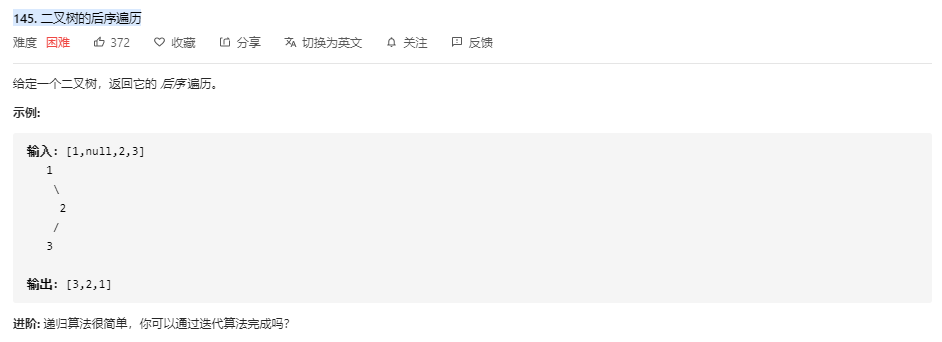

**迭代实现 栈**

```JS
var postorderTraversal = (root) => {
    let res = []
    let stack = []
    
    if (root)	stack.push(root)
    while (stack.length > 0) {
		let node = stack.pop()
        
        res.unshift(node.val)
        
        if (node.left != null) 
            stack.push(node.left)
        if (node.right != null) 
            stack.push(node.right)
    }
    return res
}
```

## [590. N叉树的后序遍历 *](https://leetcode-cn.com/problems/n-ary-tree-postorder-traversal/)

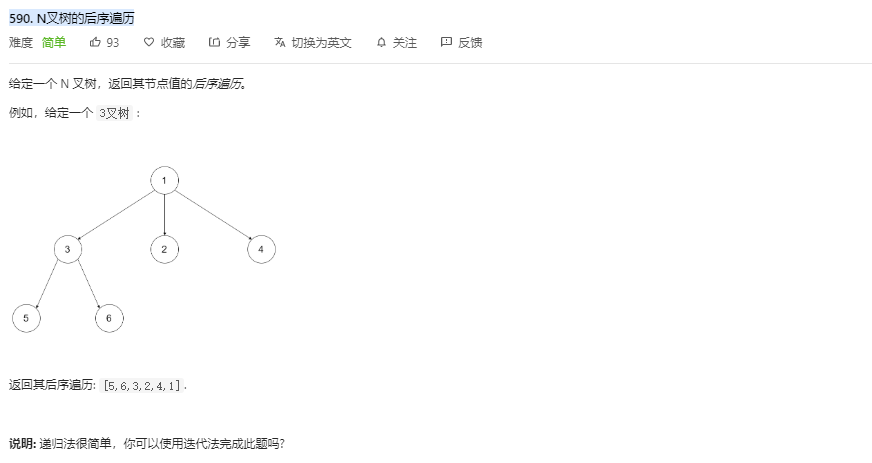

**递归**

> **注意节点的结构，像这种所有节点都定义在 children 中，可以遍历来找到每个节点**

```JS
/**
 * // Definition for a Node.
 * function Node(val,children) {
 *    this.val = val;
 *    this.children = children;
 * };
 */

/**
 * @param {Node} root
 * @return {number[]}
 */
var postorder = function(root) {
    let res = []
    let func = function(node,res) {
		if(node != null) {
            for(let i in node.children) {
        		if (node.children[i] != null)
                    func(node.children[i],res)
            }
        }
        res.push(node.val)
    }
    func(root,res)
    return res
}
```

**队列迭代 多叉树**

```JS
var postorder = (root) => {
    if (!root) return []
    let res = [root.val]	// 直接将根节点的值存储进去并定义
    let queue = root.children	//将根节点的值用队列存储起来（数组模拟队列，数组索引序号小到大分别对应从左到右）
    while(queue.length > 0) {
        let node = queue.pop()
        if (node != null) {
            res.unshift(node.val)
            if(node.children) {						// 直到遍历到底层的那个节点
                queue.push(...node.children)		//储存子节点们到队列中时，是从左往右存储。弹出时从右边开始弹出并从res头部开始储存（此时他们的父节点已经存储到res中了）），最终还是 左节点到右节点最后父节点
            }
        }
    }
    return res
}
```

## [589. N叉树的前序遍历](https://leetcode-cn.com/problems/n-ary-tree-preorder-traversal/)

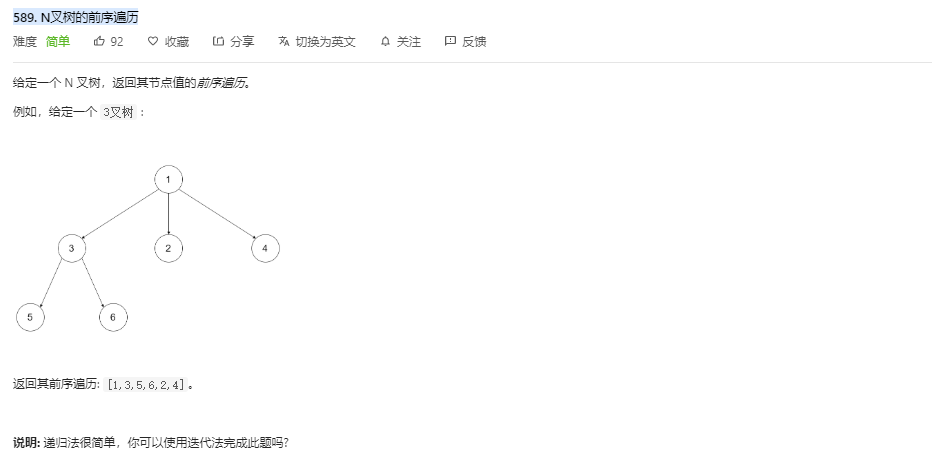

**递归**

根据后序遍历递归算法，可以类似推出

```JS
/**
 * // Definition for a Node.
 * function Node(val, children) {
 *    this.val = val;
 *    this.children = children;
 * };
 */

/**
 * @param {Node} root
 * @return {number[]}
 */
var preorder = function(root) {
    let res = []
    let func = function(node,res) {
        if(node != null) {
            res.push(node.val)
        }
        for(let i in node.children) {
            func(node.children[i],res)
        }
    }
    func(root,res)
    return res
};
```

**队列迭代 多叉树**

```JS
var preorder = (root)=>{
    if(!root){ return [];}
    let res =[root.val];
    let queue = root.children;
    while(queue.length>0){
        let node = queue.shift();
        if(node!=null){
            res.push(node.val);
            if(node.children){
                queue.unshift(...node.children);
            }            
        }       
    }
    return res;    
}
```

**在 queue 辅助队列中，插入子节点群到 queue 中，都是从队列的头部插入，（那么左节点到右节点存储到队列中），在取队列中的数据时，从头部弹出数据，符合要求即存储到 res 结果数组中（从头部弹出也就满足了 从左往右存储到 res 中）**


## [429. N叉树的层序遍历 *](https://leetcode-cn.com/problems/n-ary-tree-level-order-traversal/)

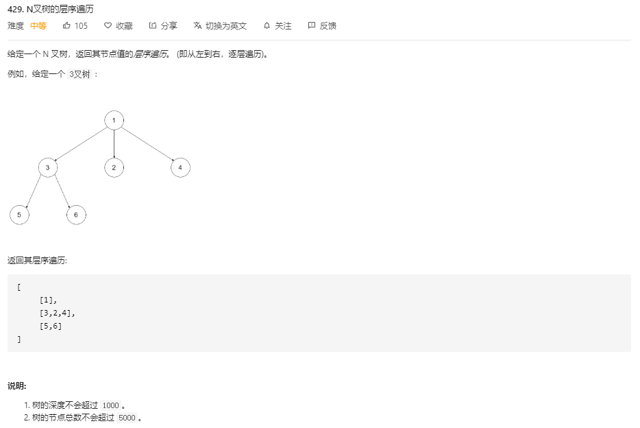

**队列辅助法**

```JS
/**
 * // Definition for a Node.
 * function Node(val,children) {
 *    this.val = val;
 *    this.children = children;
 * };
 */
/**
 * @param {Node} root
 * @return {number[][]}
 */
var levelOrder = function(root) {
    if (root === null) return [];
    let res = [];
    let queue = [root];
    
    while (queue.length > 0) {
        let length = queue.length;		// 每次都会更新 length 的长度，
        let tmp = [];
        for (let i = 0; i < length; i++) {		// 正好输出完原本那一层的节点，退出循环
            let cur = queue.shift();			// 依次输出那层的数据
            tmp.push(cur.val);					// 存储那层的数据，最后一起 push 到 res 中
            queue.push(...cur.children)			// 为下一层积累元素，（当循环结束时，上一层的数据更好存储完毕，剩下的长度为下层的所有节点）
        }
        res.push(tmp)
    }
    return res
};
```


# 递归系列题

## [70. 爬楼梯](https://leetcode-cn.com/problems/climbing-stairs/)

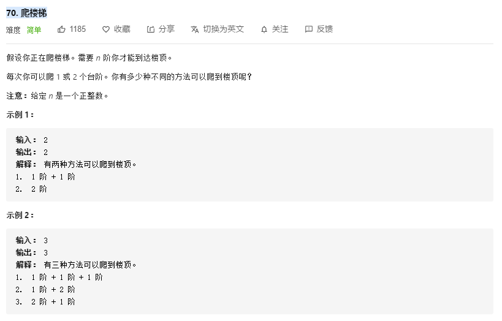

**分而自治思想,动态规划** 

这是一个考察斐波那契数列的题目，

`f(n) = f(n-1)  + f(n-2)`

> 我们用 f(x) 表示爬到第 x 级台阶的方案数，考虑最后一步可能跨了一级台阶，也可能跨了两级台阶，所以我们可以列出如下式子：
>
> f(x) = f(x - 1) + f(x - 2)
>
> 它意味着爬到第 x 级台阶的方案数是爬到第 x - 1 级台阶的方案数和爬到第 x - 2 级台阶的方案数的和。很好理解，因为每次只能爬 1 级或 2 级，所以 f(x) 只能从 f(x - 1) 和 f(x - 2) 转移过来，而这里要统计方案总数，我们就需要对这两项的贡献求和

**迭代循环法**

```js
var climbStairs = function(n) {
	let f = []
    f[0] = 0 
    f[1] = 1
    f[2] = 2
    for (let i = 3; i <= n; i++) {
		f[i] = f[i-1] + f[i-2]
    }
    return f[n]
};
```

时间复杂度 ： O(n) ，空间复杂度：O(1) 

**递归算法**

递归算法精简，但是容易超时

```JS
var climbStairs = function(n) {
	if (n==0) return 0
	else if (n==1) return 1
	else if (n==2) return 2
    
    return climbStairs(n-1) + climbStairs(n-2) 
};
```

## [22. 括号生成 ？？？](https://leetcode-cn.com/problems/generate-parentheses/)

递归算法，为什么会产生多种可能，按照代码执行的顺序不应该是只有一种可能吗？？