# 链表概念

**链表并不需要一块连续的内存空间，它通过“指针”将一组零散的内存块串联起来使用**

链表又分为四种：

1. 单链表
2. 循环链表
3. 双向链表
4. 循环双向链表

**链表的插入、删除和查询操作**

在链表中插入或者删除一个数据，**我们并不需要为了保持内存的连续性而搬移结点，因为链表的存储空间本身就不是连续的**。所以，在链表中插 入和删除一个数据是非常快速的。**但是仅仅是因为不需要维护数据的连续性，在单单进行数据删除的操作的时间复杂度的是 O(1) ，但是想要找到这个数据也是需要遍历的，遍历到的时间复杂度依旧为 O(n)**

> 链表要想随机访问第 k 个元素，就没有数组那么高效了。因为链表中的数据并非连续存储的，所以无法像数组那样，根据首地址和下标，通过寻址公式就能直接 计算出对应的内存地址，而是需要根据指针一个结点一个结点地依次遍历，直到找到相应的结点。链表随机访问的性能没有数组好，需要 O(n) 的时间复杂度

**循环链表**

循环链表仅仅是在单链表的基础上将末位元素的指针由指向 NULL 转换 指向头结点，产生一个循环的效果，在解决[约瑟父问题](https://blog.csdn.net/wenhai_zh/article/details/9620847)上，循环链表十分合适

> 建议查看一下 约瑟夫问题 的链接，里面有关于如何实现链表的建立代码和实际应用
>
> 注意到答主写错了 ，在进行 link-process 函数中，遍历到起始报数位时，进行报数遍历时，截止位 应该是 m-1 不是 m

**双向链表**

双向链表也是在单链表的基础上进行修改，在每个结点上除了 next 指针，另外添加了 prev 指针，用来指向此节点的上一个节点

> 正是因为在每个节点上都添加了一个指针，所以双向链表相对于单链表要占用更多的内存

有了前驱指针，那么更加灵活，可以实现双向遍历，双向链表的应用在哪呢，我们针对 删除 操作进行分析

在实际的软件开发中，从链表中删除一个数据无外乎这两种情况：

1. 删除结点中“值等于某个给定值”的结点； 
2. 删除给定指针指向的结点。

针对第一种情况，无论是单链表还是双向链表，都是需要先循环遍历到这个指针然后再执行删除操作，合计时间复杂度都为O(n)

而第二种情况下，我们想要实现删除的操作，我们需要知道 这个节点的 前驱节点的 引用，只有知道前驱节点的才可以进行删除操作（比如说将这个指针的前驱节点直接指向当前节点的后继节点，那么就实现了删除操作），如果是单链表的话，那么还是需要进行，遍历，当执行到 p->next = q 时，就能得到前驱节点 p 。而如果是双向链表的话， 因为当前节点保存了前驱节点的引用，所以不用进行遍历，可以直接进行删除操作，时间复杂度为O(1)

> **双向链表相对于单链表的特点，用空间换取时间**

**循环双向链表**

循环双向链表也就是在双向链表的基础上将尾节点指向头结点

**数组与链表的区别**

两者的区别不仅仅在于删除和插入操作的时间复杂度，更大的区别在于，数组使用的是连续的内存空间，一经声明就需要占用整块的连续内存空间，并且大小是固定的，无后续无法修改，内存过小，只能再申请一个更大的内存空间。而链表本身没有大小的限制，天然的支持动态扩容

链表在内存相关问题上与数组也有区别，链表在存储本身数据的同时，还需要维护本身节点的指针，如果数据量过大，内存消耗较大。另外链表在进行频繁的插入和删除操作时，还会导致频繁的内存申请和释放，容易造成内存碎片

所以，在我们实际的开发中，针对不同类型的项目，要根据具体情况，权衡究竟是选择数组 还是链表。


**链表代码的书写**

关于链表还有一个难点，如何来书写链表相关操作的代码

**将某个变量赋值给指针，实际上就是将这个变量的地址赋值给指针，或者反过来说，指针中 存储了这个变量的内存地址，指向了这个变量，通过指针就能找到这个变量。**

> 代码的正确解读方式：
>
> `p->next=q `， p 结点 中的 next 指针存储了 q 结点的内存地址。q 表示的变量现在 改为 p-next 了，也就现在 变为了 p 的下一个指向
>
> `p->next=p->next->next `  ，p 结点的 next 指针存储了 p 结点的下下一个结点的内存地址， p->next->next 位置表示的变量现在改为了 p->next ，也就是 p 的下下个节点现在是 p 的下个节点了
>
> **也就是在理解概念意思时，从左边往右度，左边存储了右边的数据，在理解指针操作上，左边的数据被右边的数据覆盖了，也就是等式左边的指针指向的原始数据会被丢失，内容会改为右边的数据，而右边的数据没有被丢失，只是更改了名字（引用名字）**

比如我们想要在 p 指针后面插入一个结点，如下操作会 导致 操作失败

```c
p->next = x; // 将 p 的 next 指针指向 x 结点；
x->next = p->next; // 将 x 的结点的 next 指针指向 b 结点；
```

第一步操作，先将左边的 数据给覆盖掉 了 ，也就是无法再访问到 原来的 p->next 。所以更不可能完成插入操作了 。第二步操作相当于将 为 `x->next = x`	 

正确的代码

```c
x->next = p->next // 先存储原始的指向数据
p->next = x // 再覆盖掉原始的数据
```

**针对删除操作**

如果是普通结点的删除

```c
p->next = p->next->next
```

**针对头节点的特殊处理**

```js
// 如果是一个空链表,插入节点
if (head == null) {
	head = new_node
}

// 如果要删除的是链表最后一个结点，也就是头结点
if (head->next == null) {
	head = null
}
```

**哨兵节点**

由于头结点的特殊性，我们在书写代码的时候特定因为头结点而进行特殊性的代码处理，这样代码显得不是很简洁，我们引入哨兵节点这个概念，也就是 head 头结点，不存储数据，存储的内容是 NULL ，而 head 的指针 指向第二个节点，第二个节点开始存储实际的数据。只需要在设计链表和构建链表的时候，将这一特点设计加入即可，那么就可以使用通用代码来实现所有节点的插入和删除操作

```C
head -> data = NULL
head -> next = q
q -> data = firstValue
q -> next = NULL
    
// 删除节点
p -> next = p -> next -> next
    
// 插入节点
x -> next = p -> next
p -> next = x
```


**应该熟练的手写以下链表代码**

1. 单链表反转
2. 链表中环的检测
3. 两个有序的链表合并
4. 删除链表倒数第 n 个结点
5. 求链表的中间结点


# 跳表概念

**跳表的设计就是为了优化链表查询某个数据的这个时间消耗**

跳表是一种动态数据结构，可以支持快速的插入、删除、查找操作，写起来也不复杂，甚至可以替代红黑树（Red-black tree）。**链表加多级索引的结构，就是跳表**

> Redis 中的有序集合（Sorted Set）就是用跳表来实现的

原始的单链表时，想要访问到某个数据上，只能从头到尾遍历链表，查找效率很低，而跳表的的原理就是在原始的单链表上 建立 一级一级的 索引。每两个节点或者多个节点 提取一个节点到上一级，我们把抽出来的那一级叫作 索引 或 索引层，

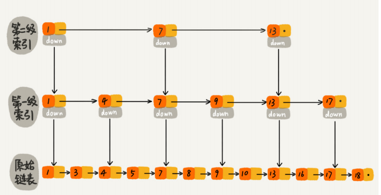

>  down 表示下级的索引指针

**跳表是如何实现查找的**？

先在最上层索引进行查找遍历，在属于的范围内通过 down 指针指向下级节点，再在下级节点的索引层接着遍历，通过 down 指针继续进入下层，直到到原始链表，遍历找到节点

**如果一个 长度为 n  的原始链表，那么他需要构建多少层 索引层？**

每两个结点会抽出一个结点作为上一级索引的结点，那第一级索引的结 点个数大约就是 n/2，第二级索引的结点个数大约就是 n/4，第三级索引的结点个数大约就 是 n/8，依次类推，也就是说，第 k 级索引的结点个数是第 k-1 级索引的结点个数的 1/2，那第 k 级索引结点的个数就是 n/(2^k^ )。

假设索引有 h 级，最高级的索引有 2 个结点。通过上面的公式，我们可以得到 n / (2^h^) = 2， 从而求得 h = log~2~n - 1。如果包含原始链表这一层，整个跳表的高度就是 log~2~n。我们在跳 表中查询某个数据的时候，如果每一层都要遍历 m 个结点，那在跳表中查询一个数据的时间复杂度就是 O(m*logn)。

那这个 m 的值是多少呢？按照前面这种索引结构，我们每一级索引都最多只需要遍历 3 个 结点，也就是说 m = 3 ，（可以通过举例论证） 。**所以在跳表中查询任意数据的时间复杂度就是 O(logn)**

> **两个重要思想：**
>
> 1. **升维：**（**这个查找的时间复杂度跟二分查找是一样的，将一维问题升为二维问题。换句话说，我们其实是基于单链表实现了二分查找**）
> 2. **空间换时间：** （**这种查询效率的提升，前提 是建立了很多级索引，也就是通过空间来换取时间的操作**）

**跳表的空间复杂度分析**

跳表的空间复杂度问题在于 为各个索引而开辟的空间，我们来进行分析

假设原始链表大小为 n，那第一级索引大约 有 n/2 个结点，第二级索引大约有 n/4 个结点，以此类推，每上升一级就减少一半，直到 剩下 4 个结点，2 个节点。如果我们把每层索引的结点数写出来，就是一个等比数列。` n/2+n/4+n/8…+8+4+2 = n-2 `。所以，**跳表的空间复杂度是 O(n)**。**也就是说，如果将包含 n 个结点的单链表构造成跳表，我们需要额外再用接近 n 个 结点的存储空间。**

可以进行优化，比如说 每 三个节点 提升一个节点，那么进行分析的结果是  `n/3+n/9+n/27+…+9+3+1 = n/2`。尽管 空间复杂度还是 O(n)，但比上面的每两个结点抽一个结点的索引构建方法，要减少了一半 的索引结点存储空间

> 实际上，在软件开发中，我们不必太在意索引占用的额外空间。在讲数据结构和算法时，我 们习惯性地把要处理的数据看成整数，但是在实际的软件开发中，原始链表中存储的有可能 是很大的对象，而索引结点只需要存储关键值和几个指针，并不需要存储对象，所以当对象 比索引结点大很多时，那索引占用的额外空间就可以忽略了。

**实现高效的动态插入和删除**

跳表 这个动态数据结构，不仅支持查找操作，还支持动态的插入、删除操作，而且插入、删除操 作的时间复杂度也是 O(logn)。

由于 插入和删除操作 本身时间复杂度为 O(1) ，关键优化的地方在于查询到这个 元素，因为跳表的实现，所以查询到的时间为 O(logn) ,所以整体时间复杂度为 O(logN)

删除操作中，因为单链表中的删除操作需要拿到要删除结点的前驱结点，然后通过指针操作完成删除。所 以在查找要删除的结点的时候，一定要获取前驱结点。当然，如果我们用的是双向链表，就不需要考虑这个问题了。

**跳表的动态更新**

当我们不停地往跳表中插入数据时，如果我们不更新索引，就有可能出现某 2 个索引结点 之间数据非常多的情况。极端情况下，跳表还会退化成单链表。作为一种动态数据结构，我们需要某种手段来维护索引与原始链表大小之间的平衡，也就是 说，如果链表中结点多了，索引结点就相应地增加一些，避免复杂度退化，以及查找、插 入、删除操作性能下降。

> 如果你了解红黑树、AVL 树这样平衡二叉树，你就知道它们是通过左右旋的方式保持左右 子树的大小平衡（如果不了解也没关系，我们后面会讲），**而跳表是通过随机函数来维护前 面提到的“平衡性”。**随机函数的选择很有讲究，从概率上来讲，能够保证跳表的索引大小和数据大小平衡性，不 至于性能过度退化

当我们往跳表中插入数据的时候，我们可以选择同时将这个数据插入到部分索引层中。如何 选择加入哪些索引层呢？ 我们通过一个随机函数，来决定将这个结点插入到哪几级索引中，比如随机函数生成了值 K，那我们就 **将这个结点添加到第一级到第 K 级这 K 级索引中。**

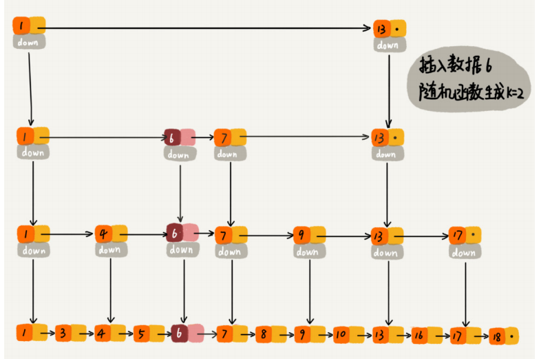

> 也就说 跳表在进行删除和插入操作的时候，维护成本较高


# 题目集合

## [21. 合并两个有序链表](https://leetcode-cn.com/problems/merge-two-sorted-lists/)

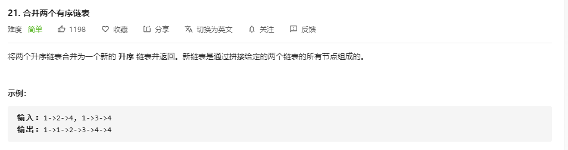

**[迭代法](https://leetcode-cn.com/problems/merge-two-sorted-lists/solution/he-bing-liang-ge-you-xu-lian-biao-by-leetcode-solu/)**

```JavaScript
/**
 * Definition for singly-linked list.
 * function ListNode(val, next) {
 *     this.val = (val===undefined ? 0 : val)
 *     this.next = (next===undefined ? null : next)
 * }
 */
/**
 * @param {ListNode} l1
 * @param {ListNode} l2
 * @return {ListNode}
 */

var mergeTwoLists = function(l1, l2) {
    const prehead = new ListNode(-1); 	// 注意到 JS 创建结点的方式

    let prev = prehead;
    while (l1 != null && l2 != null) {
        if (l1.val <= l2.val) {
            prev.next = l1;
            l1 = l1.next;
        } else {
            prev.next = l2;
            l2 = l2.next;
        }
        prev = prev.next;
    }

    // 合并后 l1 和 l2 最多只有一个还未被合并完，我们直接将链表末尾指向未合并完的链表即可
    prev.next = l1 === null ? l2 : l1;

    return prehead.next;
};
```

关于迭代法的实现，可以查看链接中的PPT演示，这里做一点总结概

在本题中，另外构建一个链表，设定一个头结点 prehead , 设定一个不断更新指向的移动指针 prev ，遍历两个 链表 （注意链表的遍历都是通过 while 语句来实现的，同时结束遍历的条件都是 !=null），先对比两个链表的值，小的那一方设定为 prev 的下一个指向（也就是连接起来下一个值），然后将 这个节点后移（相当于完成了这个节点的存储），接着将 prev 后移，更新指针，依次执行，当一个链表执行完毕后，因为都是有序的，所以另一个未执行完的一定是大于前所有的，所以可以直接连接上。最后返回新建链表的头结点后面一个节点，这个节点表示着合并链表的引用

> 注意，函数外部传递进来的是两个链表的头结点**引用**，所以在把他们作为移动指针也没关系

### **总结**

关于两个或多个链表的合并或者修改等操作，可以通过另外构建一个链表来实现，因为如果在原生链表中遍历修改的时候很容易出错

> ```js
> function ListNode(val, next) {
>     this.val = (val===undefined ? 0 : val)
>     this.next = (next===undefined ? null : next)
> }
> 
> const prehead = new ListNode(-1,null); 	// 注意到 JS 创建结点的方式
> ```
>
> **在创建结点的时候，如果未传递参数进去，创建函数内有对应的处理方法**

**递归算法**

```JS
var mergeTwoLists = function(l1, l2) {
    if (l1 === null) {
        return l2;
    } else if (l2 === null) {
        return l1;
    } else if (l1.val < l2.val) {
        l1.next = mergeTwoLists(l1.next, l2);
        return l1;
    } else {
        l2.next = mergeTwoLists(l1, l2.next);
        return l2;
    }
};
```


## 206 反转链表

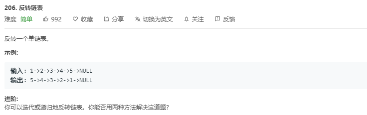

常规两种方法：迭代和递归

普通方法

### 迭代

假设存在链表 1 → 2 → 3 → Ø，我们想要把它改成 Ø ← 1 ← 2 ← 3。在遍历列表时，将当前节点的 next 指针改为指向前一个元素。由于节点没有引用其上一个节点，因此必须事先存储其前一个元素。在更改引用之前，还需要另一个指针来存储下一个节点。不要忘记在最后返回新的头引用！

```Java
class Solution {
	public ListNode reverseList(ListNode head) {
		//申请节点，pre和 cur，pre指向null
		ListNode pre = null;
		ListNode cur = head;
		ListNode tmp = null;
		while(cur!=null) {
			//记录当前节点的下一个节点
			tmp = cur.next;
			//然后将当前节点指向pre
			cur.next = pre;
			//pre和cur节点都前进一位
			pre = cur;
			cur = tmp;
		}
		return pre;
	}
}
```

**复杂度分析**

时间复杂度：O(n)，假设 n是列表的长度，时间复杂度是 O(n)。
空间复杂度：O(1)

> 迭代这个过程，实际就是将当前指向的下一个位置数据先存储起来，将指向到其前面那个数据（开始前面的数据是空null），然后将pre后移，再通过临时存储将cur向后移动，重复直到cur指到最后一个元素，pre后移指向到最后一个元素，cur为其下一个元素（即null），此时整个链表已经完成了指向翻转，同时pre现在指向的那个节点就是头结点

### [递归](https://leetcode-cn.com/problems/reverse-linked-list/solution/dong-hua-yan-shi-206-fan-zhuan-lian-biao-by-user74/)

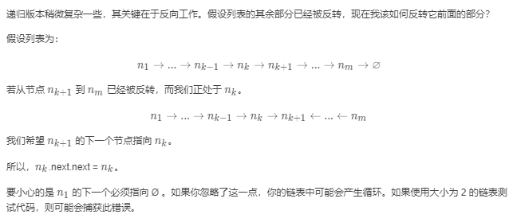

```Java
public ListNode reverseList(ListNode head) {
    if (head == null || head.next == null) return head;
    ListNode p = reverseList(head.next);
    head.next.next = head;
    head.next = null;
    return p;
}
```

> 此方法最几个重要的点：
>
> 1. 先递归到最后一个节点，当遇到终止递归条件时 head.next为null时，结束深入递归，开始执行每个剩余的部分的语句，值得注意的是在不同环境下的head值是当时递归环境下的head值，也就是在执行剩余部分语句的时候要注意到head指的都不是一个head，而是当时那个环境下的head
>
> 2. head.next.next  = head
>
>    head.next = null
>
>    这个方法是表示这个节点的下一个节点 的下一个节点指向的是自己，（也就是互相指），后面一语句，表示这个节点的下一个节点注销（所以完成了翻转，这个节点不再指向其原来的指向的下一个节点，而其原来指向的节点现在指向了他自己）
>
>    
>
>    末位return 的 cur 一直返回的是末位的数值5（这也是不符合递归逻辑的地方，按理递归应该不停的返回一个不一样的值）
>
>    根据递归，一直执行下去，最后将原来最后的一个元素返回，此时最后一个元素已为第一个元素
>
>    

**复杂度分析**

时间复杂度：O(n)，假设 n 是列表的长度，那么时间复杂度为 O(n)。
空间复杂度：O(n)，由于使用递归，将会使用隐式栈空间。递归深度可能会达到 n 层。

### 根据迭代方法的原理改进递归方法

```Java
class Solution {
    ListNode pre = null, tmp = null;
    public ListNode reverseList(ListNode head) {
        if (head == null)
            return pre;
        tmp = head.next;
        head.next = pre;
        pre = head;
        head = tmp;
        return reverseList(head);
    }
}
```

## 160 相交链表

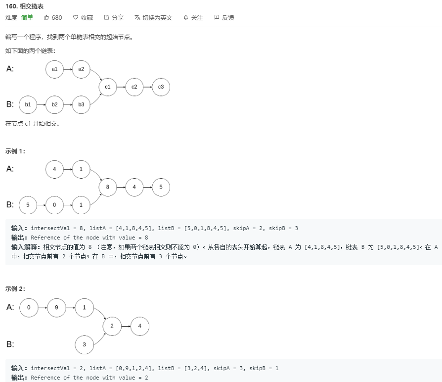

三种解法：

1. 暴力解法（两个循环嵌套，拿一个链表的每个元素和外层嵌套的元素比较）

   时间复杂度 ：O( N*M)  即链表A的长度和链表 B的长度的乘积

   空间复杂度 ：O (1)

2. 哈希标记法

   遍历链表 A 并将每个结点的地址/引用存储在哈希表中。然后检查链表 B 中的每一个结点 b是否在哈希表中。若在，则 b为相交结点。

   时间复杂度 : O(m+n)。
   空间复杂度 : O(m)或 O(n) 。（即用来构建哈希表的空间）

3. **双指针法**

   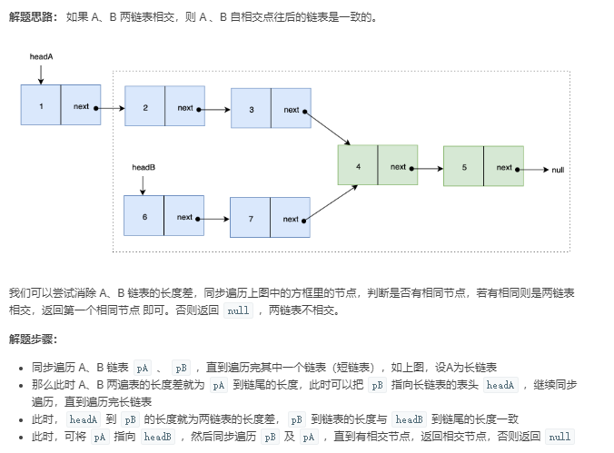

   > 特点在于公共部分是相同的，那么两者的相差就在于前部分，前部分的长度差是关键所在，两个指针同时向后移动，当一个移动完毕后就转移到对方链表上移动，当双方中长度长那一方移动到对方的链表时，已经完成了长度差带来的问题，此时两者一定是同向指定在一个位置，同步向后移动，当都移动到公共部分时，得到公共节点

   **时间复杂度：O(n)或者O(M)**

   **空间复杂度：O(1)**

   代码：

   ```JavaScript
   var getIntersectionNode = function(headA, headB) {
       // 清除高度差
       let pA = headA, pB = headB
       while(pA || pB) {
           if(pA === pB) return pA
           pA = (pA === null ? headB : pA.next)		//遇到空，即需要更换到对方链表
           pB = (pB === null ? headA : pB.next)
       }
       return null
   };
   ```

   

## 141 环形链表 （简单，成环问题）

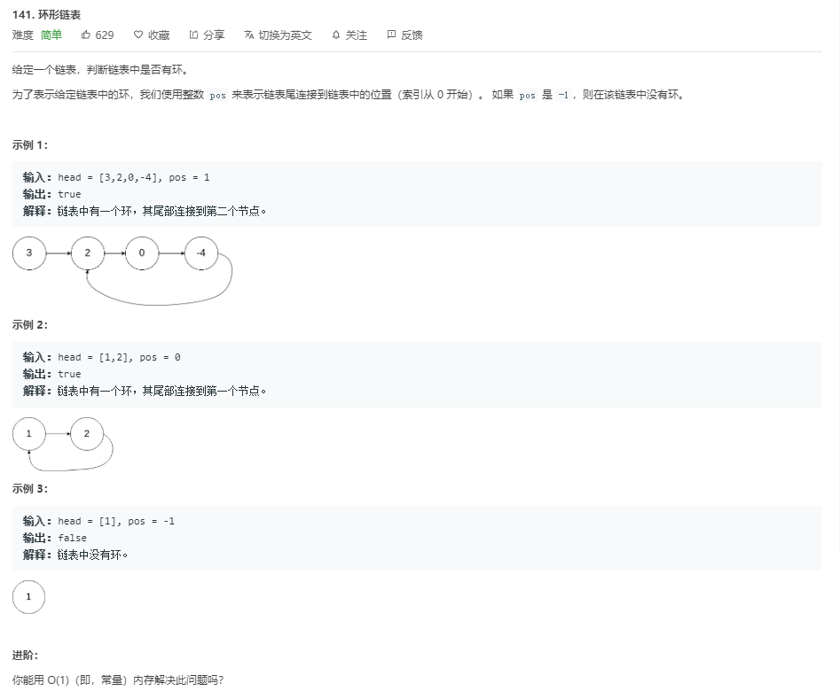

**解题方法**

### 哈希表

我们遍历所有结点并在哈希表中存储每个结点的引用（或内存地址）。如果当前结点为空结点 null（即已检测到链表尾部的下一个结点），那么我们已经遍历完整个链表，并且该链表不是环形链表。如果当前结点的引用已经存在于哈希表中，那么返回 true（即该链表为环形链表）。

```java
public boolean hasCycle(ListNode head) {
    Set<ListNode> nodesSeen = new HashSet<>();
    while (head != null) {
        if (nodesSeen.contains(head)) {
            return true;
        } else {
            nodesSeen.add(head);
        }
        head = head.next;
    }
    return false;
}
```

复杂度分析：

时间复杂度：O(n)，对于含有 n 个元素的链表，我们访问每个元素最多一次。添加一个结点到哈希表中只需要花费 O(1) 的时间。

空间复杂度：O(n)，空间取决于添加到哈希表中的元素数目，最多可以添加 n 个元素。

> 哈希表的建表的同时，也完成了是否存在的判断
>
> 只要关于出现次数的统计，就可以使用哈希表来解决

### 双指针（快慢指针）

通过使用具有 不同速度 的快、慢两个指针遍历链表，空间复杂度可以被降低至O(1)。慢指针每次移动一步，而快指针每次移动两步。

如果列表中不存在环，最终快指针将会最先到达尾部，此时我们可以返回 false

**如果存在环形链表，那么快指针一定会追击到慢指针，两者相遇**

```java
public boolean hasCycle(ListNode head) {
    if (head == null || head.next == null) {
        return false;
    }
    ListNode slow = head;
    ListNode fast = head.next;
    while (slow != fast) {
        if (fast == null || fast.next == null) {
            return false;
        }
        slow = slow.next;
        fast = fast.next.next;
    }
    return true;
}
```

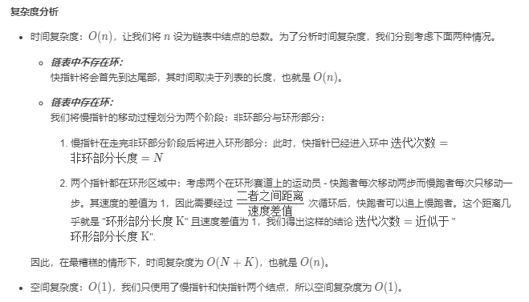

> 以上复杂度分析较为精细，习惯非常好
>
> 因为快指针比慢指针每次多1步，那么当慢指针到了环形指针的接口时（假设已经走了N步，那么非环形部分长度为N），那么快指针也在环形中走了N步
>
> 最糟糕下，快指针正好追了一圈才追上慢指针，设环形部分长度为M，那么一共的时间复杂度 O（N+M）也就是整个链表的长度 O（n）


## 142 环形链表二 （中等）

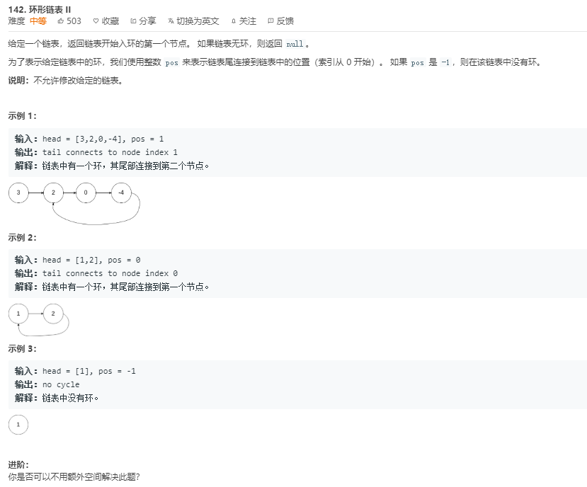

**解题方法**

### 哈希表

### 快慢指针

[双指针](https://leetcode-cn.com/problems/linked-list-cycle-ii/solution/141ti-de-kuo-zhan-ru-guo-lian-biao-you-huan-ru-he-/)

> 链接中解释的非常清楚
>
> 关键点：
>
> 1. 利用公式来构建模型关系，最后因为快指针转了圈不重要，取n=1，发现了公式关系，慢指针在环形内未完成部分正好等于慢指针从起点到入环节点的距离
>
> 2. **刻意制造相撞**，将快指针模拟慢指针过来的路径，当两者发生碰撞的时候，正好即为入环节点！
>
> 3. 画图理解，特别注意到两指针之间的倍数关系
>
> 4. 利用两指针正好发生第一次碰撞时，构建等式关系
>
>    此时快指针模拟慢指针的速度，从起点出发

代码：

```JavaScript
var detectCycle = function (head) {
  let slowP = head, fastP = head // 都从头节点出发
  while (fastP) {                // 指向null就说明没有环，返回null
    if (fastP.next == null) return null // fastP.next为null也说明无环
    slowP = slowP.next           // 慢指针走一步
    fastP = fastP.next.next      // 快指针走两步
    if (slowP === fastP) {       // 首次相遇
      fastP = head               // 让快指针回到头节点
      while (true) {             // 开启循环，让快慢指针相遇
        if (slowP === fastP) {   // 相遇地点肯定在入环处
          return slowP
        }
        fastP = fastP.next       // 快慢指针都走一步
        slowP = slowP.next
      }
    }
  }
  return null // head就是null的情况
```

```javascript
var detectCycle = function(head) {
    let fast=head,slow=head
    while(fast){
        if(fast == slow && fast != head){
            fast = head
            while(true){
                if(fast == slow)
                    return fast
                fast = fast.next
                slow = slow.next
            }
        }
        fast = fast.next.next
        slow = slow.next
    }   
    return false
};
```

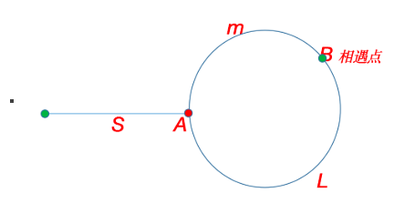

> 解得 m = S


```js

```

