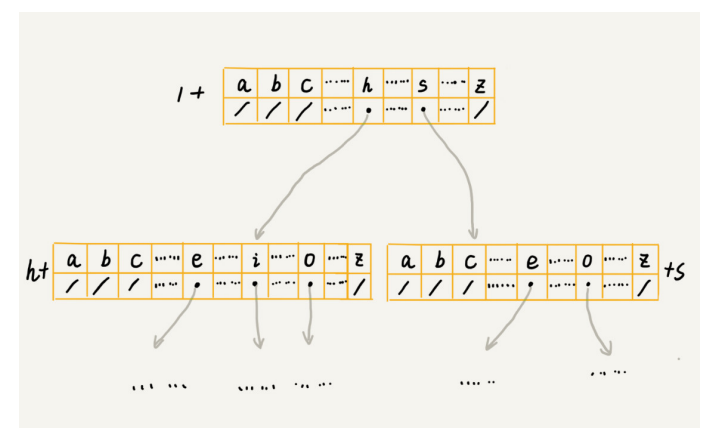

## Trie 树（字典树）

 [35丨Trie树：如何实现搜索引擎的搜索关键词提示功能？.pdf](文档引用\35丨Trie树：如何实现搜索引擎的搜索关键词提示功能？.pdf) 

**专门处理字符串匹配 的数据结构，用来解决在一组字符串集合中快速查找某个字符串的问题**

散列表、红黑树，字符串匹配算法都可以替代

Trie 树的本质，就是利用字符串之间的公共前缀， 将重复的前缀合并在一起。

分为字典树的构建过程和字典树查询的过程

在字典树构建的过程中就是将字符集合构造成一颗Tire树

在字典树中查询就是在 Trie 树中查 询一个字符串

如何存储Tire树？

每个节点都对应一个长度为26的数组，而数组中索引对应着a-z这26个字母，

数据结构：

```java
class TrieNode {
  char data;
  TrieNode children[26];
}
```

逻辑结构图：



实现代码：

```java
public class Trie {
    private TrieNode root = new TrieNode('/'); // 存储无意义字符

    // 往 Trie 树中插入一个字符串
    public void insert(char[] text) {
        TrieNode p = root;
        for (int i = 0; i < text.length; ++i) {
            int index = text[i] - 'a';
            if (p.children[index] == null) {
                TrieNode newNode = new TrieNode(text[i]);
                p.children[index] = newNode;
            }
            p = p.children[index];
        }
        p.isEndingChar = true;
    }

    // 在 Trie 树中查找一个字符串
    public boolean find(char[] pattern) {
        TrieNode p = root;
        for (int i = 0; i < pattern.length; ++i) {
            int index = pattern[i] - 'a';
            if (p.children[index] == null) {
                return false; // 不存在 pattern
            }
            p = p.children[index];
        }
        if (p.isEndingChar == false) return false; // 不能完全匹配，只是前缀
        else return true; // 找到 pattern
    }

    public class TrieNode {
        public char data;
        public TrieNode[] children = new TrieNode[26];
        public boolean isEndingChar = false;
        public TrieNode(char data) {
            this.data = data;
        }
    }
}
```

复杂度分析：

时间复杂度：

构建Tire树过程中时间复杂度：O(n)，n表示所有字符串的长度和，在查询的过程中：如果要查询的字符串长度是 k，那我们只需要比对大约 k 个节点，查找字符串的时间复杂度是 O(k)，k 表示要查找的字符串的长度

空间复杂的：

Trie 树是非常耗内存的，用的是一种空间换时间的思路

用数组来存储一个节点的子节点的指针。如果字符串中包含从 a 到 z 这 26 个字符，那每个节点都要存储一个长度为 26 的数组，并且每个数组存储一个 8 字节指针（或者是 4 字节，这个大小跟 CPU、操作系统、编译器等有关。而且，即便一个节点只有很少的子节点，远小于 26 个，比如 3、4 个，我们也要维护一个长度为 26 的数组。

如果字符串中不仅包含小写字母，还包含大写字母、数字、甚至是中文，那需要的存储空间 就更多了


总的来说：

Trie 树只是不适合精确匹配查找，这种问题更适合用散列表或者红黑树来解决。 Trie 树比较适合的是查找前缀匹配的字符串。字典树针对的正是，拥有特别多的公共前缀的情况下，在解决搜索引擎查找关键字方面特别有用，那么其实在一些普通的查询匹配字符串的情况下效率并不高，不如使用散列表、跳表等，

字典树的特点：


而在实际的工程项目中，更倾向于用散列表或者红黑树。因为这两种数据结构，我们都不需要自己去实现，直接利用编程语言中提供的现成类库

针对空间占内存这个问题也可以进行优化，比如不实用数组这种数据类型作为基础结构（因为数组便于访问连续性等问题，便于访问，但是浪费内存），可以改进为使用有序数组，数组中的指针按照所指向的子节点中的字符的大小顺序排列。查询的时候，我们可以通过二分查找的方法，快速查找到某个字符应该匹配的子节点的指针。但 是，在往 Trie 树中插入一个字符串的时候，我们为了维护数组中数据的有序性，就会稍微慢了点。

或者在就是对只有一个子节点的节点，而且此节点不是一个串的结束节点，可以将此节点与子 节点合并，称为缩点优化


按层次打印二叉树

深度优先遍历树

广度优先遍历（水波纹）


二叉搜索树：左子节点的值要小于根节点的值，右节点的值大于根节点的值

查找的时候效率更高


前中后序遍历


前缀的词频感应（搜索引擎）

最大限度的减少无畏的字符串比较，查询效率比哈希表高