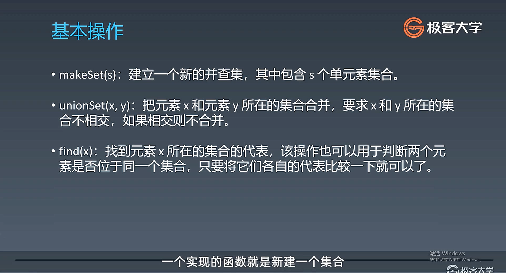
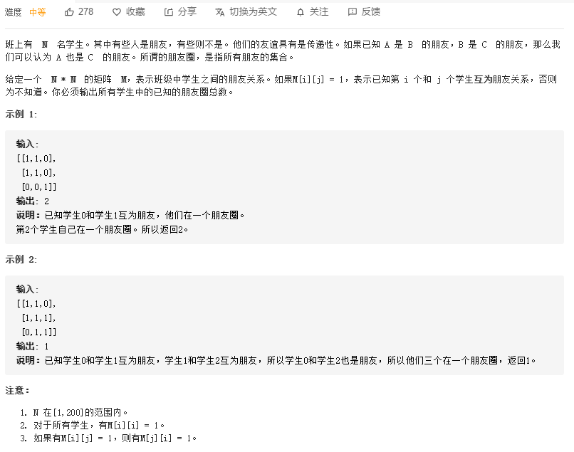
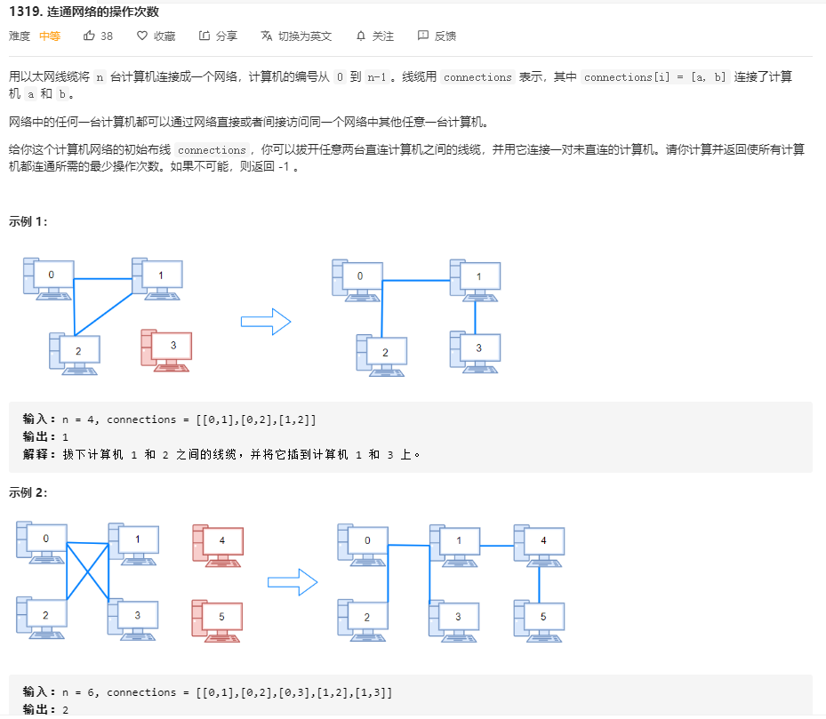

## 并查集（disjoint-set/ union -find）

### 链接推荐

1. [详细介绍](https://leetcode-cn.com/problems/friend-circles/solution/union-find-suan-fa-xiang-jie-by-labuladong/)/[副本](https://github.com/yummy-zc/fucking-algorithm/blob/master/%E7%AE%97%E6%B3%95%E6%80%9D%E7%BB%B4%E7%B3%BB%E5%88%97/UnionFind%E7%AE%97%E6%B3%95%E8%AF%A6%E8%A7%A3.md)
2. [并查集的通俗讲解【推荐】](https://github.com/leetcode-pp/91alg-1/issues/71#issuecomment-657518465)
3. [理清思路](https://gitee.com/golong/leetcode/blob/master/thinkings/union-find.md)

使用模板，调用现成的代码，题目较为固定，**一般为组团、配对问题**

相对于其他数据结构，这种结构相对独立

> 判断A和B是不是朋友，如何使他们成为朋友

> 个人总结：
>
> 并查集解题的特点，题目一般都是联通性问题，遇到联通性问题，想到并查集，那么通常会给已经联通好的数据（已知朋友圈、已连接好的网络），通常以二维数组来存储数据（每个元素的值为0或1，表示是否为朋友，又或者为有联通关系的两个值，值即为他们的下标），
>
> 解题思路通常都是直接使用到并查集的模板，然后根据题目要求，另外设置一些变量来存储一些信息，通过存储的信息来解答
>
> 并查集的模板，先将题设给的N个个体初始化为单个的个体（单个的集合），然后再根据给与的数据（数组存储的关系），来将这些单独的个体来合并起来，在合并的时候会先查询他们是否已经合并（即查询他们是否是一个代表），如果是一个代表，即表示已经在一个集合中，已经是联通的，如果不是一个代表，进行合并操作，那么单独的个体数-1（起初是N个），遍历完与的数组信息，也就完成了操作，最后根据因题目而特别设定的变量的值，来进行结果的返回
>
> 也就是说，本质的并查集的操作都是一样的，题目的变化只不过都是在这个基础上，来设定或者记录一些信息，根据信息来完成不同的题目，比如说朋友圈问题，记录最后单独的个体集合的数量（实际就是起初有N个集合个体，每次进行合并操作减少1个， SuperlusSum = InitN - UnionSum），比如说电脑通过电脑线连接成的以太网问题中，记录重复合并的个数，根据题目特点，来进行解答

### 并查集的基本操作

There are two operations for a disjoint-set, `union` and `find`




> 200 岛屿数量 

#### makeSet：

```java
class UF {
    // 记录连通分量
    private int count;
    // 节点 x 的节点是 parent[x]
    private int[] parent;

    /* 构造函数，n 为图的节点总数 */
    public UF(int n) {
        // 一开始互不连通
        this.count = n;
        // 父节点指针初始指向自己
        parent = new int[n];
        for (int i = 0; i < n; i++)
            parent[i] = i;
    }

    /* 其他函数 */
}
```

也就是起初如果有n 个元素，为这N个元素开辟一个连续的内存空间，也就是一个数组，数组用parent来表示，那么由于起初的n个元素都看做单个的个体，所以parent的长度设为N，那么parent的作用是用来表示当前元素指向的父节点，也就是这是一个指针，

在进行初始化的时候，令指针指向自己，count是指的集合的个数，起初是N个

#### unionSet：

```java
public void union(int p, int q) {
    int rootP = find(p);
    int rootQ = find(q);
    // 即相同的根节点，已经是一个集合内
    if (rootP == rootQ)
        return;
    // 将两棵树合并为一棵
    parent[rootP] = rootQ;
    // parent[rootQ] = rootP 也一样
    count--; // 两个分量合二为一
}

/* 返回当前的连通分量个数 */
public int count() { 
    return count;
}
```

合并两个集合，（起初都是单个的个体，合并多了就是多个单独的树），进行union操作时，会将一个集合的代表指针指向另外一个集合，那么也就完成合并操作，

#### find：

```java
/* 返回某个节点 x 的根节点 */
private int find(int x) {
    // 根节点的 parent[x] == x
    while (parent[x] != x)
        x = parent[x];
    return x;
}
```

find函数实现的主要功能是，当给你一个数，通过find函数来查找到这个数的代表数（也就是最后指向的那个节点），实现查找的原理，一步一步的查找，直到到这个集合最后的根节点


### 并查集的复杂度分析：

makeSet由于创建需要基于各个单独的数据建立一个指针空间，所以是O(N)

union主要依赖于find函数，而find函数是关键，如果在合并的时候不做要求，哪一方集合的代表是哪一方集合代表的父节点（即指向），那么最后生成的集合树是不确定的，最坏情况下正好合并成了一个单支树（类似于单链表），即极端不平衡的情况下，查询的时间复杂度为O(N)，最好的情况下正好合并成了一个平衡二叉树，查询的时间复杂度为O(logN)。

总的来说，时间复杂度是O(n)，这在处理图等大数据问题时，线性时间是非常低效的

#### 优化

在合并树和查询树这个环节进行优化

在合并的时候，将小的那个集合作为子集合，小集合代表指向大集合代表，这样每次相对来说最平衡，用一个变量存储集合的节点个数

初始化的时候；

```java
class UF {
    private int count;
    private int[] parent;
    // 新增一个数组记录树的“重量”
    private int[] size;

    public UF(int n) {
        this.count = n;
        parent = new int[n];
        // 最初每棵树只有一个节点
        // 重量应该初始化 1
        size = new int[n];
        for (int i = 0; i < n; i++) {
            parent[i] = i;
            size[i] = 1;
        }
    }
    /* 其他函数 */
}
```

合并操作

```java
public void union(int p, int q) {
    int rootP = find(p);
    int rootQ = find(q);
    if (rootP == rootQ)
        return;
    
    // 小树接到大树下面，较平衡
    if (size[rootP] > size[rootQ]) {
        parent[rootQ] = rootP;
        size[rootP] += size[rootQ];
    } else {
        parent[rootP] = rootQ;
        size[rootQ] += size[rootP];
    }
    count--;
}
```

那么在查询树的时候，可以进行路径压缩

```java
private int find(int x) {
    while (parent[x] != x) {
        // 进行路径压缩
        parent[x] = parent[parent[x]];
        x = parent[x];
    }
    return x;
}
```

也就是当前这个元素，直接指向其爷爷，和其爸爸并列指向爷爷，然后令爷爷为自己，再使其指向其爷爷，那么最后树的高度不会超过3，在每次进行查询的时候，同时优化了自身的树结构，方便后续合并，十分巧妙！

## [547. 朋友圈](https://leetcode-cn.com/problems/friend-circles/)



解决朋友圈问题

```java
    public int findCircleNum(int[][] M) {
        int n = M.length;
        UF uf = new UF(n);
        for (int i = 0; i < n; i++) {
            for (int j = 0; j < i; j++) {
                if (M[i][j] == 1)
                    uf.union(i, j);
            }
        }
        
        return uf.count();
    }
```

因为好友关系是相互的，所以循环遍历只需要遍历一半即可

如果查找到值为1，那么两者是好朋友，将初始化相互独立的个体进行合并到一个集合内，也就是成为好朋友，进行union操作，最后返回集合的个数即可

JavaScript版本

```JavaScript
var findCircleNum = function(M) {
    let len = M.length
    let parents = Array.from(M).map((item, index) => index)
    function find(x) {
        if(x === parents[x]){
            return x
        }
        return (parents[x] = find(parents[x]))
    }
    function union(x, y){
        if(find(x) === find(y)) {
            return
        }
        parents[parents[x]] = parents[y]
        len--
    }

    for(let i = 0; i < M.length; i++){
        for(let j = i+1; j < M[i].length; j++){
            if(M[i][j]) union(i, j)
        }
    }
    return len
};
```

## [1319. 连通网络的操作次数](https://leetcode-cn.com/problems/number-of-operations-to-make-network-connected/)



需要理解到的关键特点，当有N个独立的网络，想要全部实现联通，那么至少还需要N-1个多余的线才能实现连通。问题是如何去寻找这N-1条线，

考虑每一条线，如果线的两头已经连通（`find(p) == find(q)`），则这条线是**多余**的，可以拿去当做 `N - 1` 条线的其中一条。

Java代码

```java
class Solution {
    int[] father;
    int[] sz;
    int num;

    public int find(int p) {
        if (p != father[p]) {
            p = find(father[p]);
        }
        return p;
    }
    public void union(int p, int q) {
        int i = find(p);
        int j = find(q);
        if (i == j) return;
        num -= 1;
        if (sz[i] < sz[j]) {
            father[i] = j;
            sz[j] += sz[i];
        } else {
            father[j] = i;
            sz[i] += sz[j];
        }
    }

    public void initUF(int n) {
        father = new int[n];
        sz = new int[n];
        num = n;
        for (int i = 0; i < n; i++) {
            father[i] = i;
            sz[i] = 1;
        }
    }
    public int makeConnected(int n, int[][] connections) {
        initUF(n);
        // 多余的线缆数量
        int cnt = 0;
        for (int[] c : connections) {
            int f = c[0], t = c[1];
            // 两个点已经连通，不需要这个线缆
            if (find(f) == find(t)) {
                cnt += 1;
                continue;
            }
            union(f, t);
        }
        // 所需要的线缆数量
        int cnt2 = num - 1;
        if (cnt < cnt2) {
            return -1;
        }
        return cnt2;
    }
}
```

思路：并查集的特点，检验已知的conected数组，因为初始化数据的时候，每个计算机都是一个单独的个体，遍历connected内的数据信息，先查询两个个体之间是否已经连接（`find(p) ？= find(q)` ），（第一次都是独立的，当然不是连接的），不是，则进行union操作，即将其合并（合并后他们对应的搜索出来的find值都是一个，同时个体数n--），继续遍历connected内的数据，如果不是在同一个朋友圈（即不是同一个代表，进行合并操作,n--），如果是在同一个朋友圈（即是同一个代表，find(x) == find(y)，那么这根线是多余的，多余线数++），最后遍历完connected内的数据，比较N的值与多余线数的大小关系，如果 多余线数 +1 < 单个集合数（n），那么不能全部接通，反之，能接通，返回 单个集合数-1 (题目问的是最少操作次数)