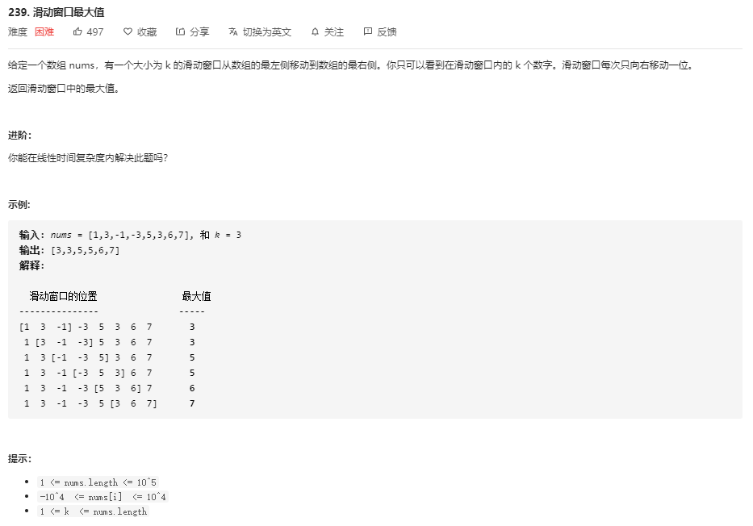

# 滑动窗口概念

滑动窗口就是在数组或者链表的基础上做变形，滑动窗口相关的题目一般都是用双端队列来解决

# **题目集合**

## [239. 滑动窗口最大值](https://leetcode-cn.com/problems/sliding-window-maximum/)



**暴力法**

每移动一次，就计算出这个窗口内的最大值，也就是通过遍历的方法找出最大值

```JS
var maxSlidingWindow = function(nums,k) {
	if (k === 1) return nums
    let result = [] , SliderArr = []
    for (let i = 0; i < nums.length; i++) {
        SliderArr.push(nums[i])
        if (i >= k-1) {
            result.push(Math.max(...SliderArr))
        	SliderArr.shift()
        }
    }
    return result
}
```

> **虽然使用的是原生API 来求的的最大值，但是本质还是通过遍历数组来获取最大值，所以时间复杂度为 O(n*k) ，因为每次求出 K 个值中的最大值，空间复杂度O(n)**
>
> **每次进入循环都压入一个元素，在  i < k-1 ,之前，也就是做初步窗口构建，当开始滑动时，每次压入，找到最大值，存入结果数组中，又从头部弹出一个数据，来实现动态窗口的效果**

**[双端队列法](https://leetcode-cn.com/problems/sliding-window-maximum/solution/javascriptjie-leetcodehua-dong-chuang-kou-zui-da-z/)**

> 关于使用双端队列来解决滑动窗口问题的基础概念解析 [视频解析](https://leetcode-cn.com/problems/sliding-window-maximum/solution/shi-pin-jie-xi-shuang-duan-dui-lie-hua-dong-chuang/)

**本题解析：使用一个双端队列存储窗口中值的 ==索引== ，并且保证双端队列中第一个元素永远是最大值，那么只需要遍历一次 nums，就可以取到每次移动时的最大值。（暴力法是每个元素至少比较了K次，总体是一次遍历过去）**

- 比较当前元素 i 和双端队列第一个元素（索引值），相差 >= k 时队首出列 （**更新双端队列的队首，因为当满足这个条件时，说明这个滑动窗口已经移开了这个元素，窗口内不再包含这个最大值了，要移除**）
- 依次比较双端队列的队尾与当前元素 i 对应的值，队尾元素值较小时出列，直至不小于当前元素 i 的值时，或者队列为空，这是**为了保证当队头出队时，新的队头依旧是最大值（做这一层处理还有另外一个意思，当前元素小于双端队列队尾元素存储的索引对应的元素值，那么就压入）**
- 当前元素入队（**也就是上面那个，默认情况下小于就是压入双端队列**）
- 从第 K 次遍历开始，依次把最大值（双端队列的队头）添加到结果 result 中 （**正因为不断的更新队首和当前元素与队尾比较而产生的更新，保证了头部永远是存储了最大值的索引**）

```JavaScript
var maxSlidingWindow = function(nums,k) {
	let deque = []
    let result = []
    for (let i = 0; i < nums.length; i++) {
        if (i - deque[0] >= k) {
            deque.shift()
        }
        while (nums[deque[deque.length-1]] <= nums[i]) { // 注意这个等于号，存储的是索引，索引值不同
            deque.pop()
        }
        deque.push(i)
        if (i >= k - 1) {
            result.push(nums[deque[0]])
        }
    }
    return result
}
```

> **时间复杂度：O(N) 。 空间复杂度：O(N)**

[滑动窗口类型集合](https://github.com/Alex660/Algorithms-and-data-structures/blob/master/demos/%E6%BB%91%E5%8A%A8%E7%AA%97%E5%8F%A311%E9%81%93.md)

## 821 字符的最短距离


**滑动窗口**

****

```JS
var shortestToChar = function(s, c) {
    let res = Array(s.length);
    let l = s[0] === c ? 0 : Infinity,
        r = s.indexOf(c,1);
    for (let i = 0; i < s.length; i++) {

        res[i] = Math.min(Math.abs(i - l),Math.abs(r - i));

        if (i === r) {
            l = r;
            r = s.indexOf(c,r + 1);
        }
    }
    return res;
};
```

画出特殊情况

- 开头字符为 目标字符
- 开头不为 目标字符
- 结尾字符为 目标字符
- 结尾不为 目标字符

**注意到在什么时候滑动窗口（谁等于谁时），怎么滑动窗口（变换两个指针的值）**

## 28 实现 str


滑动窗口，双指针

```JS
var strStr = function(haystack, needle) {
    let p = 0,j = 0;
    if (haystack.toString() == needle.toString()) return 0;
    while ( p < haystack.length && j < needle.length) {
        if (haystack[p+j] === needle[j]) {
            j++;
        } else {
            p++;
            j = 0;
        }
    }
    return j === needle.length ? p : -1
};
```

### 总结

注意到 移动主串上的指针时，在未进行完完全的比较成功时不要移动主串指针，仅加上某个变量值来访问后面元素，否者容易忽略到意外情况

